## Le Crêpier psychorigide

> Un des principaux problèmes en informatique est le tri / classement de données dans un tableau, comme nous l'avons déjà vu.
>
> Mais il existe le même genre de souci ailleurs : par exemple, en Bretagne, un de nos concitoyens a bien du mal à ranger ses crêpes...

Jean-Michel, crêpier à Ploujean, dans le Finistère, est tout chafouin. Ses crêpes se sont mélangées et maintenant son beau stand ne ressemble plus à rien.

Il faut aider Jean-Michel à remettre les crêpes dans le bon ordre ! 

Pour cela, il va nous falloir : 

- Télécharger le fichier [java](crepe-applet1-jnlp.jnlp) et l'exécuter. Si cela ne fonctionne pas, appeller le professeur.
- Prendre son temps et comprendre comment cela fonctionne.
- Mettre en place nos idées.
- Retourner les crêpes !

### Interface

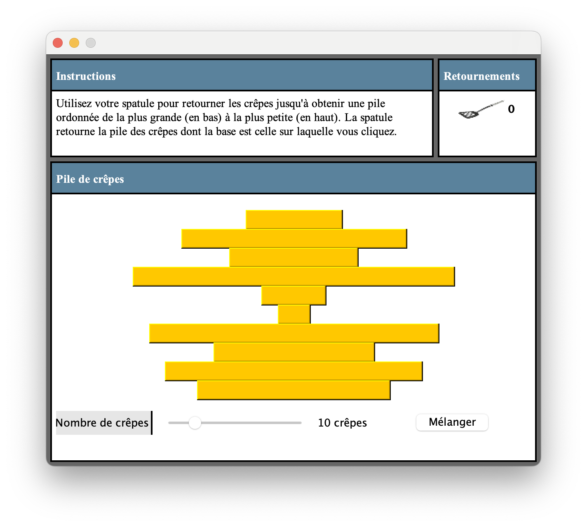

Puisque nous sommes à Nice, loin de Jean-Michel, on va devoir utiliser cette interface virtuelle afin de l'aider.

Ici nous avons une pile de crêpes, dans le désordre. On peut d'ailleurs régler leur nombre, disons à six (6) pour commencer.

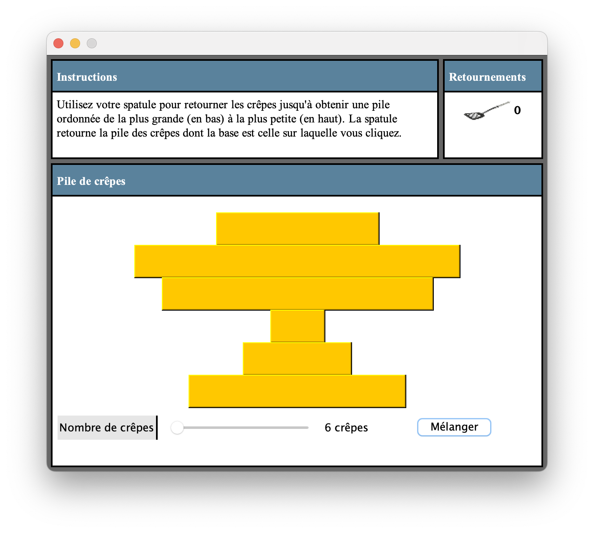

Le but est de faire en sorte que les crêpes soient triées par ordre décroissant, de bas en haut.

Pour cela, vous allez pouvoir selectionner les crêpes en glissant la souris dessus : plus vous descendez, plus vous en retournerez :

Si je clique ici je ne retournerais que deux (2) crêpes :

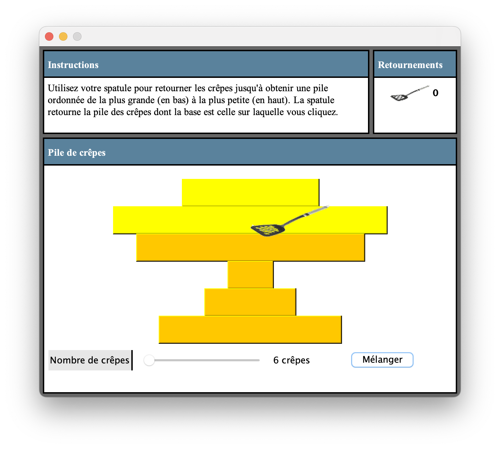

Ici, quatre (4):

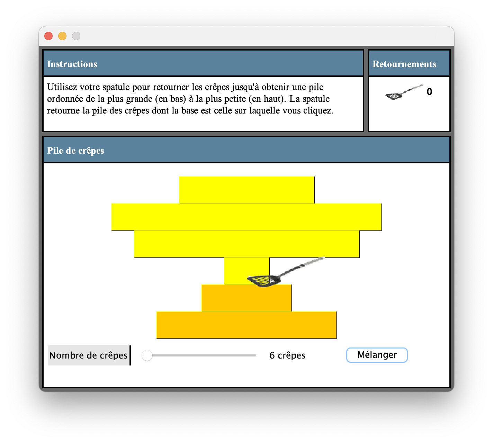

Ou carrément toute la pile :

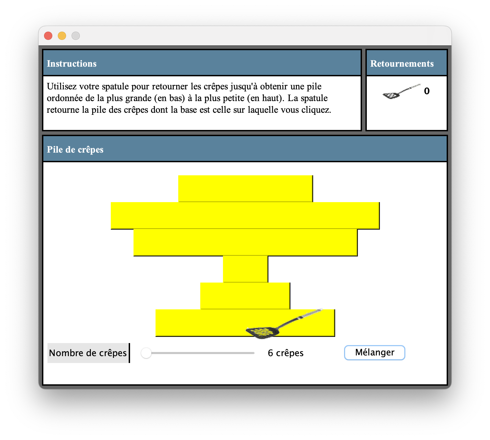

-----------

### Procédure de résolution du problème

En commençant avec six (6) crêpes, je peux donc facilement m'en sortir, voilà comment :

- Je regarde où se situe la plus grande crêpe puis je fais en sorte de la placer tout en haut.

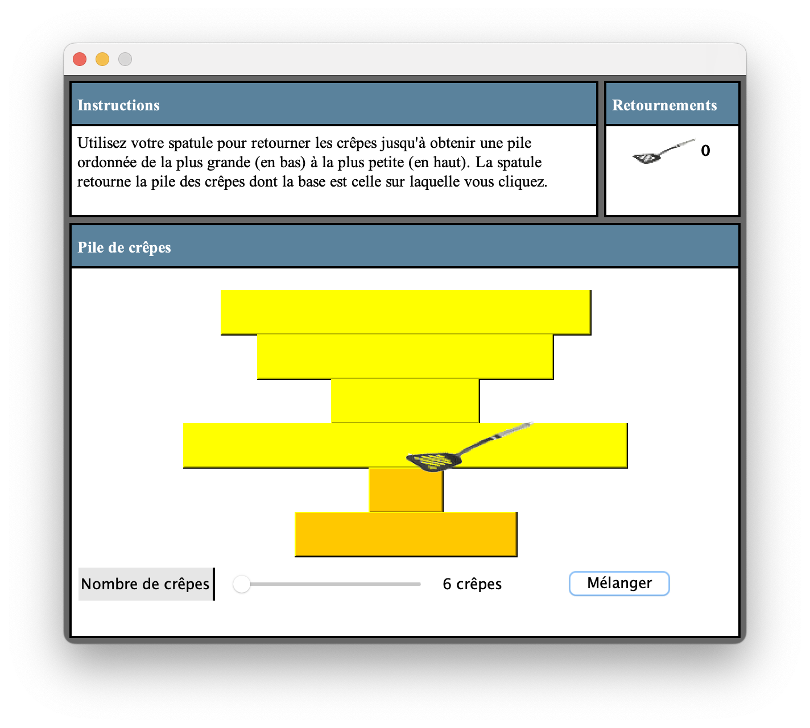

- Puis je retourne cette pile.

- On retourne le tout en cliquant sur la crêpe du bas pour inverser la position entre la crepe la plus large qui est en haut, et la crêpe qui se retrouve en bas.

  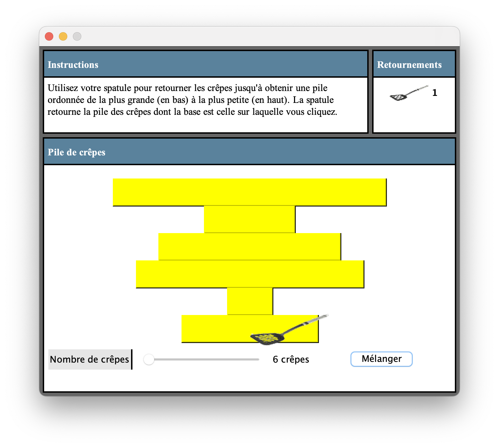

- Et me voilà donc avec au moins une crêpe bien placée ! On considère donc la plus grande crêpe comme ***déjà triée*** puisqu'elle se situe déjà au bon emplacement.

  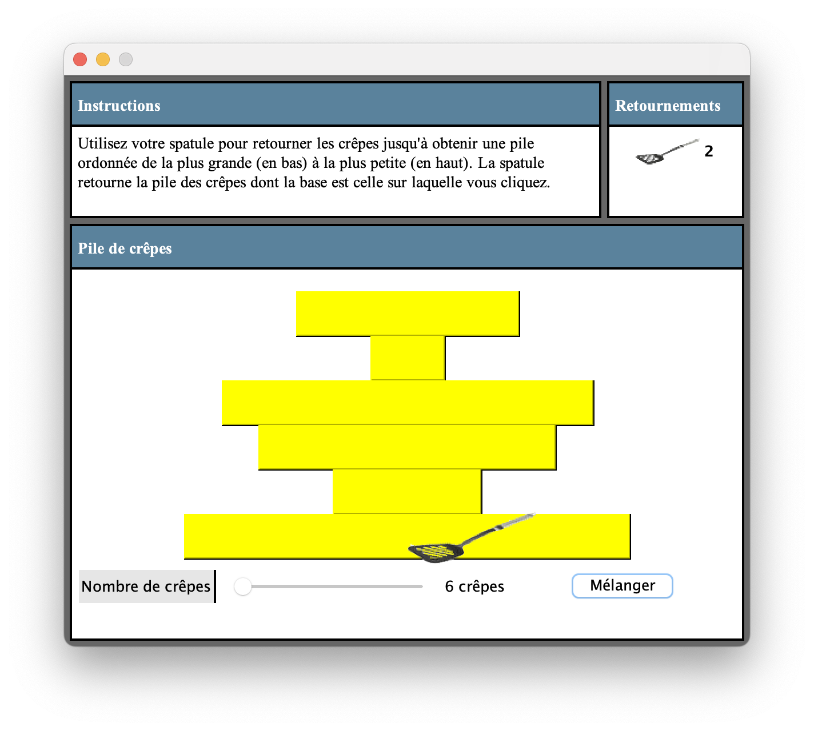

- Maintenant, il ne me reste plus qu'à faire de même pour les autres crêpes en cherchant à chaque fois ***la plus grande parmi les crêpes non triées.***

À vous de jouer ! Une fois terminée, vous pouvez obtenir deux écrans de fin de jeu :

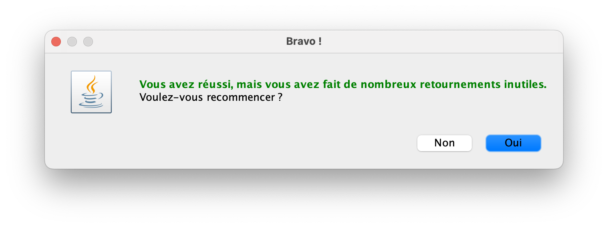

Cela signifie que vous aurez atteint le but recherché, mais que votre **algorithme de recherche** n'est pas optimal et donc pas le plus efficace. On retourne donc au travail !

Si par contre, vous obtenez l'écran ci dessous, c'est gagné, appelez le professeur pour valider, et à vous les joies d'énormes piles de crêpes à trier ! 

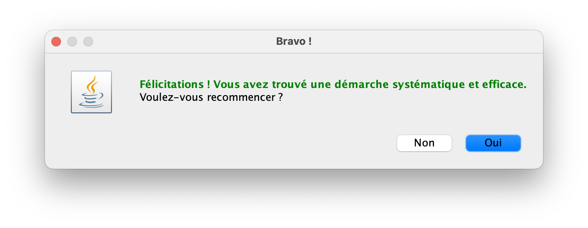

------

### Question

- Quel tri ressemble à notre méthode de résolution ?
- Peut-on dégager un algorithme de notre méthode de résolution ?
- Quel serait le pire des cas ?
- Donner la complexité de l'algorithme le cas échéant.

--------

### Mini-Projet

Écrire cet algorithme avec vos propres mots.

---------

### Bonus

- Réussir à trier 30 crêpes comme le prof :

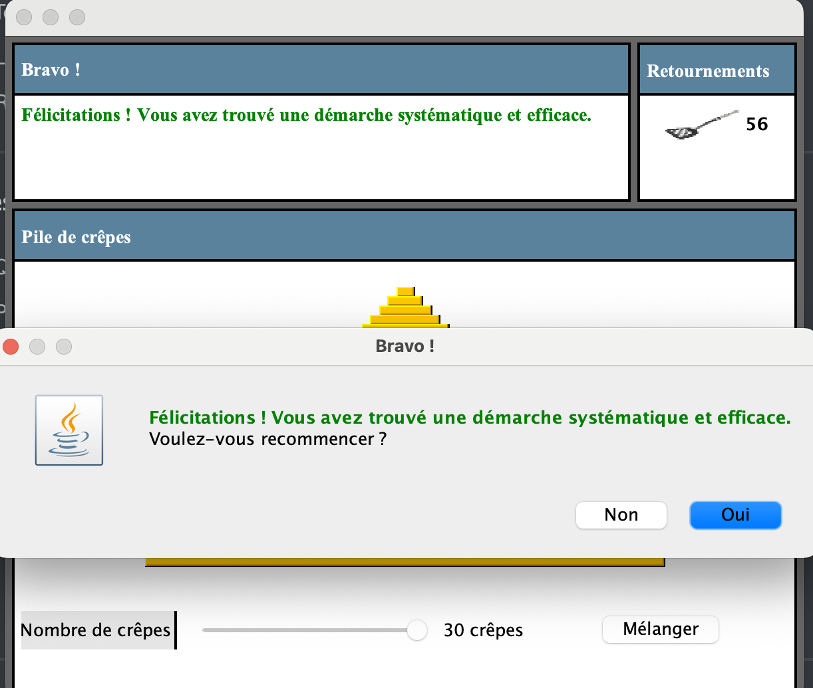

----

Auteur : Florian Mathieu

Licence CC BY NC

  Ce cours est mis à disposition selon les termes de la <a rel="license" href="http://creativecommons.org/licenses/by-nc-sa/4.0/">Licence Creative Commons Attribution - Pas d’Utilisation Commerciale - Partage dans les Mêmes Conditions 4.0 International</a>