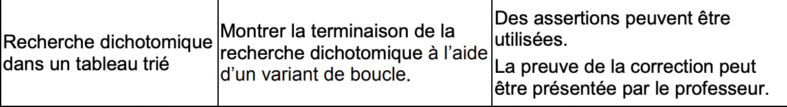

> Après avoir vu le parcours séquentiel d'un tableau dans le but de trouver un élèment, on va pouvoir voir une méthode bien plus efficace dans le cas d'une liste triée, **la recherche dichotomique.**

### Le programme



-----------

### Etymologie

Le mot dichotomie vient du grec ancien
$$
dikhotomia
$$
qui signifie ***couper en deux***

-------------

### Problème de base

Supposons un tableau tab :

```python
tab = [1,2,6,9,12,14,18,21,42]
```

Si on souhaite chercher un élèment, par exemple 7, en utilisant le [parcours séquentiel](PARCOURS.md) on fonctionne par balayage (avec une boucle for...) et donc parcourir la liste du début à la fin en colparant chaque valeur à l'élèment recherché.

Ici par exemple, on effectuerait 9 comparaison pour finir par dire que non, 7 n'est pas présent.

Dans le cas d'une liste **déjà triée**, la recherche dichotomique permet d'améliorer les performances.

-----------

### Principe

- Si le tableau est vide, on renvoie False, la recherche est terminée.
- Sinon, on trouve la valeur la plus *centrale* du tableau et on la compare avec l'élément recherché :
  - si la valeur est celle qu'on recherche, on renvoie True, la recherche est terminée.
  - si la valeur est plus petite que l'élèment recherché, on recommence la procédure avec la seconde moitié du tableau.
  - si la valeur est plus grande que l'élément recherché, on recommence avec la première moitié du tableau.


> Par Tushe2000 — Template:LoStrangolatore, Domaine public, https://commons.wikimedia.org/w/index.php?curid=39675138

Exercice :

Montrer le nombre d'étapes nécessaires à la réussite de cette recherche.


-------------

### Complexité

| Taille tableau         | 0    | 1    | 2    | 4    | 8    | 16   | 32   | 64   | 128  | N                |
| ---------------------- | ---- | ---- | ---- | ---- | ---- | ---- | ---- | ---- | ---- | ---------------- |
| Recherche Séquentielle | 0    | 1    | 2    | 4    | 8    | 16   | 32   | 64   | 128  | N                |
| Recherche Dichotomique | 0    | 1    | 2    | 3    | 4    | 5    | 6    | 7    | 8    | log<sub>2</sub>N |

- Quel est le pire des cas ici ? Que l'élèment recherché ne soit pas dans le tableau.
- Le nombre de tours de boucle de la recherche dichotomique est de l'ordrede log<sub>2</sub>(n) où *n* est la taille de la liste.

*Explications*

Qu'est ce que le ***Logarithme***:

pour faire simple, le logarithme en base n - écrit log<sub>n</sub> correspond au nombre de division par n successive pour arriver au nombre 0.

***Exemple :***

Soit un tableau de taille 𝑛.

Si on « coupe » ce tableau en deux parts égales, cela revient à diviser 𝑛 par deux à chaque itération :


<br>


<br>


***Important***  : la taille d’un tableau étant forcément un *nombre entier*, 𝑛𝑖 va devenir à un moment ou un autre égal à 1. 

Cela signifiera qu’après avoir divisé 𝑛 par 2 un nombre de fois égal à un certain nombre 𝑎, le tableau ne comportera plus qu’une seule valeur (et par conséquent l’algorithme s’arrête).


Soit : 𝑎 =log<sub>2</sub>(𝑛)

La recherche dichotomique est donc de complexité ***logarithmique***.

--------

### Terminaison

Pour vérifier que la recherche dichotomique se termine bien, regardons ensemble son code python - on suppose que le tableau en entrée est déjà trié.

````python
def dichotomique (tab, x)
```
:param tab: tableau contenant différents élèments déjà triés
:param x: élèment recherché
```
a = 0 # on initialise la borne inférieure
b = len(tab) - 1 # borne supérieure
while a <= b: # tant que la borne inférieure est plus petite ou égale à la borne supérieure
  m = (a + b) // 2 # on se place au milieu du tableau
  if tab[m] == x: # si l'élément central est l'élément recherché
    return True # alors on a terminé
  elif tab[m] < x: # si l'élément central est plus petit que l'élément recherché
    a = m + 1 # on déplace la borne minimum vers la sous-partie droite du tableau
  else: #si l'élement central n'est ni plus petit ni égal à l'élément recherché, donc s'il est >...
    b = m - 1 #on déplace la borne supérieure vers la sous-partie gauche
    #si après tout ça on ne trouve pas l'élément...
return False
````

-----------

Exercices :

- Écrire une fonction *tableau_random*(x, i, j) qui crée un tableau de x nombres aléatoires compris entre i et j
- Écrire une fonction trier_tableau (tab) qui va trier un tableau par ordre croissant.
- Écrire la fonction dichotomique (tab, x) qui renvoie True si l'élément x se trouve dans tab, False sinon.


-----------

Auteur : Florian Mathieu

Licence CC BY NC

<a rel="license" href="http://creativecommons.org/licenses/by-nc-sa/4.0/"></a> <br />Ce cours est mis à disposition selon les termes de la <a rel="license" href="http://creativecommons.org/licenses/by-nc-sa/4.0/">Licence Creative Commons Attribution - Pas d’Utilisation Commerciale - Partage dans les Mêmes Conditions 4.0 International</a>.