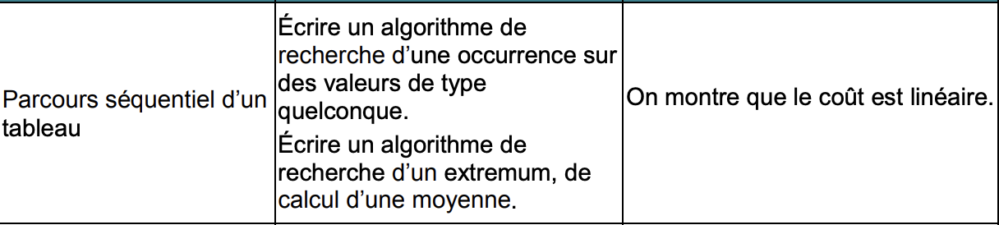

# Parcours séquentiel d'un tableau

> Quelques exemples d'algorithmes qui nécessitent un parcours simple d'un tableau.
>
> On utilisera ici une seule boucle **for** : la complexité est donc **linéaire**.


### Le programme 




On supposera que tous les tableaux traités ici contiennent des nombres.

### Exemples

#### Recherche d'occurence

Si on souhaite savoir si un élément nommé *e* en particulier se trouve dans un tableau *tab* :

```python
def recherche(tab,e):
  occurrence = False
  for i in range (len(tab)):
    if tab[i] == e:
      occurrence = True
      return occurrence
  return occurrence
```

***Complexité :***

Le programme effectue n+1 affectation : 

- La première, avant la boucle.
- Les n suivantes, selon la taille du tableau

Le coût est donc *linéaire* : proportionnel à n, il dépend donc de la taille du tableau, ***O(n)***

-------------

#### Recherche d'un extremum (maximum ou minimum)

Si on souhaite trouver le plus grand élément d'un tableau *tab* :

```python
def recherche_max(tab):
  max = tab[0]
  for i in range (len(tab)):
    if tab[i] > max:
      max = tab[i]
  return max
```

*Complexité linéaire*

Car on parcours toute la liste et donc pour n élèments, on effectuera n comparaisons.

--------

####  Calcul d'une moyenne

```python
def moyenne(tab):
  m = 0
  for i in range(len(tab)):
    m = m + tab[i]
  moyenne = m // len (tab)
  return moyenne
```

*Complexité linéaire*

Car on parcours toute la liste et donc pour n élèments, on effectuera n comparaisons.

-----------

#### Autres exemples simples :

- Vérifier si une un tableau est rangé par ordre croissant ou décroissant
- Chercher un mot de plus de n lettres dans une liste de mots...

--------

Auteur : Florian Mathieu

Licence CC BY NC

<a rel="license" href="http://creativecommons.org/licenses/by-nc-sa/4.0/"></a> <br />Ce cours est mis à disposition selon les termes de la <a rel="license" href="http://creativecommons.org/licenses/by-nc-sa/4.0/">Licence Creative Commons Attribution - Pas d’Utilisation Commerciale - Partage dans les Mêmes Conditions 4.0 International</a>.