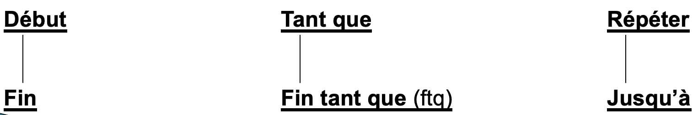
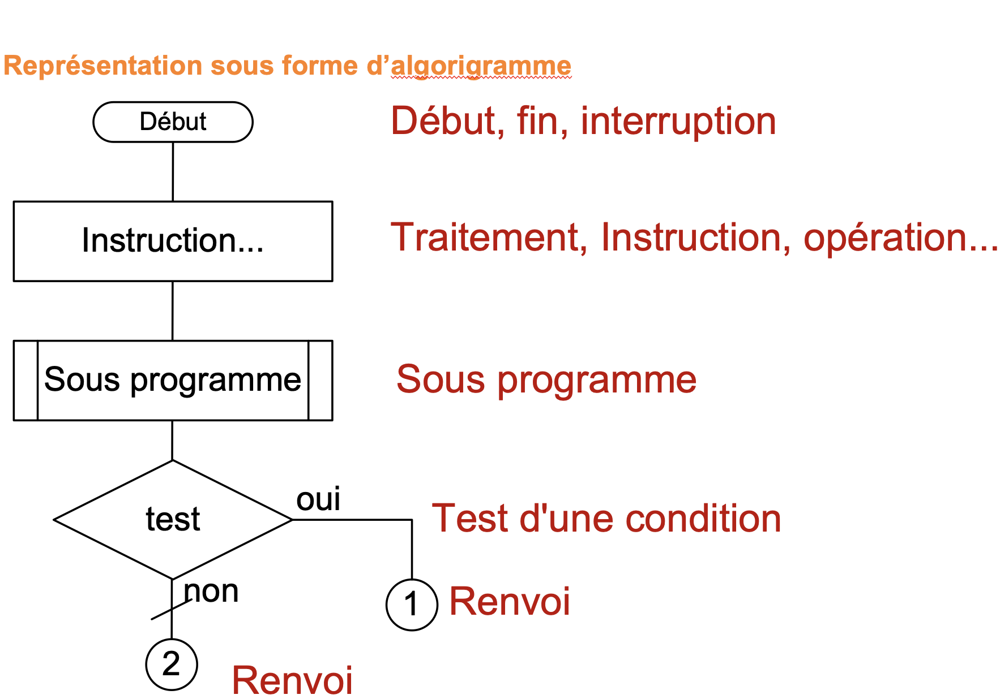
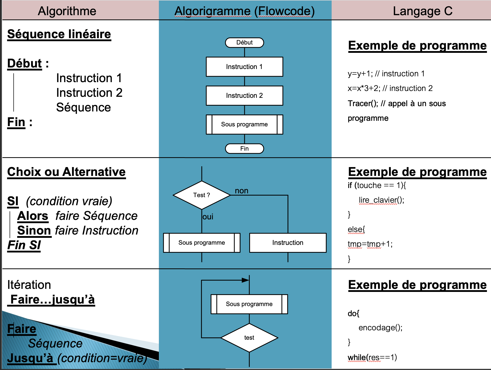
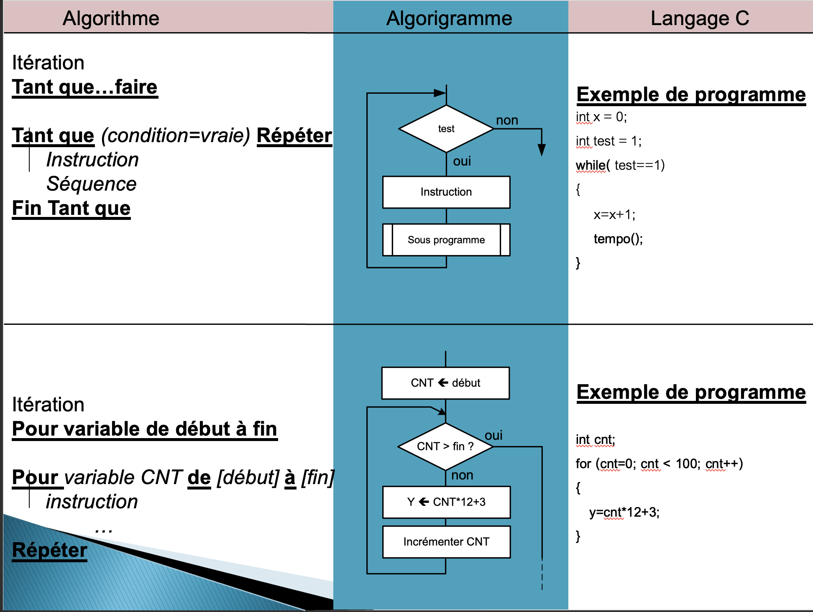

## Les algorithmes

### Un algorithme ? C’est quoi ?

Le mot algorithme signifie étymologiquement le nom d’un mathématicien arabe du moyen âge : ***Al-Khawarizm***i, il a été le premier a décrire une méthode claire pour la résolution d’équation en 825. 

Un algorithme est une séquence finie d’instructions faite pour être exécutée dans le but de résoudre *un problème précis*, nous retiendrons qu’un algorithme est une séquence d’instructions exécutées de façon **logique** mais **non intelligente**.

- Logique parce que la personne (ou la machine) qui exécute les instructions sera capable de facilement comprendre et exécuter sans erreur ni ambigüité chacune des instructions.

- Non intelligente parce que la personne qui exécute l’algorithme n'aura qu'à suivre toutes les instructions, dans l'ordre pour arriver au résultat sans avoir a comprendre la méthode de solution.

---------

## Utilisation en informatique

- L’ordinateur n’est pas intelligent, pour résoudre un problème, vous devez lui donner des successions claires d’instructions à suivre.

Nous nous intéresserons  à la façon de combiner des instructions pour résoudre un problème indépendamment des langages de programmation :

 **Objectif : décomposer des calculs compliqués en successions d’étapes simples.**

----------

## Intérêt de l'algorithme 

- Un algorithme sert à transmettre un savoir faire.
- Il décrit clairement les étapes à suivre pour réaliser un travail. 
- Il permet d'expliciter clairement les idées de solution d'un problème indépendamment d'un langage de programmation

-----------

## Quand l'utiliser ?

**Lorsque l’on doit traiter de l’information**: 

- Tâches humaines (issues d’une interface)
- Tâches automatiques (issues de capteurs)
- Tâches ou traitement par lot (issues d’une base de données) 

**D’un point de vue « professionnel »** : 

- Etablissement d’un cahier des charges
- –Tâches/traitement
- –Acteurs
- Interfaces

-----------

## Démarche

**Analyse du cahier des charges (avec le client, les acteurs du futur produit) :** 

- Réflexion des étapes de la programmation: **ce que doit faire le programme**

- –Pseudo-code

- –SysML

–

**Programmation**

Réflexions sur l’environnement:

- –Quel système ? 

- À quelle broche brancher telles ou telles commandes …

- –Utilisation d’un langage de programmation :  
  -  Interprété ? Compilé ?
  - –Fiabilité ?
  - –Disponibilité ?

----------------------

## Lien avec la programmation ?

**Ecriture du programme** :

À partir du cahier charge fonctionnel (CdCf), le programmeur écrit le programme sous forme *d'algorithme*.

**Le codage** :

À partir de l’algorithme le codeur va transcoder l’algorithme  en

- un langage littéral (syntaxe) : C, C++, Python, Java, Assembleur, etc…

- Un langage graphique: Flowcode, mBlock, Scratch, etc…

*À ce stade le programme peut-être **simulé** afin de vérifier que son exécution est conforme.*

---------

## Règles 

Un algorithme est un ensemble de règles à respecter : 

Processus défini par une succession **finie, ordonnée** dans le **temps**, d’opérations d’un **acteur unique** appliquées à un nombre **fini** de données conduisant en un nombre **fini** d’étapes à un résultat défini quelles que soient les valeurs des données dans leurs domaines de définition.

Représentation:

- Algorithme
  - –Littéral: PseudoCode
  - Graphique : Algorigramme

***Règle* *0*** 

- **L’algorithmique est faite pour décrire l’aspect temporel des processus**
  - **Un algorithme sans fin ne peut représenter qu’un programme mal fait et planté.**
  - **Deux événements représentés sur deux lignes (cellules graphiques) consécutives se succèdent strictement dans le temps.**

***Règle 1***

- **Deux événements simultanés doivent être mentionnés dans la même ligne d’algorithme, ou dans le même rectangle d’algorigramme**

***Règle 2***

- **Les** **mots clés** **de l’algorithmique (il n’y en n’a même pas 20, un minimum de 12 suffisent) s’emploient toujours soulignés**

**Règle 3**

**Les couples suivants fonctionnent comme des parenthèses algébriques**  **et sont toujours** **reliés par des traits verticaux de validation** **:**

**Règle 4**

- **Le signe « = » a toujours une valeur de test booléen** 

- **l’affectation est toujours représentée** **par son signe «** **prend pour valeur »** <-----

- **Ce qui n’est plus vrai lors de l’utilisation d’un langage de programmation**

**Règle 5**

- **Tout algorithme a un début et une fin**

- **Un processus « permanent » a toujours une boucle principale qui n’atteint sa fin que sur rupture des conditions normales de fonctionnement.**

**Règle 6**

- **Tout algorithme peut se représenter en** **algorigramme** **et réciproquement**

**Règle 7**

- **Les deux formes de boucle légitimes ne sont pas équivalentes.**
  - Les événements de la boucle **répéter** sont toujours exécutés au **moins une fois** alors que la boucle **tant que** peut très bien **ne jamais avoir lieu**.

**Règle 8**

- **Un « si » ne contrôle jamais une boucle ! ! !**
  - Ce sont les structures **« tant que »** et **« répéter ...jusqu’à » qui contrôlent les boucles** légitimes

**Règle 9**

- **Une boucle** **algorithmique** **est toujours exécutée un nombre entier de fois**

**Règle 10** : 

**Deux boucles** **peuvent être** **successives** **ou** **imbriquées, jamais enchevêtrées**

**Règle 11** 

- **Tout état physique mémoire (bascule, charge de condensateur, état d’un commutateur...) se représente par une variable**

## Pour faire bref

--------

Auteur : Florian Mathieu

Licence CC BY NC

  Ce cours est mis à disposition selon les termes de la <a rel="license" href="http://creativecommons.org/licenses/by-nc-sa/4.0/">Licence Creative Commons Attribution - Pas d’Utilisation Commerciale - Partage dans les Mêmes Conditions 4.0 International</a>.

