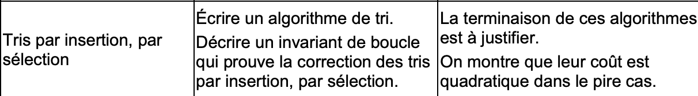

# Algorithmes de tri 


> En python, on dispose de plusieurs algorithmes permettant de trier des tableaux et relativement faciles à implémenter.


### Le programme



Il existe un problème récurrent en informatique : le tri de données. Comme vu précédemment, on travaille souvent sur de grands nombres de données, et il faut bien trier tout ça à un moment pour plusieurs raisons :

- espace
- temps
- argents
- facilité d'utilisation

En python, deux méthodes permettent de trier les tableaux simplement par ordre croissant :

- sort()

```python
>>> l = [3, 2, 1]
>>> l.sort()
>>> l
[1, 2, 3]
```

La méthode *sort* va modifier la liste elle-même (et renvoie *None* pour éviter les confusions).

Ne fonctionne qu'avec le type *list*.

- sorted ()

```python
sorted([3, 2, 1])
[1, 2, 3]
```

Renvoie une nouvelle liste triée.

Fonctionne avec n'importe quel type *itérable*.

## Tri par insertion

### Présentation

Le tri par insertion est efficace dans le cas de tableaux de petite taille ou de tableaux triés en partie.


Le principe est ici de parcourir tous les éléments :

- Chaque élément est inséré à sa place dans les éléments déjà triés qui le précèdent
- Il n'est pas nécessaire de faire une copie de la liste
- Deux éléments égaux resteront toujours dans le même ordre
- Les éléments peuvent être fournis au fur et à mesure


Supposons un tableau suivant :

```python
tab = [9,8,5,4,7,6]
```

```python
procédure tri_insertion(tableau T)
     pour i de 1 à taille(T) - 1

          # mémoriser T[i] dans x
          x ← T[i]                            

          # décaler les éléments T[0]..T[i-1] qui sont plus grands que x, en partant de T[i-1]
          j ← i                               
          tant que j > 0 et T[j - 1] > x
                   T[j] ← T[j - 1]
                   j ← j - 1

          # placer x dans le "trou" laissé par le décalage
          T[j] ← x 
```


Le tri par insertion est *naturel* dans l'esprit : on parcourt le tableau de la gauche vers la droite et pour chaque élément, on le classe dans la partie du tableau situé sur sa gauche.

### Preuve de correction

| Valeur de i | Tableau avant la boucle | Valeur de la clé | Tableau en fin de boucle |
| ----------- | ----------------------- | ---------------- | ------------------------ |
| 1           | [9,8,5,4,7,6]           | 8                | [**8,9**,5,4,7,6]        |
| 2           | [8,9,5,4,7,6]           | 5                | [**5,8,9**,4,7,6]        |
| 3           | [5,8,9,4,7,6]           | 4                | [**4,5,8,9**,7,6]        |
| 4           | [4,5,8,9,7,6]           | 7                | [**4,5,7,8,9**,6]        |
| 5           | [4,5,7,8,9,6]           | 6                | [**4,5,6,7,8,9**]        |

> À la fin de chaque boucle, le tableau est trié de la case n°0 à la case n°i

Une preuve de correction de l'algorithme est la propriété *p(i)* : "le tableau est trié jusqu'à la case n°i" : cette propriété est vraie **avant** et **après** chaque tour de boucle : c'est ce qu'on appelle ***Invariant de boucle***

À l'inverse, le **variant** de boucle est une expression dans la valeur varie à chaque tour de boucle et qui doit justement permettre de mettre fin à la-dite boucle : le variant d'un algorithme de tri sera alors la taile de la liste restante à trier.

### Complexité

Dans le pire des cas (éléments classés par ordre décroissant), la boucle while effectue 2n opérations : chaque tour de boucle for compte pour 2n + 3, répérées n - 1 fois. On a donc (n - 1) (2n + 3).

L'ordre de grandeur est donc de n<sup>2</sup> : on aura donc un coût **quadratique** dans le pire des cas.

>  Par contre si la liste est déjà triée, le coût est **linéaire**.

[Une excellente méthode pour comprendre](https://www.youtube.com/watch?v=ROalU379l3U)

-----------------

## Tri par selection

> Contrairement au tri par insertion, le tri par selection a pour avantage de déplacer moins de valeurs.


Principe:

- On recherche du plus petit élément et on le met à sa place (indice 0 donc)
- Puis on recherche le deuxième plus petit et on le met à l'indice 1
- Et on continue comme cela avec tous les éléments
- Il n'est pas necessaire de faire une copie de la liste
- Deux éléments égaux ne resteront pas forcément à la même place

Supposons le tableau suivant :

```python
tab = [9,8,5,4,7,6]
```

```python
procédure tri_selection(tableau t)
    n ← longueur(t) 
    pour i de 0 à n - 2
        min ← i       
        pour j de i + 1 à n - 1
            si t[j] < t[min], alors min ← j
        fin pour
        si min ≠ i, alors échanger t[i] et t[min]
    fin pour
fin procédure
```

> En python, pour échanger des cases, on peut écrire :
>
> ```python
> tab[i], tab[mini] = tab[mini], tab [i]
> ```


### Preuve de correction

| Valeur de i | Tableau avant la boucle | Tableau après la boucle |
| ----------- | ----------------------- | ----------------------- |
| 0           | [9,8,5,4,7,6]           | [**4**,8,5,9,7,6]       |
| 1           | [4,8,5,9,7,6]           | [**4,5**,8,9,7,6]       |
| 2           | [4,5,8,9,7,6]           | [**4,5,6**,9,7,8]       |
| 3           | [4,5,6,9,7,8]           | [**4,5,6,7**,9,8]       |
| 4           | [4,5,6,7,9,8]           | [**4,5,6,7,8,9**]       |

Il faut montrer l'invariant : à la fin du tour i de la boucle for, les cases tab[0] à tab[i] incluses sont à leur place définitives.

### Complexité

- La première boucle for tourne pour i variant de 0 à n-2. Elle s'effectue donc n-2 fois.
- La seconde boucle s'effectue n-1 - i fois.
- On a donc n*n en ordre de grandeur, donc la complexité est : **quadratique**

[Et donc la méthode pour mieux comprendre](https://www.youtube.com/watch?v=Ns4TPTC8whw)

-----


#### Exercices

- Ecrire les fonctions 

```python
tri_selection (tab)
```

et 

```python
tri_insertion(tab)
```

qui permettent de trier différement les tableaux donnés en entrée.

Expliquer pourquoi ces algorithmes sont en O(n<sup>2</sup> ) avec vos propres mots.


--------------

### Outils

[Le simulateur de tri](http://fred.boissac.free.fr/AnimsJS/Dariush_Tris/index.html)

-------

Auteur : Florian Mathieu

Licence CC BY NC

<a rel="license" href="http://creativecommons.org/licenses/by-nc-sa/4.0/"></a> <br />Ce cours est mis à disposition selon les termes de la <a rel="license" href="http://creativecommons.org/licenses/by-nc-sa/4.0/">Licence Creative Commons Attribution - Pas d’Utilisation Commerciale - Partage dans les Mêmes Conditions 4.0 International</a>
