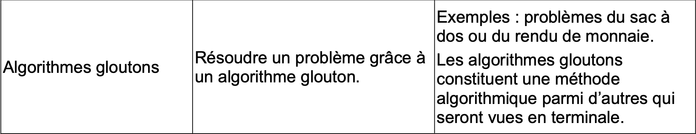

> En informatique, on retrouve fréquemment des problèmes d'optimisation comme par exemple le problème du **rendu de monnaie**. Les algorithmes gloutons sont utilisés pour résoudre ce type de problème.

## Le Programme




--------

### Définition

**Problème d'optimisation** : problème dont on cherche à maximiser (ou minimiser) un résultat. 

Un ***algorithme glouton*** est un algorithme qui vise à optimiser la résolution d'un problème en utilisant une approche particulière :

- On procède par étapes, en effectuant à chaque fois le meilleur choix possible.
- On ne revient jamais sur un choix déjà fait.

Selon le problème on utilise une méthode pour résoudre ce dernier. Il peut exister plusieurs instances qui donneront lieu à des résultats différents. 

À un problème d'optimisation, on associe une fonction objective.

Prenons un exemple simple : la liste des 23 joueurs selectionnés pour la coupe du monde :

```
Didier Desvilles est bien embêté : il doit choisir 23 joueurs pour aller jouer au Kotor.
Dans cette optique, il décide d'utiliser une méthode simple: choisir le meilleur joueur possible pour chaque poste, puis le deuxième meilleur comme remplaçant.

Peu importe si les joueurs selectionnés ne s'entendent pas forcément très bien, comme Olivier Gibrun et Karim Bamazette, l'important c'est de faire le meilleur choix à chaque étape.
```

Un algorithme glouton ne renvoie pas obligatoirement un résultat optimal, dans ce cas la, on parle ***d'heuristique.*** Il renverra un résultat optimal pour chacun des sous-problèmes.

Un algorithme glouton ne revient pas sur un sous-problème déjà traité.

---------

### Exemple de problème d'optimisation : rendu de monnaie

> Le problème du rendu de monnaie s'énonce de la façon suivante : étant donné un système de monnaie (pièces et billets), comment rendre une somme donnée de façon optimale, c'est-à-dire avec le nombre minimal de pièces et billets ?

On veut programmer une caisse automatique qui rend de façon optimal la monnaie (le moins de pièces/billets) :

#### **Des exemples**

```
Système de monnaie : ```{1, 2, 5, 10}```

Recherché : ```14```

Résultat optimal : 10 + 2 + 2
```

Système de monnaie : ```{1, 2, 5, 7, 10}```

Recherché : ```14```

Résultat optimal : 7 + 7

#### **Algorithme**

```python
system_1 = [1, 2, 5, 10]
system_2 = [1, 2, 5, 7, 10]

def rendu(systeme, recherche):
  tmp = recherche
  i = len (systeme) - 1
  res = []
  while tmp > 0:
    if tmp = systeme[i]:
      

rendu(SYSTEM_1, 14) # >>> [10, 1, 1] -> Optimal
rendu(SYSTEM_2, 14) # >>> [10, 1, 1] -> Non optimal car [7, 7] mieux
```

Force brute avec le ```system_2``` pour ```14```:

On cherche **toute** les solutions possibles :
- \[1, 1, 1, 1, 1, 1, 1, 1, 1, 1, 1, 1, 1, 1\]
- \[2, 2, 2, 2, 2, 2, 2\]
- \[5, 5, 2, 2\]
- \[7, 7\]
- \[10, 1, 1, 1, 1\]
- \[10, 2, 2]
- ...

On parcours la liste des solutions pour garder la solution la plus optimal (la plus courte) : **\[7, 7\]**.

### Exemples de problèmes que l'on peut résoudre par algorithme glouton

- **Sac à dos** 
- **Rendu de monnaie**
- [Gestion d'organisation de classe](https://info.blaisepascal.fr/nsi-algorithmes-gloutons#Un_algorithme_glouton-2)
- **Voyageur de commerce**.

### **Sac à dos**

2 systemes : \[(valeur, poids)\]

- ```[(22, 11), (5, 5), (1, 1)]``` ;
- ```[(12, 11), (10, 5), (10, 4), (1, 1)]```.

Pour un poids max de ```12```.

Plusieurs stratégies : **valeur/poids**, **le + de valeur** ou **le poids le plus gros**.

La fonction (et donc le résultat optimal) dépendra de la stratégie choisie.

### **Voyageur de commerce**

Le problème du **voyageur de commerce**, est un problème d'optimisation qui, étant donné une liste de villes, et des distances entre toutes les paires de villes, détermine un plus court circuit qui visite chaque ville une et une seule fois.

--------


Auteur : Florian Mathieu

Licence CC BY NC

<a rel="license" href="http://creativecommons.org/licenses/by-nc-sa/4.0/"></a> <br />Ce cours est mis à disposition selon les termes de la <a rel="license" href="http://creativecommons.org/licenses/by-nc-sa/4.0/">Licence Creative Commons Attribution - Pas d’Utilisation Commerciale - Partage dans les Mêmes Conditions 4.0 International</a>
