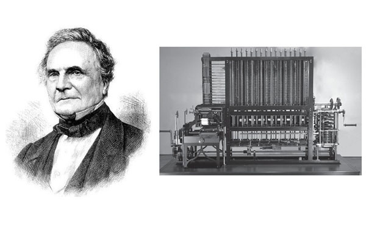
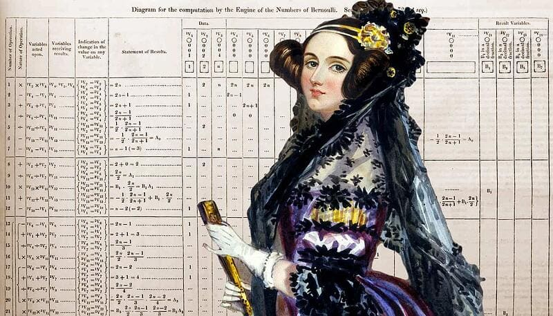
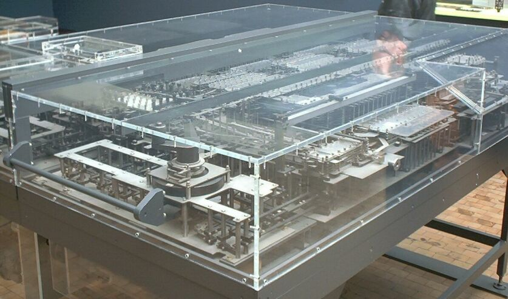
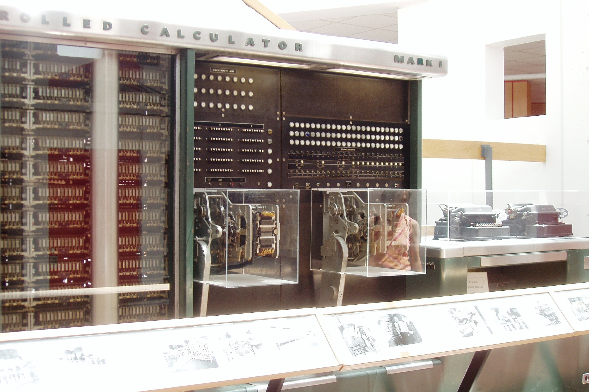
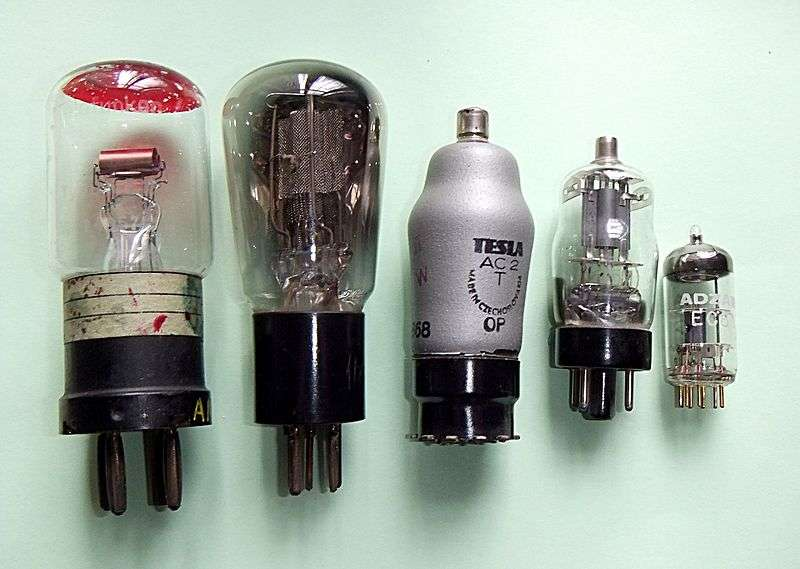
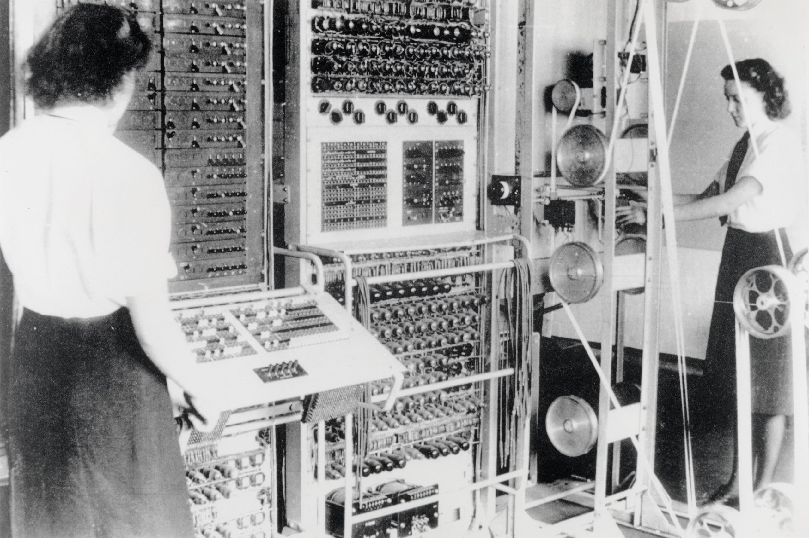
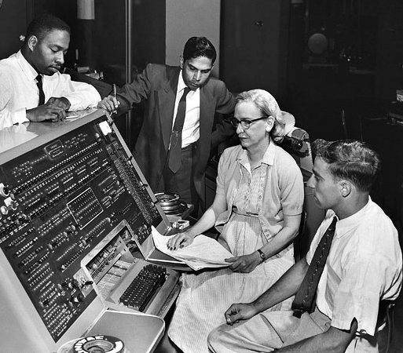

## Historique

> Si aujourd'hui nous pouvons utiliser smartphones, ordinateurs et autres appareils numériques, c'est parce que certaines personnes ont révolutionné, en leur temps, la sciences ainsi que les mathématiques. Petit tour d'horizon.

### Machines à programme externes

Depuis la [révolution industrielle](https://fr.wikipedia.org/wiki/R%C3%A9volution_industrielle) (XVIIIeme - XIXeme siècles), les machines mécaniques remplacent petit à petit les humains dans la réalisation de tâches ardues et complexes.

Cependant, tout n'est pas réalisable pour ces machines, et il faudra attendre quelques années pour que l'électromécanique ainsi que l'électronique permettent à l'humain d'espérer pourvoir s'émanciper du travail.

[Charles Babbage](https://fr.wikipedia.org/wiki/Charles_Babbage) apparaît souvent comme le « père »  de l’ordinateur : il conçoit une  *machine analytique* en 1834, une calculatrice automatique et mécanique à programme externe, susceptible de calculer aussi bien sur des nombres que sur des symboles.

Mais plus encore que Bubbage, c'est une femme du nom d'[Ada Lovelace](https://www.franceculture.fr/numerique/ada-lovelace-la-premiere-codeuse-de-lhistoire) qui fera la plus belle percée dans ce domaine :

Elle souhaite avant tout créer une science poétique, dans laquelle on pourrait voir les prémisses de l’intelligence artificielle d’aujourd’hui. 

Lorsque Charles Babbage tombe malade, Ada prend la relève pour le développement et la promotion de sa machine analytique. 

Cette machine est un outil à calculer programmable comme votre calculatrice (mais en bien mieux !)

Ada complète le travail de Babbage pour mettre au point un algorithme beaucoup plus performant et détaillé qui permet à la machine de réaliser des calculs de plus en plus complexes.

 Elle imagine des applications sociétales au service de l’imagination. Il s'agit donc de la toute première programmeuse de l'histoire.

✏ En 1920, l'auteur tcheque [Karel Čapek](https://fr.wikipedia.org/wiki/Karel_Čapek) employa le terme ***robota*** pour designer une machine capable de servir d'esclave, ou de travailler à la place des humains. ✏

Il faudra attendre les années 1930 pour retrouver des personnes capablent de faire évoluer et progresser la science numérique.

L'allemand [Konrad Zuse](https://fr.wikipedia.org/wiki/Konrad_Zuse) invente le ***Z1***, le premier ordinateur méchanique utilisant le système binaire.

Celui-ci était très defectueux, c'est pourquoi en 1941 le ***Z3*** pris la relève : il s'agit tout simplement du premier ordinateur complétement automatique, capable de lire les programmes sur bandes perforées, et surtout, utilisant la **virgule flottante**.

Il était alors en mesure de réaliser 3 ou additions à la seconde (combien peut on en faire aujourd'hui ?)

>  À ce moment là, on remarque une accélération des recherches, à cause de quoi à votre avis ? 

En 1944, Howard Aiken fabrique le ***Mark 1***, inspiré notamment par les travaux de Babbage et de Lovelace.

>  Le Mark 1 pèse 5 tonnes et comporte 750 000 pièces

-----

### Machines electroniques

L'apparition des tubes à vides marque le début de l'électronique (Tv, Radio, Ampli, Ampoules...)

> Comme chaque élèment de l'électronique, on vise la miniaturisation des tubes à vides

Entre 1943 et 1945, des scientifiques anglais mettent en place des machines appelées ***Colossus*** qui permettront de déchiffrer le code employé par les allemands pendant la seconde guerre mondiale.

Dans le même temps, Alan Turing créer un appareil capable de casser Enigma.

> L'existence des Colossus ne sera révélée qu'au début des années 1970. Jusque là, on pensait alors que le tout premier ordinateur electonique était l'Eniac.

En novembre 1945, l'Eniac est présenté : il permet d'effectuer des calculs balistiques grâce à ses 18 000 tubes à vides !

> 30 tonnes sur la balance

À partir des années 50, on entre dans une nouvelle phase : les programmes seront stockés dans la mémoire désormais.

Cette époque voit naître de grands noms de l'informatique comme IBM.

### Démocratisation et miniaturisation

Avec l'invention du transistor (1947), l'informatique voit sa grande révolution : plus petit, pas cher, et surtout fiable, ce composant va permettre de remplacer les tubes à vide et permettra l'emergence du circuit intégré en 1958.

IBM domine alors le marché informatique, et petit à petit, les universités vont permettre de démocratiser l'informatique pour tous et toutes. On forme alors les premières personnes aptes à programmer des machines.

Le micro-processeur (et de l'intel 4004 en 1971) est la suite logique de toute cette miniaturisation : il offre aux entreprises le moyen d'intégrer les foyers de particuliers, tout en ouvrant le marché pour des acteurs plus petits et avec moins de moyens financier : c'est l'âge d'or de l'informatique.

On a donc une pléthore d'offres : Altair 8008 (premier ordinateur sans clavier ni écran), Apple II (1977), l'IBM PC (1981), Commodore 64 (1982), Le Macintosh (1984)...

### Langages de programmation

Si aujourd'hui nous utilisons Python très facilement, il a fallu au départ partir de rien ! 

En 1951, Madame [Grace Hopper](https://fr.wikipedia.org/wiki/Grace_Hopper) invente les langages Fortran (1954) ainsi que Cobol (1959). 

> Grace Hopper donna également le nom à un évènement récurrent de l'informatique, le bug !

Vient ensuite le BASIC (1964), puis les années 70 et 80 arrivèrent : on assista alors à une explosion du nombre de langages :

- C (1972)
- C++ (1986)
- ML -> OCaml (1973)
- Ada (1983)
- Python (1991)
- Java (1995)

### Systèmes d'exploitation

Dans les années 60 - 70, il n'y avait pas encore de norme  / harmonisation dans le monde de l'informatique, chaque constructeur fait donc à sa manière. On trouve alors :

- OS/360 & MVS chez IBM
- UNIX chez AT&T 
- Etc

Finalement, Microsoft et son MS-DOS (écrit pour IBM ! ) s'imposera dans le monde de l'informatique particulier, avant de céder la place à Windows dès 1985.

Au même moment, un certain [Richard Stallman](https://fr.wikipedia.org/wiki/Richard_Stallman) mettra en chantier son système GNU, suivi de près par [Linus Torvald](https://fr.wikipedia.org/wiki/Linus_Torvalds) et son [Linux](https://www.linux.org) (1991)

On voit donc dès les années 80 apparaître un mouvement du sytème libre, en opposition au format propriétaire.

Aujourd'hui, seuls quelques OS subsitent encore, notamment du fait du nombre peu élevé de différents types d'architectures.

On peut donc citer Windows (10, 11) MacOS et ses dérivés iOS et iPadOS, Ubuntu et toutes les distributions Linux, Android...

----

Souces:

- [Wikipedia](https://fr.wikipedia.org/)
- [Assiste.com](https://assiste.com/Grace_Hopper.html)
- [Futura Sciences](https://www.futura-sciences.com/tech/definitions/informatique-microprocesseur-487/)
- Programmes NSI (Editions Ellipses)

