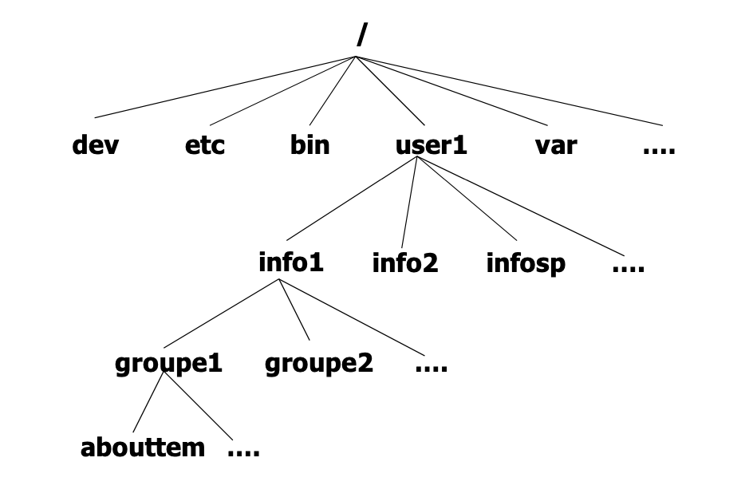

> Dans un système Unix, tout est fichier. Chaque élèment du système d'exploitation est un fichier, une donnée.
>
> On peut donc accéder et modifier chaque élèment de manière simple. 
>
> On parle de ***Système de Gestion de Fichiers (SGF)*** pour définir l'organisation des données dans un système d'exploitation.

### Tout est fichier

Dans un système Unix, on distingue 3 types de fichier : 

- ***Les fichiers ordinaires*** : 
  - *Fichiers de données* : textes ou formats libres et  propriétaires
  - *Fichiers programmes* : instructions exécutables (binaire ou script)

- ***Les répertoires***

- ***Les fichiers spéciaux*** : préiphériques, imprimantes, disques, cd / dvd / blu ray ... etc

Un fichier est désigné par son **nom**, il faut donc ne pas nommer n'importe comment vos fichiers.
De plus, les fichiers systèmes portent tous un nom prédéfini que le système reconnait afin de faciliter son fonctionnement.

-----------------

### Chemin relatif contre chemin absolu

L'accès au fichier se fait par :

- Une référence *absolue*

- Une référence *relative*

Pour mieux comprendre ce que cela signifie, il faut avoir en tête plusieurs choses :

Dans tous les répertoires se trouve :

- le répertoire courant : 

```bash
.
```

- le répertoire père :

```bash
..
```


Le **chemin absolu** représente le chemin complet vers un emplacement depuis ***la racine*** (il débute obligatoirement par ‘ / ’) 

```bash
usr/local/bin/NSI/cours.pdf
```

Au contraire, le chemin relatif démarre du répertoire courant :

```bash
« qcm/nsi_qcm_os.md
../repertoire_pere/toto.pdf »
```

---------------

### Arborescence

Tous ces fichiers sont regroupés dans une ***structure hierarchisée*** représentée sous la forme d' un **arbre** inversé :

L’arbre comprend :

- Les nœuds : les répertoires
- Les feuilles : les fichiers ordinaires ou spéciaux

Le sommet de l'arbre est appelé **racine** (la même qui débute le chemin absolu d'un fichier) aussi appelée **root**.

On peut représenter cette arborescence sous la forme suivante:



À chaque fois que l'on entre dans un répertoire, on descend dans l'arbre.

Le dossier **racine** contient les principaux dossiers d'un système Unix :

- bin (les commandes de bases du système)

- dev (fichiers représentants les différents matériels connextés au système)

- etc (configuration du système)

- home (répertoire d'accueil des utilisateurs et utilisatrices, chacun et chacune possédant le sien)

- lib (contient les librairies utilisées par le système)

- mnt (dossier où l'on "monte" les périphériques usb entre autres...)

- tmp (fichiers temporaires)

- usr (outils et logiciels installés dans le système)

- var (données fréquemment utilisées)

- ...

  

---------------

### Rappel sur les commandes UNIX

- Changement de répertoire : cd
- Affichage du nom du répertoire courant : pwd
- Affichage du contenu du répertoire : ls
- Création d’un répertoire : mkdir
- Suppression d’un répertoire : rmdir
- Renommage/déplacement un répertoire : mv 

***Exemples*** 

Pour changer de répertoire, la syntaxe est : *cd nom_répertoire*

```bash
$ cd /usr/bin $ cd
 $ cd ../etc
 $ cd ..

$ cd ~/nsi
```

Pour déplacer un fichier, la syntaxe est : mv nom_fichier chemin_du_nouveau_repertoire

```bash
mv cours_nsi.pdf cours_pdf/nsi
```

Cela déplacera le fichier *cours_nsi.pdf* du répertoire courant vers le répertoire *cours_pdf/nsi*

Pour renommer un fichier, il suffit de le déplacer au même endroit en changeant le nom de destination:

```bash
mv cours_nsi.pdf toto.pdf
```

Ici, cours_nsi.pdf va être renommé en toto.pdf

---------------

### Droits et permissions

> Il s'agit d'un point très important dans l'aproche de la sécurité d'un système Unix, ainsi que dans sa gestion.

Le système Unix reconnaît 3 (trois) types d'utilisateurs :

- L'utilisateur ou propriétaire
- Le groupe
- Le reste (autres)

Les fichiers sont protégés au moyen d'un code binaire de 9 (neuf) bits :

| Propriétaire | Groupe | Autres |
| ------------ | ------ | ------ |
| 3 bits       | 3 bits | 3 bits |
| r w x        | r w x  | r w x  |

Une lettre indique l'autorisation:

- r pour ***r**ead* - lire
- w pour ***w**rite* - écrite
- x pour *e**X**ecute* - executer

Un tiret indique, quant à lui, l'interdiction.

Les droits d'accès d'un fichier sont décrits par une succession des bits indiqués au dessus dans l'ordre du tableau.

Exemple : Si les droits de mon fichier visé sont 

```bash
r w x r - x r - - 
```

cela signifie que mon fichier est accessible en :

- lecture, écriture et exécution pour le propriétaire
- lecture et exécution pour le groupe
- lecture seule pour les autres

Les droits d'accès concernent aussi les dossiers :

- Lecture  : permet de visualiser le contenu des répertoires
- Écriture : permet d'ajouter de renommer ou de supprimer des élèments
- Exécution : permet d'accéder au contenu (indispensable sinon les deux autres droits ne servent à rien)

Il existe trois principales commandes pour gérer les droits sous un système Unix :

```bash
chmod 
```

change les autorisations d'accès à un fichier ou répertoire

```bash
chown
```

change le ou la propriétaire d'un fichier ou répertoire

```bash
chgrp
```

change le groupe propriétaire

> Auteur : Florian Mathieu
>
> Licence CC BY NC
>
> <a rel="license" href="http://creativecommons.org/licenses/by-nc-sa/4.0/"></a> <br />Ce cours est mis à disposition selon les termes de la <a rel="license" href="http://creativecommons.org/licenses/by-nc-sa/4.0/">Licence Creative Commons Attribution - Pas d’Utilisation Commerciale - Partage dans les Mêmes Conditions 4.0 International</a>.