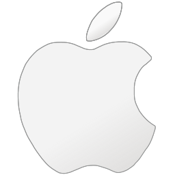
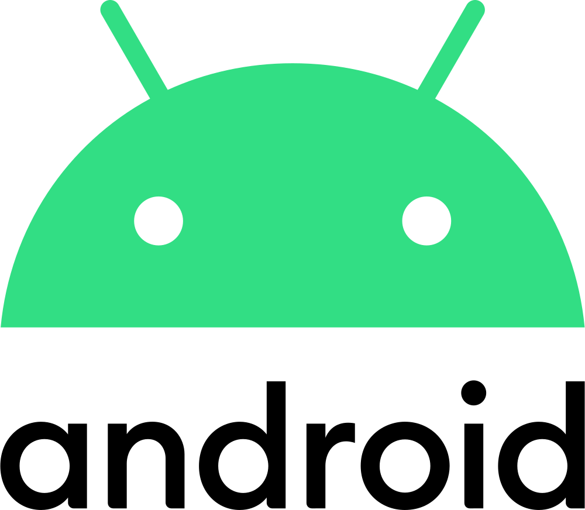

## Les Systèmes D'exploitation

> Dans ce chapitre, nous allons découvrir les grandes familles de systèmes d'exploitation et devenir capable de les classer, tout en acquérant une vie d'ensemble sur leur histoire.

### Le programme

-----------

### Qu'est ce qu'un système d'exploitation ?

Un système d'exploitation est perçu comme un ensemble de programmes constituant une interface entre le matériel et la personne qui utilise la machine.

Il a deux objectifs :

- fournir une machine virtuelle au dessus du matériel
- partager et gérer des ressources de plus en plus complexes

Le système d'exploitation relie la machine composée d'éléments physiques comme le processeur, la mémoire, avec l'utilisateur - utilisatrice souhaitant effectuer des calculs (car tout n'est que calcul !)

Sans le contrôle de l'OS, les utilisateurs pourraient détruire irrémédiablement certaines données, voir détruire certains périphériques en programmant des opération illicites.

Il permet donc de gérer :

- les fichiers
- la mémoire
- les applications
- les entrées/sorties (avec les pilotes)

----------------

### Types de systèmes d'exploitation

On distingue trois grandes familles de systèmes d'exploitation aujourd'hui :

- Lesquelles à votre avis ?
- Quel(s) systèmes utilisez vous ? Pour quel usage ?

---------------

### Libre ou propriétaire ?

#### Le libre :

D'après [wikipedia](https://fr.wikipedia.org/wiki/Liste_de_syst%C3%A8mes_d'exploitation_libres) :

> Un logiciel libre est, selon la définition de la *[Free Software Foundation](https://fr.wikipedia.org/wiki/Free_Software_Foundation)*, un programme qui accorde 4 libertés essentielles à l'utilisateur : 
>
> - liberté d'exécuter le programme pour n'importe quel usage
>
> - liberté de le modifier 
>
> - liberté de redistribuer des copies du programme  
>
> - liberté de distribuer des versions modifiées. 
>
>   
>
>   Un système d'exploitation libre est donc un système d'exploitation composé de logiciels libres.
>
>   La *Free Software Foundation* tient une liste de systèmes libres, la présence dans cette liste nécessitant de respecter des conditions strictes : le système ne doit contenir aucun programme propriétaire, et ne doit pas inciter à en installer.

- Connaissez vous des logiciels et systèmes libres ?

- Lesquels ?

Dans le cadre du cours, nous étudierons et utiliserons un système libre : [Ubuntu](https://www.ubuntu-fr.org), la plus célèbre et facile d'utilisation des distributions linux.

[Activité_linux](tp_linux.ipynb)

En 1991, [Linus Torvald](https://fr.wikipedia.org/wiki/Linus_Torvalds) étudiant de 21 ans, crée le noyau Linux, permettant de développer des systèmes d'exploitation libres et open sources. Le nom Linux provient du prénom de son créateur et de la référence aux systèmes [Unix](https://fr.wikipedia.org/wiki/Unix), famille d'OS crée dans les années 70.

> Tux, la mascotte du noyau Linux, crée par Larry Ewing, développeur du logiciel GIMP.

Parallèlement, [Richard Stallman](https://fr.wikipedia.org/wiki/Richard_Stallman) développe [GNU](https://www.gnu.org/home.fr.html) un système d'exploitation qui, couplé au noyau linux, permet de n'utiliser que des logiciels libres. On parle alors de système ***GNU/Linux***.

> Logo du système GNU

De facto, il existe une multitude de systèmes GNU/Linux puisque n'importe qui peut faire sa propre version !

-----------

#### Le propriétaire

Contrairement aux systèmes libres, les systèmes et logiciels dits propriétaires limitent ou interdisent la reproduction, la modification ainsi que le partage du code original. Ces logiciels et systèmes sont souvent fournis sous la forme de fichiers binaires interdits d'ouvrir.

Par ailleurs, les logiciels propriétaires sont parfois payants mais ça n'est pas forcément le cas pour tous.

[Microsoft](https://fr.wikipedia.org/wiki/Microsoft), créée par Bill Gates et Paul Allen en 1975, célèbre pour son système d'exploitation Windows, système d'exploitation le plus utilisé au monde sur les ordinateurs grand public grâce à sa politique commerciale et son lobbying intensif (parfois même au sein des gouvernements mondiaux.)

> timeline des systèmes Microsoft

[Apple](https://fr.wikipedia.org/wiki/Apple) et MacOs, créée le 1er avril 1976 dans le garage de la maison d'enfance de Steve Jobs par [Steve Jobs](https://fr.wikipedia.org/wiki/Steve_Jobs), [Steve Wozniak](https://fr.wikipedia.org/wiki/Steve_Wozniak) et [Ronald Wayne](https://fr.wikipedia.org/wiki/Ronald_Wayne). 

Le système macOS, utilisable sur machine Apple, est une système Unix propriétaire.

> timeline des systèmes macOS

En résumé :

En plus de l'activité que nous alllons mener en cours, vous avez la possibilité de tester :

- [Windows 2000](https://bellard.org/jslinux/vm.html?url=win2k.cfg&mem=192&graphic=1&w=1024&h=768)
- [Linux en mode graphique](https://bellard.org/jslinux/vm.html?url=alpine-x86-xwin.cfg&mem=256&graphic=1)
- [Linux en mode console](https://bellard.org/jslinux/vm.html?url=alpine-x86.cfg&mem=192)
- [MacOS7](https://system7.app)
- [MacOS8](https://macos8.app)

Je vous invite vivement à aller explorer, tester, essayer ces systèmes.

---------

### Sources

- [Wikipedia](https://fr.wikipedia.org/wiki/Liste_de_syst%C3%A8mes_d'exploitation_libres#:~:text=Un%20logiciel%20libre%20est,%20selon,de%20distribuer%20des%20versions%20modifi%C3%A9es)

- [Free Software Foundation](https://www.fsf.org)

- Images (Wikipédia domaine public et CC BY SA 

  - Rôle d'un système d'exploitation https://commons.wikimedia.org/wiki/File:Role_of_an_Operating_System.svg
  - Icone Apple https://commons.wikimedia.org/wiki/File:Icon-Mac.svg

  - Icone Windows https://commons.wikimedia.org/wiki/File:Windows_logo_and_wordmark_-_2021.svg
  - Icone GNU/Tux https://commons.wikimedia.org/wiki/File:GNU_and_Tux.svg
  - Icone iOS https://upload.wikimedia.org/wikipedia/commons/6/63/IOS_wordmark_(2017).svg
  - Icone Android https://commons.wikimedia.org/wiki/File:Android_logo_2019_(stacked).svg

  - Timeline Windows "[File:Microsoft timeline of operating systems 2.png](https://commons.wikimedia.org/w/index.php?curid=46634740)" by [Paulire](https://commons.wikimedia.org/w/index.php?title=User:Paulire&action=edit&redlink=1) is marked with [CC BY-SA 4.0](https://creativecommons.org/licenses/by-sa/4.0/?ref=openverse).
  - Timeline MacOs https://fr.wikipedia.org/wiki/Mac_OS_Classic

  >  Auteur : Florian Mathieu
  >
  > Licence CC BY NC
  >
  >    Ce cours est mis à disposition selon les termes de la <a rel="license" href="http://creativecommons.org/licenses/by-nc-sa/4.0/">Licence Creative Commons Attribution - Pas d’Utilisation Commerciale - Partage dans les Mêmes Conditions 4.0 International</a>.

