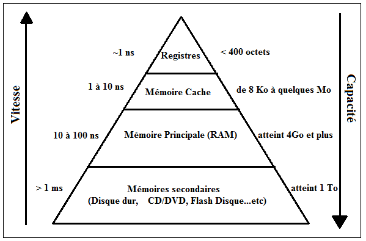

## Mémoire 

>  L'ordinateur effectue des calculs à partir d'instructions simples en binaires, stockées dans des cases mémoires.

### Types de mémoire

Il existe différentes mémoires dans une machine qui diffèrent selon : 

- **Coût** (plus une mémoire est efficace, plus est est chère)

- **Vitesse ou rapidité d'accès** (temps d'accès au données stockées)

- **Durabilité** (volatiles ou permanentes)

  - Mémoire vive (volatile) : le contenu est effacé une fois le programme terminé ou la machine éteinte - RAM -
  - Mémoire dure (permanente) : permet de stocker durablement des données. - HDD, SSD, Disques Magnétiques -

- **Capacité** ( exprimées en octets)

- **Mode d'accès** (Adresses ou ordre de rangement)

  

  On a donc dans l'ordre :

  - ***Les registres*** 

  Il s'agit d'un emplacement mémoire interne au processeur qui permet de stocker des opérandes et des résultats intermédiaires lors des opérations effectuées dans l'UAL (Unité Arithmétique & Logique) et d'accéder très rapidement à son contenu.

  Le type de registre varie selon le modèle de processeur, aujourd'hui la plupart des machines disposent d'un registre de taille 64 bits.

  

  - ***La mémoire cache*** 

  Aussi appelée mémoire tampon, elle est très rapide et permet de réduire le temps d'attente pour l'accès à la ***mémoire centrale***.

  En effet, la différence de vitesse entre le processeur (très rapide) et la mémoire centrale (plus lente) necessite un intermédiaire.

  Celle ci contient souvent les données et instructions en cours d'utilisation : il y a de fortes probabilités que celles-ci soient à nouveau utilisées prochainement.

  > Ce type de mémoire est souvent de type RAM statique (SRAM), plus rapide mais plus chère que la RAM de base.

- La mémoire centrale

Mémoire vive qui contient les programmes en cours d'exécution ainsi que les données qu'ils manipulent. De taille très importante (de l'ordre du giga aujourd'hui), elle est organisée en cellules qui contiennent chacune une donnée ou instruction représentée par un entier : c'est ce qu'on appelle ***adresse mémoire***

Le temps d'accès est le même, peu importe la cellule : on parle alors de ***RAM*** pour Random Acess Memory

----------

Auteur : Florian Mathieu

Licence CC BY NC

  Ce cours est mis à disposition selon les termes de la <a rel="license" href="http://creativecommons.org/licenses/by-nc-sa/4.0/">Licence Creative Commons Attribution - Pas d’Utilisation Commerciale - Partage dans les Mêmes Conditions 4.0 International</a>.

