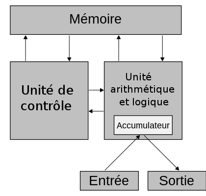
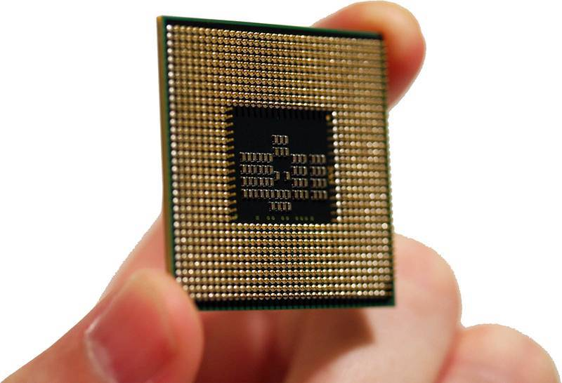
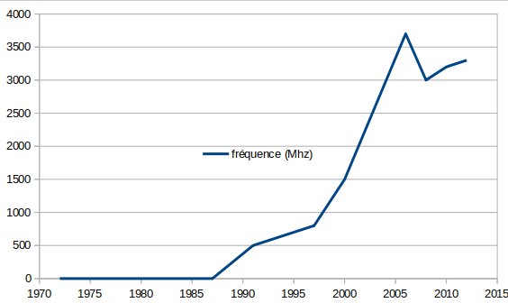

## Architecture Von Neumann

### Avant la calculatrice...le calculateur !

Comme vu précédemment, l'informatique est avant tout une histoire de calcul et de ...philosophie !

Avant d'en arriver aux ordinateurs que nous utilisons quotidiennement, la technologie aura bien évoluée :

De la machine analytique de Charles Babbage à la machine de Turing, pourquoi l'informatique a t-elle évoluée ?

Après la machine de Babbage, [Alan Turing](https://fr.wikipedia.org/wiki/Alan_Turing) a probablement permis la plus grande avancée :

Il s'agit d'une machine virtuelle qu'on l'appelle [machine de Turing](https://fr.wikipedia.org/wiki/Machine_de_Turing).

-----

Le vrai problème de cette machine de Turing est qu'elle ne peut faire qu'une chose : calculer. Il faut une machine entièrement dédiée pour effectuer ces calculs.

Turing imagine alors écrire sur le ruban la procédure à suivre : c'est le début de la **virtualisation** : les programmes deviennent des données comme les autres et une unique machine peut devenir **universelle** et réaliser n'importe quel calcul.

En 1945, **[Von Neumann](https://fr.wikipedia.org/wiki/John_von_Neumann)**,  invente un modèle qui définit un schéma d'ordinateur que l'on utilie toujours aujourd'hui :  une structure de stockage unique pour conserver à la fois  les instructions et les données demandées ou produites par le calcul. 

> Avec l'arrivée des odinateurs quantiques, ce modèle est probablement voué à disparaître prochainement.

L’**architecture de Van Neumann** décompose l’ordinateur en 4 parties distinctes :

- l’**[unité arithmétique et logique](https://fr.wikipedia.org/wiki/Unité_arithmétique_et_logique)** ou unité de traitement : son rôle est d’effectuer les opérations de base.
- l’**[unité de contrôle](https://fr.wikipedia.org/wiki/Unité_de_contrôle)**, chargée du « séquençage » des opérations.

Ces deux premières parties sont intégrées dans ce qu'on appelle le CPU ( Central Process Unit) ou [Processeur](https://fr.wikipedia.org/wiki/Processeur)

- la **[mémoire](https://fr.wikipedia.org/wiki/Mémoire_(informatique))** où sont stockées les données et programmes.
- les dispositifs d’**[entrée-sortie](https://fr.wikipedia.org/wiki/Entrées-sorties)**, pour échanger avec le monde extérieur.

On peut également citer les [bus](https://fr.wikipedia.org/wiki/Bus_informatique) qui sont chargés de conduire des impulsions électriques entre les différents composants.

 Le processeur contient l'unité arithmétique et logique, l'unité de contrôle mais aussi une petite partie de mémoire, appelée **registre** :  il s'agit de la mémoire la plus rapide d'un ordinateur.

---------

### Spécificités

Les échanges entre la mémoire et les registres du processeur se font via des bus selon une chronologie décidée par l'horloge et suivant le type d'échange.

Tous les programmes sont enregistrés dans la mémoire désormais.

L'adresse d'une instruction (représentée par un nombre entier) en cours de traitement est stockée dans une mémoire interne au processeur.

La valeur de cette instruction est également stockée dans une autre mémoire interne.

Enfin, le CPU stock les données d'un programme avant son utilisation dans un *banc de registre* .

---------

### Le processeur

L'univté arithmétique effectue des opérations *arithmétiques* telles que :

- additions
- opérations
- logiques

Ces opérations sont transmises en langage binaire et donc incompréhensibles pour nous. Néanmoins, il existe un langage dit ***assembleur*** qui permet, à l'aide d'outils tels que des [compilateurs](https://fr.wikipedia.org/wiki/Compilateur)  de traduire le code d'un langage de haut niveau en langage compréhensible pour un microprocesseur et inversement.

 Le CPU dispose d'une horloge qui cadence l'accomplissement des instructions : on utilise l'unité de mesure ***cycle*** pour mesurer le nombres d'instructions à la seconde.

La fréquence d'un processeur correspond donc au nombre de cycles que celui-ci peut réaliser par seconde.

> Nos processeurs actuels sont cadencés à plusieurs GHz : plusieurs milliards de cycles d'horloges par seconde.

Jusqu'à 2005, la fréquence des processeurs évoluait de manière continuelle. Depuis, c'est plus compliquée : la chaleur produite par les puces devenait trop importante et perturbait la lecture des tensions. Il a donc fallu passer par l'augmentation des coeurs dans le processeur.

> Un cycle représente cinq actions :
>
> - Lire l'instruction (LI)
> - Décoder l'instruction (DI)
> - Executer l'opération (EX)
> - Accéder à la mémoire (M)
> - Écrire le résultat dans les registres (ER)

Enfin, le processeur n'execute pas les instructions de manière séquentielle : il le fait simultanément pour différentes instructions qui sont à différentes étapes de leur traitement : on appelle ce principe *pipeline d'instructions*

| 1    | 2    | 3    | 4    | 5    | 6    | 7    | 8    | 9    |
| ---- | ---- | ---- | ---- | ---- | ---- | ---- | ---- | ---- |
| LI   | DI   | EX   | M    | ER   |      |      |      |      |
|      | LI   | DI   | EX   | M    | ER   |      |      |      |
|      |      | LI   | DI   | EX   | M    | ER   |      |      |
|      |      |      | LI   | DI   | EX   | M    | ER   |      |
|      |      |      |      | LI   | DI   | EX   | M    | ER   |

Dans ce tableau, nous avons cinq instructions : il nous faudrait vingt-cinq (25) cycles en théorie.

Ici, il ne nous en faut que neuf (9).

### Pour la culture ...

- Les constructeurs de processeurs avaient deux méthodes simples pour augmenter les performances :
  - Reduire la taille des composants (Entre 10 et 5 nanomètres aujourd'hui)
  - Augmenter la fréquence d'horloge
-  Le constructeurs font en sorte de s'aligner sur ce qu'on appelle la **[loi de Moore](https://fr.wikipedia.org/wiki/Loi_de_Moore)** pendant très longtemps : le nombre de transistors présents sur un processeur ne fait que doubler chaque année depuis 1975. 
-  Limite physique : on ne peut plus réduire les composants car des problèmes physiques sont apparus.

- L'augmentation des fréquences entraine une augmentation de la consommation électrique : une augmentation par deux des performances multiplie la consommation par...huit (8) !!
  - Quels problèmes cela pose t-il ?

Pour poursuivre la course à la performance il faut donc trouvez d'autres solutions :

- Les microprocesseurs actuels embarquent plusieurs *coeurs*, c'est à dire plusieurs processeurs dans le processeurs.
  - En réalité, le gain n'est obtenu que pour les applications spécifiquement programmé pour utilisés cette architecture et travailler en *parallèle* 
- D'autres architectures apparaissent également, même si elles ne sont pas encore tout à fait au point, du moins pour le grand public :
  - l'[ordinateur quantique](https://fr.wikipedia.org/wiki/Calculateur_quantique) que les scientifiques étudient depuis les années 1990 et qui fait des progrès impressionnant depuis quelques années.
  - moins connu, l'[ordinateur ADN](https://fr.wikipedia.org/wiki/Ordinateur_à_ADN), un ordinateur non non électronique actuellement explorées pour résoudre des problèmes combinatoires.

--------

Sources :

- [Wikipedia](https://fr.wikipedia.org/wiki/Wikip%C3%A9dia:Accueil_principal)
- [Christophe Mieszczak](https://framagit.org/tofmzk/informatique_git/-/blob/master/premiere_nsi/architecture/microprocesseurs/architecture_van_neuman.md)
- [France Culture](https://www.franceculture.fr/emissions/la-question-du-jour/a-quoi-sert-un-ordinateur-quantique)
- [INRIA](https://www.inria.fr/fr/comment-fonctionne-un-ordinateur-quantique)
- Manuel de spécialité NSI, éditions Hatier

