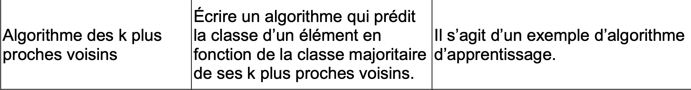
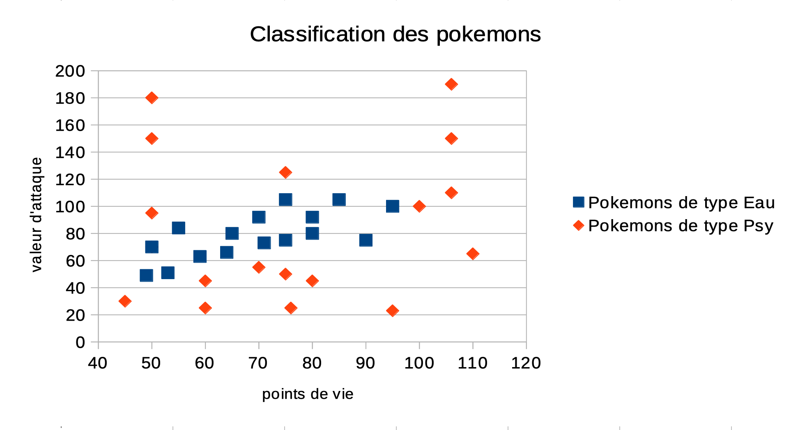
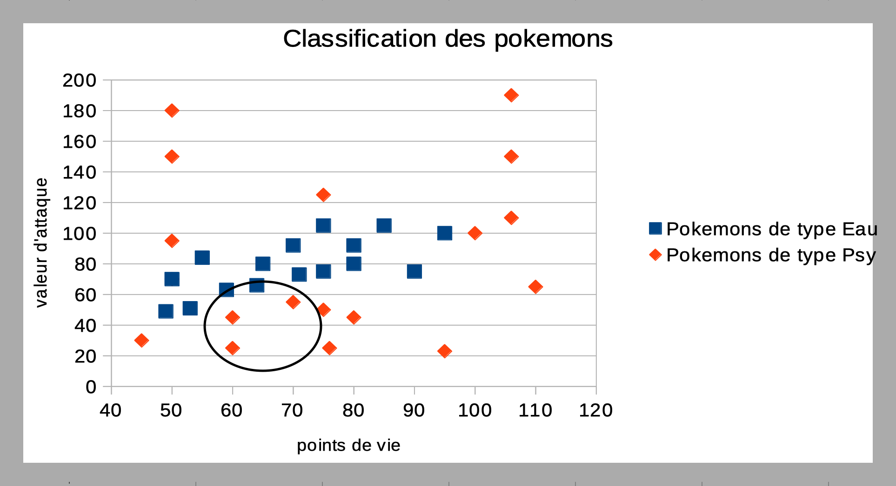

> Dans le domaine de l'apprentissage automatique des machines "Machine Learning", l'algorithme des k plus proches voisins est l'un des plus utilisé.

### Le programme

------

### Exemple de Problème de classification

L'algorithme des *k plus proches voisins* permet de résoudre certains problème, notamment ceux qui proposent de classer des données et élèments.

Par exemple, le Professeur Chen, inventeur du Pokédex, utilise cet algorithme afin que son appereil puisse prédire quel pokémon se trouve devant lui.

Pour simplifier, imaginons que les Pokemons ne possèdent que deux caractéristiques : leurs points de vie et leur valeur d'attaque. On peut prendre deux types pour commencer.

| Nom           | Écayon | Deoxys | Éoko | Groret | Taraud |
| ------------- | ------ | ------ | ---- | ------ | ------ |
| Points de vie | 49     | 50     | 80   | 90     | 90     |
| Attaque       | 49     | 95     | 45   | 75     | 75     |
| Type          | Eau    | Psy    | Psy  | Psy    | Eau    |

------------

- Nous pouvons utiliser cet échantillon afin de prédire la classification d'un Pokémon mystère, selon ses points de vie et sa valeur d'attaque.

------------

### Prédiction

À partir des données du diagramme, on veut prédire la classe d'un pokémon ayant 65 points de vie et 40 en attaque.

Il devrait donc se trouver dans zone. On peut alors trouver ses cinq ou six plus proches voisins.

- Parmi ces voisins se trouvent deux Pokémons de type Eau, et trois de types Psy.
- Le Pokémon mystère sera donc probablement de type Psy !

### Formulation de l'algorithme

--------------

Auteur : Florian Mathieu

Licence CC BY NC

  Ce cours est mis à disposition selon les termes de la <a rel="license" href="http://creativecommons.org/licenses/by-nc-sa/4.0/">Licence Creative Commons Attribution - Pas d’Utilisation Commerciale - Partage dans les Mêmes Conditions 4.0 International</a>.

