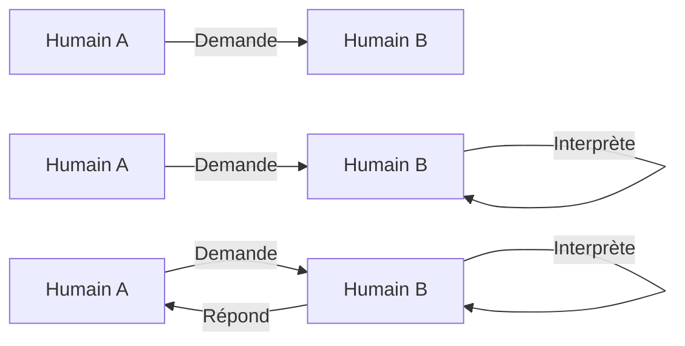
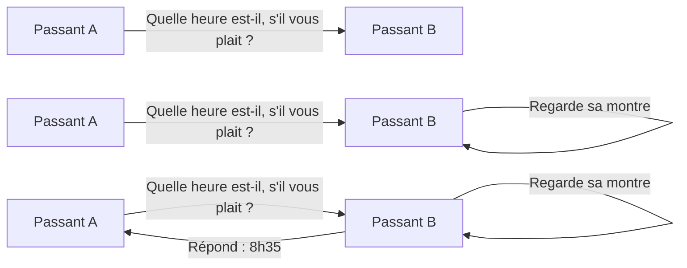
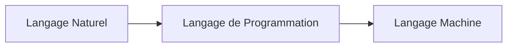
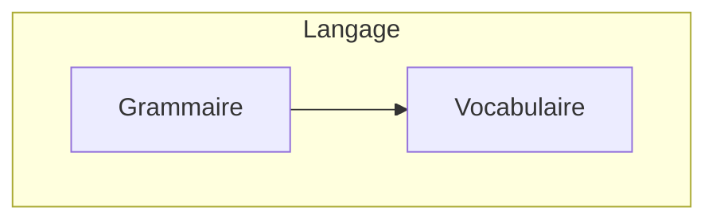
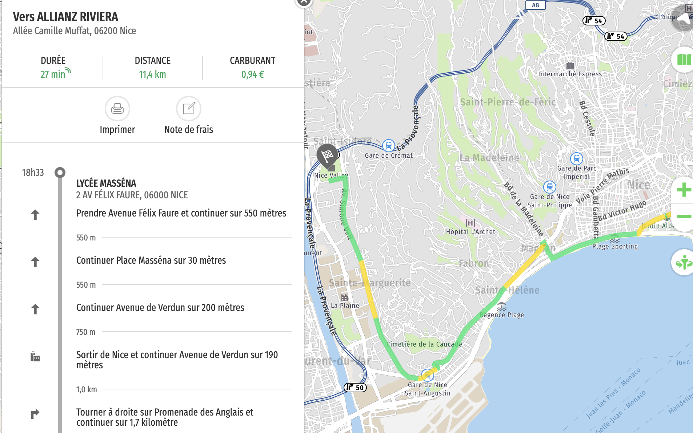
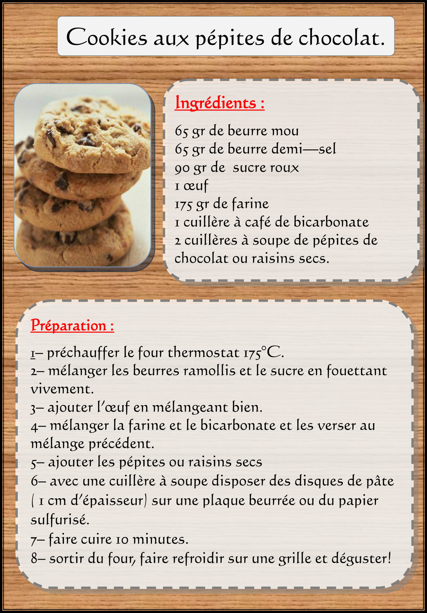

# Programmation - Généralités

📺 Pourquoi programme-t-on ? ([Vidéo](https://www.youtube.com/watch?v=7b3QupZc08Y&ab_channel=Lumni))

## Objectifs

Les objectifs de la séquence Langages et Programmation est de se questionner et répondre aux interrogations suivantes :

- Qu'est-ce qu'un __langage de programmation__ ?  
- __Pourquoi a-t-on besoin__ d'un langage de programmation ?
- Qu'est-ce que __programmer__ ? 
- __Comment__ programme-t-on ?

## Définition

> __Langage__ (Selon le Larousse) : Capacité, observée chez tous les humains, d'exprimer leur pensée et de communiquer au moyen d'un système de signes vocaux et éventuellement graphiques.

- Le langage est un système permettant la communication entre 2 entités, 2 humains :



Exemple :



- Le langage est propre à une communauté. Un __langage naturel__, ou langage ordinaire, est une langue « normale » parlée par un être humain (Exemple : le Français, l'anglais...)
- Le __langage machine__ : directement interprétables par le processeur d'un ordinateur, mais peu lisibles aux yeux d'un humain,
- Le __langage de programmation__ :  Compréhensible par un humain et aisément traduisible en langage machine.

> Un __langage de programmation__ est un langage proche du langage naturel, utilisable par un humain, et exécutable, après traduction par une machine.

___Sans langage de programmation, un humain devrait connaitre et commander la machine en maitrisant son langage, donc écrire des 0 et des 1.___



### Constituants d'un langage

Tout langage est constitué de 2 ensembles :



> __Vocabulaire__ : Ensemble des mots ou vocables d'une langue

Exemples : 

- heure, quelle, table...
- rehue, llequ, betal...

> __Grammaire__ (Selon le Larousse) : Ensemble des structures linguistiques propres à telle ou telle langue. Autrement dit, la grammaire indique l'ordre et les règles de structures du vocabulaire

Exemples : 

- Quelle heure est-il ?
- Il ? heure est quelle

## ...Mais avant de programmer

> Quelles sont les similitudes et différences entre ces 3 activités

| Itinéraire Mappy | Recette de cuisine | Montage de meuble IKEA |
| :--: | :--: | :--: |
|  |  |  |

> __Algorithme__ (Selon Le Robert) : Ensemble fini des règles opératoires propres à un calcul. Ce terme vient d'__Al-Khwarizmi__, mathématicien du 9ème siècle.


Source : Wikipedia

> Autrement dit, un __algorithme__ est une suite finie d'instructions exprimées en __langage naturel__.

Un __programme__ est l'_implantation_ d'un algorithme dans un __langage de programmation__.

> __Programmer__ (Selon le Larousse) : Établir à l'avance une suite d'opérations ; planifier, déterminer à l'avance le moment et les modalités d'une action.


Exemple : _Le calcul de l'hypoténuse dans un triangle rectangle_

__Algorithme__ : Dans un triangle rectangle, le carré de la longueur de l’hypoténuse est égal à la somme des carrés des longueurs des deux autres côtés.

__Implantation en Java__ :

```java
class Hypotenuse 
{
public static void main(String[] args) 
    {
        double adjacent=4, oppose=3, hypotenuse;          
        hypotenuse= Math.sqrt((adjacent*adjacent)+(oppose*oppose));
        System.out.println("La longueur de l'hypotenuse est : " + hypotenuse);
    }
}
```

__Implantation en Python__ :

```python
import math

adjacent = 4
opposite = 3
hypotenuse = math.sqrt(adjacent**2 + opposite**2)
print("La longueur de l'hypotenuse est :", hypotenuse)
```


## Langage de Programmation au lycée

Au collège, vous avez déjà programmé mais en utilisant un langage de programmation par blocs : __Scratch__. Ce type de langage est très utile pour apprendre les bases de l’algorithmique et de la programmation mais ne constitue pas un langage utilisé pour programmer réellement. Pour cela, on utilise des langages dits textuels qui nécessitent d’écrire tout le code avec son clavier.

Au lycée, vous allez apprendre l’un de ces langages : le langage __Python__. Vous l’utiliserez dans différentes disciplines : Mathématiques, SNT, Physique-Chimie, spécialité NSI notamment.
