# Programmation Python

## Présentation

Ce chapitre a pour objectif de répondre aux questions suivantes : 

- Qu'est-ce que __programmer__ ?
- Qu'est que __Python__ ?
- Comment programmer en Python ?

## Progression

```mermaid
flowchart LR;
    A[1. Généralités]-->B[2. Prise en main de Python];
    B-->C[3. Les variables];
    C-->D[4. Les instructions conditionnelles];
    D-->E[5. Les boucles];
    E-->F[6. Les fonctions];
    
    click A "./programmation/GENERALITES.md" "Lien vers 1. Généralités" _self
    click B "./programmation/NOTEBOOK.ipynb" "Lien vers 2. Prise en main de Python" _self
    click C "./programmation/chapitre_1/" "Lien vers 3. Les variables" _self
    click D "./programmation/chapitre_2/" "Lien vers 4. Les instructions conditionnelles" _self
    click E "./programmation/chapitre_3/" "Lien vers 5. Les boucles" _self
    click F "./programmation/chapitre_4/" "Lien vers 6. Les fonctions" _self
```

## Attendus du Programme

| Contenus                                                     | Capacités attendues                                          |
| ------------------------------------------------------------ | ------------------------------------------------------------ |
| Constructions élémentaires | Mettre en évidence un corpus de constructions élémentaires. Séquences, affectation, conditionnelles, boucles bornées, boucles non bornées, appels de fonction. |
| Diversité et unité des langages de programmation | Repérer, dans un nouveau langage de programmation, les traits communs et les traits particuliers à ce langage. |
| Spécification | Prototyper une fonction. Décrire les préconditions sur les arguments. Décrire des postconditions sur les résultats.|
| Mise au point de programmes | Utiliser des jeux de tests. |
| Utilisation de bibliothèques | Utiliser la documentation d’une bibliothèque. |
