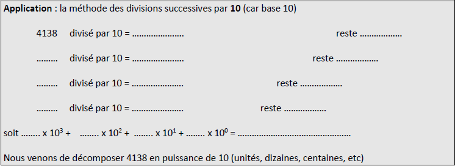
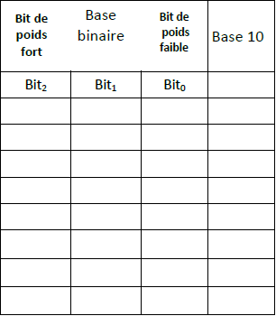
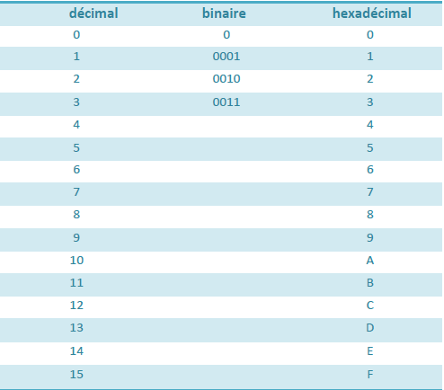

# <span style="color:orange">Représentation des entiers naturels </span>

> **_Contenu_** : Notions introduites pour l’écriture en base 2, en base 16 ainsi que la notion de boulisme. <br>
> **_Compétences_** : Maitriser le codage d’une information et les différentes représentations de celle-ci

## Le programme 

<br>


## <span style="color:blue"> Apport de connaissances </span>

Pour que vous compreniez le fonctionnement du binaire, et des systèmes de comptage en général (plus communément appelés bases), je vais commencer par faire une petite réintroduction à la base 10 que vous connaissez tous et toutes. <p>

<p>
  En effet, tout le monde sait compter en base 10 (décimal). Mais comment ça marche ? Comment est construit notre système ? Pour répondre à cette question à l'apparence simple, oubliez tout et reprenons depuis le début : comment avez-vous appris à compter à l'école ?

### <span style="color: green" > La numération décimale (base 10) </span>

Dans la vie courante et dans beaucoup de domaines, nous utilisons la numération décimale. Elle repose à l’origine sur nos dix doigts : les dix symboles – chiffres – permettent de représenter tous les nombres.
<br>
La position des chiffres est primordiale dans cette représentation (numération de position) : il y a quelques années déjà, vous avez appris ce qu’étaient les unités (colonne de droite), les dizaines, les centaines, etc…

Bref, il y a 10 chiffres : 0, 1, 2, 3, 4, 5, 6, 7, 8, 9. Avec ces derniers, on peut compter jusqu'à 9. Et si l'on veut aller au-delà de 9, il faut changer de rang. Le nombre en est ainsi décomposé. <br>

Ainsi, on peut écrire 4138 comme 4 * 1000 + 1 * 100 + 3 * 10 + 8 * 1
→ On remarque les égalités suivantes : 1000 = 10<sup>3</sup> ; 100 = 10² ; 10 = 10<sup>1</sup> ; 1 = 10<sup>0</sup>

Donc 4138 peut s’écrire : 4 * 10<sup>3</sup> + 1 * 10<sup>2</sup> + 3 * 10<sup>1</sup> + 8 * 10<sup>0</sup> <br>
→où 10 est appelé BASE de cette numération (ici décimale)<br>
→où chaque chiffre (compris entre 0 et 9) est soit celui des unités, dizaines, etc…



✏ *Un nombre est égal à la somme des valeurs de ses rangs, et on peut décomposer n'importe quel nombre en
puissance de sa base.* ✏

### <span style="color: green" > Le codage binaire (base 10) </span>

Je vous ai parlé ci-dessus de rangs. <br>En binaire, c'est pareil à la différence qu'on utilise le terme bit, qui est la
contraction de **_binary digit_**, littéralement **_chiffre binaire_**. <br>Un bit a deux états stables.
En électronique, il est facile d'obtenir un système présentant deux états stables distincts. Prenons l'exemple
d'un interrupteur


Ainsi, pour coder une information qui peut ne prendre que deux états stables, la numération binaire est la
plus adaptée.
<br>
**Remarque** : étant donné que les symboles 0 et 1 sont communs à beaucoup de bases de numération (en
l’occurrence 2 et 10), nous adoptons les notations suivantes.

(1011)<sub>b</sub> ou 1011(en base 2) ou encore (1011)<sub>2</sub> pour la base binaire <br>
(101)<sub>d</sub> ou 101(en base 10) ou encore (101)<sub>10</sub> pour la base dix

#### <span style="color:blue">Comment trouver la représentation en base deux d'un entier naturel donné en base dix </span>

→ Méthode des divisions successives <br>
Exemple: (11)<sub>d</sub> = (?)<sub>b</sub>


(11)<sub>d</sub> => (1011)<sub>b</sub>

<br>


✏ <span style ="color:purple"> Comment représenter des informations complexes ? </span> ✏

<li>Avec 1 bit, nous pouvons coder 2 informations.
<li>Avec 2 bits, nous pouvons coder 4 informations différentes (2²)

Si nous généralisons un peu : avec **_k_** bits, nous pouvons coder **_2<sup>k</sup>_** informations différentes

### À faire vous-même 

Compléter le tableau suivant afin de coder les 8 premiers entiers naturels (entiers positifs ou nul)



### À faire vous-même 

1. Convertir 42(10) en base 2 : 101010 
2. Convertir 104(10) en base 2 : 1101000

<br>

### <span style="color:violet"> Qu'est-ce qu'un octet ? </span>

Un octet ((**byte** en anglais) est un regroupement de 8 bits.
On parle aussi de mot. Il permet de coder 2<sup>8</sup> = 256 mots différents.
Si nous codons des entiers naturels, nous coderons les nombres 0 à 255. Dans la littérature, un regroupement de 4 bits est appelé un quartet (cela nous servira plus tard).


### <span style="color:violet">Unités de mesure</span>

Il est très courant en informatique de mesurer la capacité mémoire d'un disque dur, de la RAM d'un ordinateur ou d'un débit de données Internet avec une unité de mesure exprimée comme un multiple d'octets. Ces multiples sont traditionnellement des puissances de 10 et on utilise les préfixes "kilo", " méga", etc. pour les nommer. Le tableau ci-dessous donne les principaux multiples utilisés dans la vie courante.

| Nom              | Symbole            | Valeur |
| :--------------- |:---------------:   | -----:|
| Kilooctet  |   ko                     |  10<sup>3</sup> octets |
| Mégaoctet  |   Mo                     |  10<sup>3</sup> ko |
| Gigaoctet  |   Go                     |  10<sup>3</sup> Mo |
| Teraoctet  |   To                     |  10<sup>3</sup> Go |

> Remarque : Historiquement, les multiples utilisés en informatique étaient des puissances de 2. Pour ne pas confondre l'ancienne et la nouvelle notation, on utilise des symboles différents pour représenter ces multiples.

| Nom              | valeur            | Nombre d'octeets |
| :--------------- |:---------------:   | -----:|
| Kio  |   2<sup>10</sup> octets                 |  1024 |
| Mio  |   2<sup>10</sup>Kio                     |1048576|
| Gio  |   2<sup>10</sup>Mio                     |1073741824|
| Tio  |   2<sup>10</sup>Gio                     |1099511627776| 

### À faire vous-même 

> Faisons la conversion de la base 2 vers la base 10 --> Passer de (0 1 1 0 1 1 0 1)<sub>b</sub> = (….......)<sub>d</sub>

Méthode : 
<li>Ecrire le nombre binaire dans le tableau de correspondance <br>
<li>Faire la somme des valeurs des rangs pour lesquels la valeur du bit vaut 1.


Somme : ............

----------------------------

### <span style="color: green" > Le système hexadécimal (base 10) </span>

<p>
      La représentation en binaire n'est pas pratique à nous humain pour travailler (longueur de l'information importante, difficile à écrire et à lire sans faire d'erreur...).
    <p>
        Pour cela, nous travaillons avec la base hexadécimale. Le système hexadécimal permet de réduire la longueur des mots et facilite leur manipulation :
L'écriture d'un nombre binaire en base hexadécimale est aisée.
 

Ce système comporte seize symboles :
- les dix chiffres du système décimal (0 à 9)
- et les six premières lettres de l’alphabet (A à F) <br>
<br>
Ce sera donc un système en **base 16**.

✏ Pour l'ordinateur, ça ne change rien, il travaille toujours en binaire. ✏

### À faire vous-même

> Compléter la colonne binaire



> Passer de la base décimale à la base hexadécimale <br> Écrire le nombre 63650 (10) en base 16


> Faisons la conversion de la base 16 vers la base 10, écrire le nombre 2A3 (16) en base décimale

Méthode : 
<li>Ecrire le nombre hexadécimal dans le tableau de correspondance en positionnant le chiffre correspondant à chacun des rangs.
<li> Faire la somme des produits des chiffres avec la pondération correspondante.


> Passer du code binaire au code hexadécimal

**_Première méthode_** : opérer en deux étapes.
<li> passer du binaire au décimal dans un premier temps
<li> passer ensuite du décimal à l’hexadécimal <br>
    
Exemple : vérifier que 10110111101 (2) = 1469 (10) = 5BD


**_Deuxième méthode_** : plus rapide, elle consiste à découper le nombre binaire en quartets (mots de 4 bits), à partir de la droite, puis à remplacer chaque quartet par le symbole hexadécimal correspondant.

Exemple : 10110111101 (2) = 101 1011 1101 en binaire découpé en quartet 
                          =  5   B    D   en hexadécimal

------------------------------------

### <span style = "color:green">Passer d'une base quelconque à une autre </span>

Pour passer d'une base à une autre, on passera par la base 10 car c'est sur cette base qu'on maîtrise le mieux les opérations de base.

Exemple : (944)<sub>10</sub> → ( 12234)<sub>5</sub>


-------------------------

### <span style ="color:orange"> Le boutisme </span>

La représentation des entiers naturels sur des mots de 2, 4 ou 8 octets se heurte au problème de l'ordre dans lequel ces octets sont organisés en mémoire. Ce problème est appelé le boutisme (ou endianness en anglais).

Prenons l'exemple d'un mot de 2 octets (16 bits) comme 5BC9. Il y a deux organisations possibles d'un tel mot en mémoire :

<li> Le gros boutisme (ou ou « mot de poids fort en tête » ou big endian en anglais), qui consiste à placer l'octet de poids fort en premier, c'est à dire à l'adresse mémoire la plus petite.


> Quelques architectures respectant cette règle : _les processeurs Motorola 68000, les SPARC (Sun Microsystems) ou encore les System/370 (IBM)_. De plus, tous les protocoles TCP/IP communiquent en gros-boutiste. Il en va de même pour le protocole PCI Express.

<li>Le petit boutisme (ou little endian en anglais), qui au contraire place l'octet de poids faible en premier.


> Les processeurs x86 ont une architecture petit-boutiste. Celle-ci, au prix d'une moindre lisibilité du code machine par le programmeur, simplifiait la circuiterie de décodage d'adresses courtes et longues en 1975, quand un 8086 avait 29 000 transistors. Elle est d'influence pratiquement nulle aujourd’hui.

Généralisons pour 4 octets. Ainsi, le mot 5BC96AF sera représenté de la manière suivante :
en **gros boutisme**


en **petit boutisme**


La représentation petit ou gros boutisme est en principe transparente à l'utilisateur car cela est géré au niveau du système d'exploitation. Cette représentation prend de l'importance quand on accède aux octets soit en mémoire, soit lors d'échanges d'informations sur un réseau.


```python

```
