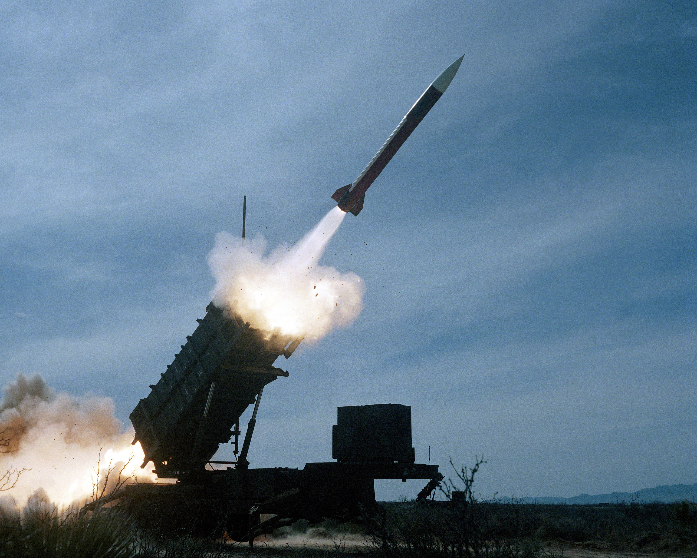

# Missile Patriot


Source : Department of Defense. American Forces Information Service. Defense Visual Information Center.

## Pré-requis

Avoir programmer :

- une fonction qui prend un nombre de secondes et affiche au format (hh:mm:ss)
- une fonction qui calcule le PGCD de 2 entiers

## Corrigé

Le micro-contrôleur de l’antimissile *Patriot* stocke la valeur $`\frac{1}{10}`$ en ne conservant que 23 bits pour la partie décimale (codage en virgule fixe).

Il calcule le temps écoulé depuis son démarrage en multiples de $`\frac{1}{10}`$ème de seconde.

1. Écrire $`\frac{1}{10}`$ en binaire, en conservant au moins 30 chiffres binaires après la virgule.

	```math
	\begin{aligned}
	& 0,1 \times 2 = \textcolor{red}{0},2 \\
	& \left.\begin{aligned}
	0,2 \times 2 & = \textcolor{red}{0},4 \\
	0,4 \times 2 & = \textcolor{red}{0},8 \\
	0,8 \times 2 & = \textcolor{red}{1},6 \\
	0,6 \times 2 & = \textcolor{red}{1},2 \\
	0,2 \times 2 & = \textcolor{red}{0},4 \\
	0,4 \times 2 & = \textcolor{red}{0},8 \\
	0,8 \times 2 & = \textcolor{red}{1},6 \\
	0,6 \times 2 & = \textcolor{red}{1},2 \\
	0,2 \times 2 & = \textcolor{red}{0},4 \\
	\end{aligned}\right\rbrace \textit{suivi de 2 fois}
	\end{aligned}
	```

	Soit $`0,1 = 0,00011001100110011001100110011_2`$

2. Sachant que les registres du *Patriot* ne conservent que 23 bits après la virgule, quelle est, en base 10, la valeur qui est codée effectivement à la place de $`\frac{1}{10}`$ ?

	La représentation binaire de 0,1 sur 23 bits est $`0,00011001100110011001100_2`$. Le nombre $`n`$ associé correspond à :

	```math
	\begin{aligned}
	n & = 0 \times 2^{-1} + 0 \times 2^{-2} + 0 \times 2^{-3} + 1 \times 2^{-4} + \dots + 0 \times 2^{-23}\\
	 & = 2^{-4} + 2^{-5} + 2^{-8} + 2^{-9} + 2^{-12} + 2^{-13} + 2^{-16} + 2^{-17} + 2^{-20} + 2^{-21} \\
	 & = \frac{1}{2^4} + \frac{1}{2^5} + \frac{1}{2^8} + \frac{1}{2^9} + \frac{1}{2^{12}} + \frac{1}{2^{13}} + \frac{1}{2^{16}} + \frac{1}{2^{17}} + \frac{1}{2^{20}} + + \frac{1}{2^{21}}\\
	 & = \frac{2^{17}}{2^{17} \times 2^4} + \frac{2^{16}}{2^{16} \times 2^5} + \frac{2^{13}}{2^{13} \times 2^8} + \frac{2^{12}}{2^{12} \times 2^9} + \frac{2^9}{2^9 \times 2^{12}} + \frac{2^8}{2^8 \times 2^{13}} + \frac{2^5}{2^5 \times 2^{16}} + \frac{2^4}{2^4 \times 2^{17}} + \frac{2}{2\times2^{20}} + \frac{1}{2^{21}}\\
	 & = \frac{2^{17} + 2^{16} + 2^{13} + 2^{12} + 2^9 + 2^8 + 2^5 + 2^4 + 2 + 1}{2^{21}} \\
	 & = \frac{131072 + 65536 + 8192 + 4096 + 512 + 256 + 32 + 16 + 2 + 1}{2097152} \\
	 & = \frac{209715}{2097152} \\
	 & \simeq 0.09999990463256836
	 \end{aligned}
	```

3. Quelle est l’erreur approximative commise sur la représentation de $`\frac{1}{10}`$ ?

	L'erreur approximative sur la représentation de $`\frac{1}{10}`$ :

	```math
	\begin{aligned}
	\epsilon & = \frac{1}{10} - n\\
	 & = \frac{1}{10} - \frac{209715}{2097152} \\
	 & = \frac{2097152 - 2097150}{20971520} \\
	 & = \frac{2}{20971520} \\
	 & = \frac{1}{10485760} \\
	 & \simeq 0.000000095
	\end{aligned}
	```

4. Combien de signaux d’horloge le *Patriot* reçoit-il en 100 h de fonctionnement ?

	Le nombre de signaux d'horloges $`s`$ que reçoit un missile _Patriot_ en 100h de fonctionnement :

	```math
   \begin{aligned}
    s & = \textit{nombre de signaux par seconde} \times \textit{nombre de secondes en } 100h \\
   & = 10 \times 60 \times 60 \times 100 \\
   & = 3600000
    \end{aligned}
	```

5. En tenant compte de l’erreur calculée à la question 3., quel est le décalage de l’horloge du *Patriot* par rapport à l’heure réelle au bout de 100h ?

	Le décalage de l'horloge $`d`$ du missile _Patriot_ au bout de 100h de fonctionnement :

	```math
	\begin{aligned}
	d & = \textit{nombre de signaux d'horloges sur } 100h \times \textit{erreur approximative de la représentation d'un } \frac{1}{10} \\
	 & = s \times \epsilon \\
	 & = 3600000 \times \frac{1}{10485760} \\
	 & = 360000 \times \frac{1}{1048576} \\
	 & = \frac{360000}{1048576} \\
	 & = \frac{5625}{16384} \\
	 & \simeq 0,34 s
	\end{aligned}
	```

6. Sachant qu’un missile se déplace à une vitesse d’environ 1 676 m/s, à quelle erreur de position en mètres correspond le décalage d’horloge d’un *Patriot* ayant fonctionné 100 h sans interruption ?

	Soient :

	- $`v`$, la vitesse du missile, 1676m/s,
	- $`d`$, le décalage de l'horloge calculée à la question 5,
	- $`e`$, l'erreur de position d'un missile _Patriot_, ayant fonctionné 100h, est :

	```math
	\begin{aligned}
		e & = v \times d \\
		& = 1676 \times \frac{5625}{16384} \\
		& = \frac{9427500}{16384} \\
		& = \frac{2356875}{4096} \\
		& \simeq 575,40 m
	\end{aligned}
	```

7. Conclure, sachant que, pour atteindre sa cible un *Patriot*  doit l’approcher à moins de 500 m.

	La question 6 nous a permis de calculer l'erreur de position du missile _Patriot_ ayant fonctionné pendant 100h. Le décalage d'un tel missile est supérieur à la distance d'approche finale de 500m. En conclusion, le missile _Patriot_ n'atteint pas sa cible.

N.B :

- En 1991, pendant la guerre du Golfe, un anti-missile _Patriot_ manque l’interception d’un missile Scud. Bilan : 28 soldats morts.
- Si au lieu de tronquer $`\frac{1}{10}`$ on avait arrondi au plus proche : $`0,00011001100110011001101_2`$ alors l’erreur aurait été de 0,000000024 au lieu de 0,000000095 soit environ 140 m au lieu de 575 !
