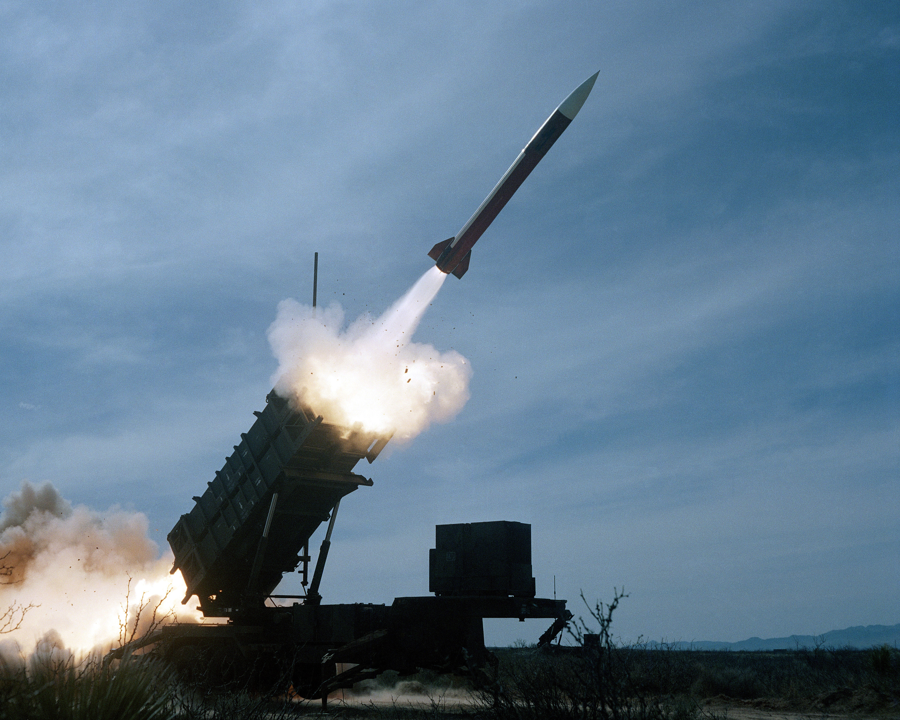

# Missile Patriot

Source : Department of Defense. American Forces Information Service. Defense Visual Information Center.

## Pré-requis

Avoir programmé :

- une fonction qui prend un nombre de secondes et l'affiche au format (hh:mm:ss)
- une fonction qui calcule le PGCD de 2 entiers
- une fonction qui indique si une fraction de 2 entiers est irréductible (i.e dont le PGCD est égal à 1)

## Énoncé

Le micro-contrôleur de l’antimissile *Patriot* stocke la valeur $`\frac{1}{10}`$​ en ne conservant que 23 bits pour la partie décimale (codage en virgule fixe).

Il calcule le temps écoulé depuis son démarrage en multiples de $`\frac{1}{10}`$ème de seconde.

1. Écrire $`\frac{1}{10}`$ en binaire, en conservant au moins 30 chiffres binaires après la virgule.
2. Sachant que les registres du *Patriot* ne conservent que 23 bits après la virgule, quelle est, en base 10, la valeur qui est codée effectivement à la place de $`\frac{1}{10}`$ ?
3. Quelle est l’erreur approximative commise sur la représentation de $`\frac{1}{10}`$ ?
4. Combien de signaux d’horloge le *Patriot* reçoit-il en 100 h de fonctionnement ?
5. En tenant compte de l’erreur calculée à la question 3., quel est le décalage de l’horloge du *Patriot* par rapport à l’heure réelle au bout de 100h ?
6. Sachant qu’un missile se déplace à une vitesse d’environ 1 676 m/s, à quelle erreur de position en mètres correspond le décalage d’horloge d’un *Patriot* ayant fonctionné 100 h sans interruption ?
7. Conclure, sachant que, pour atteindre sa cible un *Patriot*  doit l’approcher à moins de 500 m.
