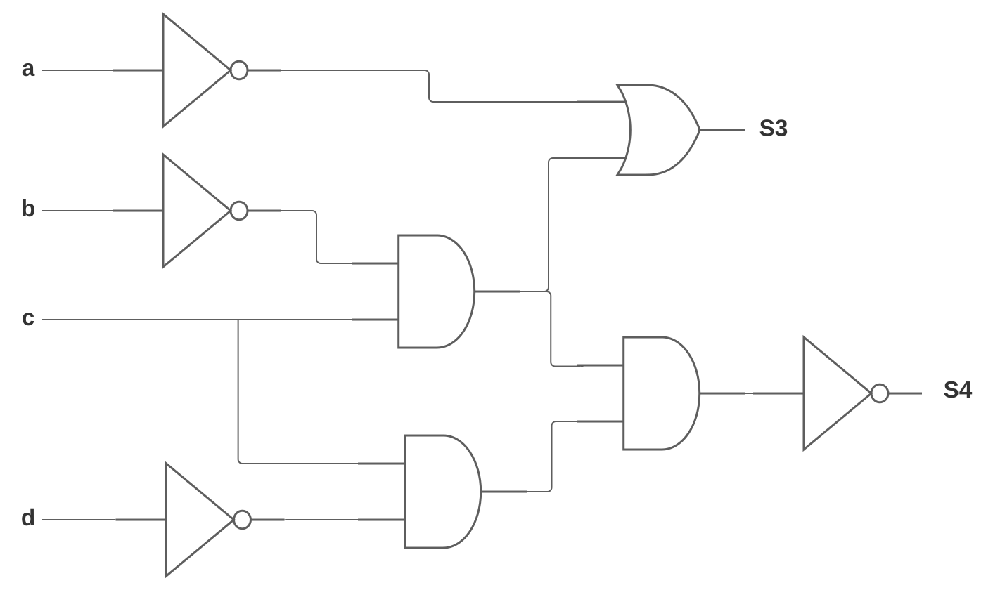
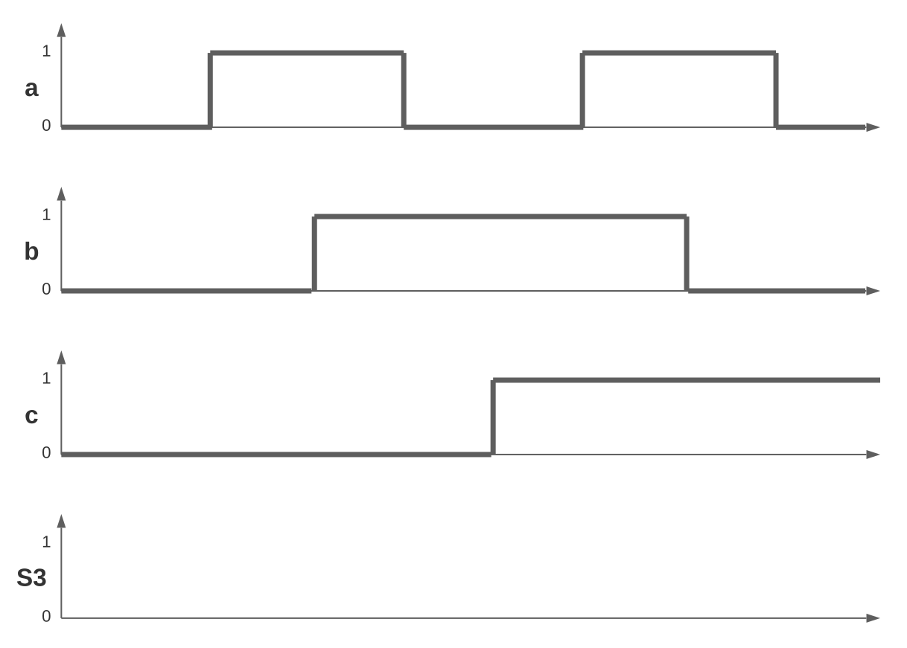

# TD : Logique combinatoire

## Algèbre de Boole

Q1. Simplifier les équations suivantes à l'aide des théorèmes de l'algèbre de Boole : 

1. $`S = (\overline{a} \lor b) \land (a \lor b)`$
2. $`S = \overline{a} \land b \land \overline{c} \lor \overline{a} \land b \land c \lor a \land b \land \overline{c} \lor a \land b \land c`$
3. $`S = a \land b \land c \lor b \land c \lor b \land \overline{b}`$
4. $`S = (a \lor \overline{a} \land b) \land \overline{( a \lor b )} \lor b \land \overline{c} \lor b \land c`$

## Logigrammes

Q2. Établir les logigrammes réalisant les équations suivantes : 

5. $`S = a \lor b \land \overline{c}`$​
6. $`S = \overline{(\overline{a} \land b \lor c) \land \overline{d}}`$
7. $`S = a \land (\overline{b} \lor c)`$

Q3. Établir l'équation des sorties S3 et S4 du logigramme suivant :

Q4. Établir la table de vérité de S3 et de S4 en fonction de l'état des variables d'entrée :

Q5. Compléter le chronogramme de la sortie S3 ci-dessous :

## Étude du fonctionnement d'une perçeuse

On considère une perceuse actionnée par un moteur $`M`$. Le moteur ne peut tourner que si l’interrupteur $`C`$ est actionné et si toutes les conditions de sécurité suivantes sont respectées :

- La protection de sécurité $`P`$ est en place
- Le courant de surcharge $`I`$ n’est pas dépassé

Outre ces conditions normales de fonctionnement, une clé $`K`$ permet de faire tourner le moteur sans aucune condition de sécurité.

Q6. En supposant que chaque variable $`C, P, I`$ et $`K`$ vaut 1 lorsque la condition de fonctionnement est respectée, donner la table de vérité du moteur $`M`$.

Q7. Donner l’équation et le logigramme.

