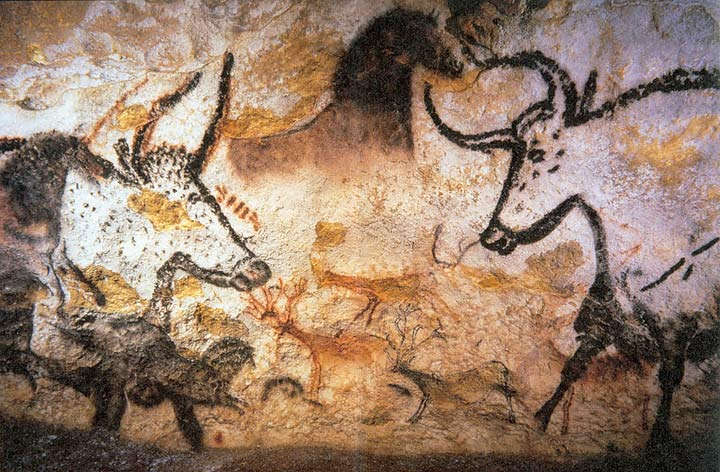

# Activité débranchée : Codage des caractères

## Contexte

L'histoire de la communication est aussi ancienne que l'histoire de l'humanité. Depuis les origines, l'homme a eu besoin de communiquer. Pour cela il mit au point des codes, des alphabets et des langages. Parole, gestes de la main, signaux de fumée, tam-tam, document écrit… tout était bon pour véhiculer le message.

Dès la préhistoire, les hommes ont commencés à communiquer notamment grâce à l'art rupestre.

Les peintures rupestres pouvaient permettre de marquer un territoire d'habitation ou de chasse ou transmettre des pensées, une façon de voir le monde et ce qu'il l'entoure.

Photographie de peintures d'animaux dans la grotte de Lascaux, Source : Wikimedia

Le __codage des caractères__ est une convention qui permet, à travers un codage connu de tous, de transmettre de l'information textuelle, là où aucun support ne permet l'écriture scripturale et sa transmission.

Cela consiste à représenter chaque caractère, par un motif visuel, un motif sonore, ou une séquence abstraite.

## Objectifs

L'objectif de ce TD est d'étudier des codages ancestraux de l'ère de la mécanisation et de la numérisation des communications.

4 codages sont étudiés :

- [L'alphabet de Chappe](./chappe/),
- [Le code morse](./morse/),
- [Le code Baudot](./baudot),
- [Le code BCD](./bcd).

## Consignes

- Par groupe, vous devez étudier les documents relatifs au codage,
- Individuellement : (20 minutes)
	- Coder votre nom et âge,
	- Coder une phrase de votre choix de 10-15 caractères,
	- L'échanger à un autre membre,
	- Décoder la phrase transmise
- Collectivement, répondre aux questions suivantes (10 minutes) :
	- Époque du codage
	- Principe de fonctionnement : nombre de caractères codés, mécanisme pour coder un caractère
	- Avantages / inconvénients
- A la fin du temps imparti, un élève du groupe présente au reste de la classe les réponses aux questions traitées. (5 minutes)
