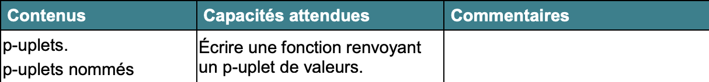
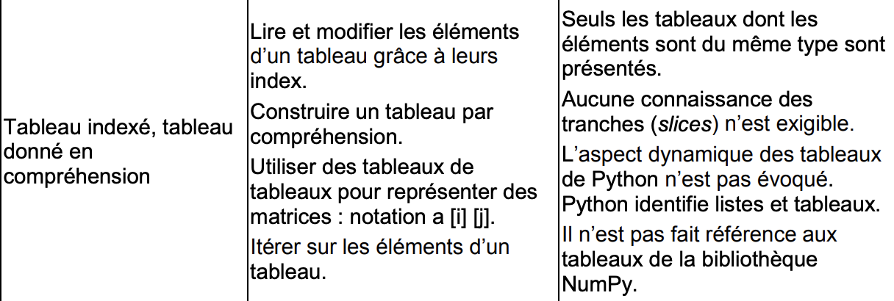

## Représentation des données : tuples, tableaux et itérations

-------------

> ***Contenue*** : Notions introduites : le type conteneur, avec les tableaux, les tuples, parcours de séquences. 
> ***Compétences*** : Comprendre la différence entre un tableau python et un tuple. Maîtriser la création de conteneurs sur Python.

## Le programme

-----------





## Apport de connaissances

----------

Les types *conteneurs* comme les tuples ou les tableaux permettent de stocker des objets, et proposent des méthodes d'accès, de modification et d'itération sur ces mêmes objets.

Ici nous allons voir trois types de conteneurs en particulier : les tuples, les tableaux, et enfin les dictionnaires. En apprenant à créer et à manipuler ces types d'objets, cela nous permettra de travailler sur un grand nombre de données de manière rapide et efficace.

--------

### Les tableaux

Pour le moment, nous n'avons appris à travailler qu'avec un nombre limité de variables. Cependant, il peut arriver que vous deviez lire, stocker, traiter et enfin imprimer des dizaines, voire des centaines ou des milliers de valeurs de données. Comment stocker et accéder efficacement à ces données ? 

Par exemple, si l'on décide de de manipuler une demi-douzaine de variables, doit on les déclarer comme ceci ?  

```python
var1 = int(input())
var2 = int(input())
var3 = int(input())
var4 = int(input())
var5 = int(input())
var6 = int(input())
```

Nous allons voir que la structure de données appelée tableau va nous permettre de  déclarer une variable à valeurs multiples.

-----------------

### Créer un tableau

- Vide :

```python
tab = [ ] 
```

- On peut les créer par ***extension*** (comprendre *un tableau déclaré littéralement*) comme ceci :

```python
tab = [3, 8, 5, 4]
```

- Mais aussi par ***compréhension*** (itération, que l'on verra plus loin)

On peut tester ça dans la console python 

```python
tab = [2, 3, 5, 7 ]
type (tab)
```

Que retournent ces lignes python ?

On peut afficher le tableau de la même manière qu'une variable classique :  avec la commande *print* 

```python
print(tab)
```

--------------

### Accéder aux élèments d'un tableau

Les élèments d'un tableau peuvent être comparés à des élèments d'une séquence : chaque élèment a une position précise dans le conteneur, comme nous l'avons vu pour les chaînes de caractères (*str*).

On appelle cette position *indice*, c'est cet indice qui nous permet d'accéder à un élèment en particulier.

Le premier élèment d'un tableau a pour indice **0**.

Tout comme avec les chaînes de caractères, un indice négatif permet d'accéder l'élèment en partant de la fin.

Pour connaître le nombre total d'élèments dans un tableau, on utilise la fonction ***len***

```python
t_1 = [2,4,6,8]
len (t_1)
```

On peut désigner une **tranche** en indiquant l'indice du premier élèment, ainsi que celui du dernier ***non inclus*** :

```py
t_1[1:3]
```

Attention : Un indice qui dépasse la valeur *longueur du tableau - 1* provoquera une erreur dans votre code

----------

### Parcours d'une séquence

Comme indiqué plus haut, il est possible de créer et de parcourir un tableau par une méthode dite *de compréhension* ou *itération*.

Celà signifie qu'on construit ce tableau à partir d'élèments itérables : que l'on peut répétèr. Par exemple :

```pyth
tab = [x for x in range(5)]
print(tab)
```

Que vous affiche la console ?

L'intérêt de tableaux par compréhension, c'est que l'on peut utiliser les structures conditionnelles, à l'aide de boucles...

On peut également initialiser un tableau à partir d'un autre :

```pytho
tab_1 = [1, 2, 3, 4]
tab_2 = [2 * x for x in tab_2]
print(tab_2)
```

Une fois que votre conteneur est crée, on peut le parcourir :

```pyth
for elt in tab_2:
	print (elt, end='')
```

Ici, on va afficher chaque élèment de tab_2.

On peut également utiliser une boucle en itérant l'indice i des élèments :

```python
for i in range (len(tab_2)):
	print(tab_2[i], end='')
```

Ici, pour i compris entre 0 et longueur de tab_2, on va affichier l'élèment correspondant à l'indice valant i.

 À faire : 

- créer un tableau par extension, puis par itération
- afficher les élèments de ce tableau

-----------

### Propriétés

Une structure comme un tableau peut être modifiable : on parle d'un objet *mutable*

- On peut donc supprimer un élèment de la séquence avec le mot clé *del*	

  ```pyth
  toto = [1,2,3,4,5]
  del toto[0]
  print(toto)
  [2,3,4,5]
  ```

  Il faut noter qu'en supprimant l'élèment situé à l'indice 0, j'ai fait changer tous les indices des élèments du tableau !

  

- On peut également ajouter un élèment  : 

  ```py
  tab = [1,2,3,4,5]
  tab.append(6)
  print (tab)
  [1,2,3,4,5,6]
  ```

  L'élèment ajouté se positionne donc à la *fin* du tableau.

  

- Pour modifier un élèment en particulier, on lui affecte une nouvelle valeur :

```pyth
t = [1,2,3,4,5]
t[1] = 8
print (t)
[1,8,3,4,5,6]
```

- Il est préférable de ne stocker que des données de même type dans un tableau.

- Il peut-être passé comme paramètre d'une fonction

--------


## Les tuples (ou p-uplets)

 À la différence des tableaux, les tuples ne sont ***pas mutables***. On ne peut donc plus les modifier une fois créés, leur taille est fixe.

Mais ils peuvent néanmoins contenir des données de différents types.

Pour initialiser un tuple, on utilise cette syntaxe :

```pyth
tuple = (1, 3)
print (tuple)
(1, 3)
```

Ici, de la même manière qu'avec les tableaux, on pourra accéder à un élèment en particulier via son indice

```python
tuple = (1, 3, 5, 7, 9)
tuple[-1]
9
```

De plus, on peut tout à fait utiliser l'itération pour construire ou parcourir une structure tuple.

Enfin, il est courant, dans une fonction, de renvoyer plusieurs valeurs. Par exemple, via ce type de syntaxe :

```pyth
return a, b
```

En réalité, cette syntaxe signifie : return (a, b) : on a donc un tuple composé des variables a et b qui est renvoyé.

----------

### À retenir:

***Pour les tableaux et tuples :***

| Opération  | Résultat                                                     |
| ---------- | ------------------------------------------------------------ |
| x in t     | Renvoie True si un élément de t est égal à x                 |
| x not in t | Renvoie True si aucun élément de t n'est égal à x, False sinon |
| len(t)     | Renvoie le nombre d'éléments de t                            |
| t == t1    | Renvoie True si t et t1 sont de même type, ont la même longueur, et ont des éléments égaux 2 à 2 |

| Opération  | Résultat                                                     |
| ---------- | ------------------------------------------------------------ |
| t[i]       | Renvoie l'élément d'indice i de t                            |
| t[i:j]     | Renvoie une partie de t de l'indice i à j non inclus         |
| t.index(x) | Renvoie l'indice de la première apparition de x dans t       |
| t.count(x) | Renvoie le nombre d'apparitions de x dans t                  |
| s + t      | Renvoie une nouvelle séquence qui correspond à la concaténation de s et de t (seulement si s et t ont le même type) |

***Uniquement pour les tableaux :*** 

| Opération      | Résultat                                                     |
| -------------- | ------------------------------------------------------------ |
| t.append(x)    | Ajoute l'élément x à la fin du tableau t                     |
| t[i] = x       | Modifie le tableau et affecte la valeur x à la case d'indice i |
| t.insert(i, x) | Insère l'élément x  à la position de l'indice i              |
| t.remove(x)    | Supprime le premier élément dont la valeur est égale à x     |
| t.pop(i)       | Enlève du tableau l'élément à la position i et renvoie sa valeur |

