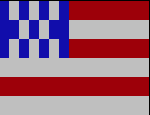

# TP : Les Drapeaux

 

Fig 1. Drapeau français

## 1. Contexte

Un drapeau peut être vu comme une matrice, i.e un tableau de tableaux, de dimension $n \times m$.

Soient les codes couleurs suivants :

| Code | Couleur associée |
| :--: | :----------------: |
| 0    | NOIR             |
| 1    | ROUGE             |
| 2    | VERT             |
| 3    | JAUNE             |
| 4    | BLEU             |
| 5    | MAGENTA             |
| 6    | CYAN             |
| 7    | BLANC             |

Il est dès lors possible de représenter le drapeau français de la Fig.1 , en python, par la matrice $15 \times 7$ suivante :

```python
>>> drapeau = [
  [4, 4, 4, 4, 4, 7, 7, 7, 7, 7, 1, 1, 1, 1, 1],
  [4, 4, 4, 4, 4, 7, 7, 7, 7, 7, 1, 1, 1, 1, 1],
  [4, 4, 4, 4, 4, 7, 7, 7, 7, 7, 1, 1, 1, 1, 1],
  [4, 4, 4, 4, 4, 7, 7, 7, 7, 7, 1, 1, 1, 1, 1],
  [4, 4, 4, 4, 4, 7, 7, 7, 7, 7, 1, 1, 1, 1, 1],
  [4, 4, 4, 4, 4, 7, 7, 7, 7, 7, 1, 1, 1, 1, 1],
  [4, 4, 4, 4, 4, 7, 7, 7, 7, 7, 1, 1, 1, 1, 1]
]
```

En utilisant le formalisme par compréhension :

```python
>>> drapeau = [ [4] * 5 + [7] * 5 + [1] * 5 for _ in range(7)]
```

Ce formalisme compact traduit le fait que le drapeau français est constitué de ***5 cases bleues, 5 cases blanches et 5 cases rouges, et cela sur 7 lignes***.

## 2. Matériel fourni

Le module `paint` dispose de :

- 8 variables : `NOIR, ROUGE, VERT, JAUNE, BLEU, MAGENTA, CYAN, BLANC`, qui permettent de matérialiser les couleurs,
- d'une méthode `dessiner` qui permet d'afficher un drapeau, à partir d'une matrice passée en paramètre, dans la console de l'interpréteur python.

<figure>
  <center></center>
  <figcaption style='text-align:center;'>Fig 2. Exemple d'utilisation du module paint</figcaption>
</figure>

## 3. Consignes

Vous devez créer un module `drapeau`.

Pour chaque drapeau de la liste fournie en Annexe, vous devez :

- Formaliser la matrice modélisant le drapeau,

- Identifier la structure algorithmique,

- Écrire une fonction, dans le module `drapeau` qui permette de créer la matrice modélisant le drapeau.

***N.B : Vous devez utiliser le formalisme par compréhension ou l'utilisation de boucle mais il est interdit d'utiliser l'affectation par valeur, case par case.***

Le module sera exécutable de la manière suivante :

> python3 drapeau.py france

Le résultat attendu étant l'affichage du drapeau du pays passé en paramètre.

## 4. Annexe : Liste des pays et drapeaux

|  Pays    | Drapeau     | Consigne |
| :--: | :--: | :-- |
|  Belgique    |   | Le drapeau est de dimension $ 15 \times 7$ |
| Pays-Bas | | Le drapeau est de dimension $ 15 \times 6$ |
| Suède | | Le drapeau est de dimension $ 15 \times 7$ |
| Finlande |  | Le drapeau est de dimension $ 15 \times 7$ |
| Irlande | | Le drapeau est de dimension $ 15 \times 7$ |
| Côte d'Ivoire | | Vous devez utiliser la fonction de création du drapeau d'Irlande. |
| Bénin | | Le drapeau est de dimension $ 15 \times 6$ |
| Suisse | | Le drapeau est de dimension $ 15 \times 7$ |
| Guinée | | Le drapeau est de dimension $ 15 \times 7$ |
| Mali | | Vous devez utiliser la fonction de création du drapeau de Guinée. |
| Botswana |  | Le drapeau est de dimension $ 15 \times 7$ |
| Monaco | | Le drapeau est de dimension $ 15 \times 6$ |
| Pologne | | Vous devez utiliser la fonction de création du drapeau de Monaco. |
| Japon | | Le drapeau est de dimension $ 15 \times 7$ |
| Hongrie | | Le drapeau est de dimension $ 15 \times 7$ |
| Iran | | Vous devez utiliser la fonction de création du drapeau de Hongrie. |
| Palaos | | Le drapeau est de dimension $ 15 \times 7$ |
| Grèce | | Le drapeau est de dimension $ 15 \times 6$ |
| Etats-Unis | | Le drapeau est de dimension $ 15 \times 6$ |
| République du Congo | | Le drapeau est de dimension $ 15 \times 7$ |
| Trinidad et Tobago | | Le drapeau est de dimension $ 15 \times 7$ |
| Jamaique | | Le drapeau est de dimension $ 15 \times 7$ |
