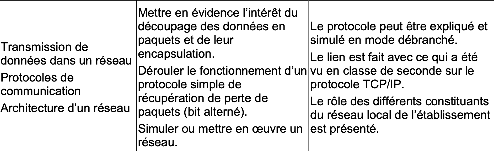

> Dans le monde ultra connecté qu'est le notre, Internet et les réseaux tiennent une place primordiale.
>
> Plus de trente (30) milliards d'appareils sont connectés quotidiennement à un réseau. Comment cela est-il possible ?
>
> Qu'est ce qui nous attend de ce côté dans le futur ?

### Le programme

---------

### Définition

Un réseau est un ensemble d'élèments matériels et logiciels reliés ensemble afin de transporter des informations. Il permet de mettre en oeuvre des services.

- Quels types de services ?
- Quels types de matériels connaissez vous ?

Un réseau est