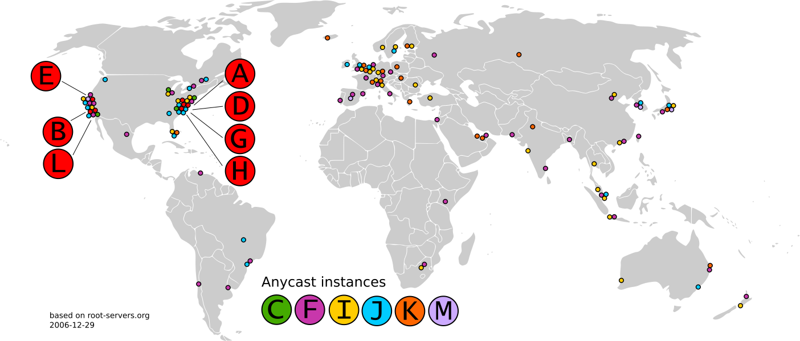
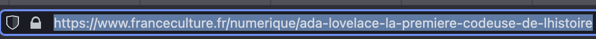
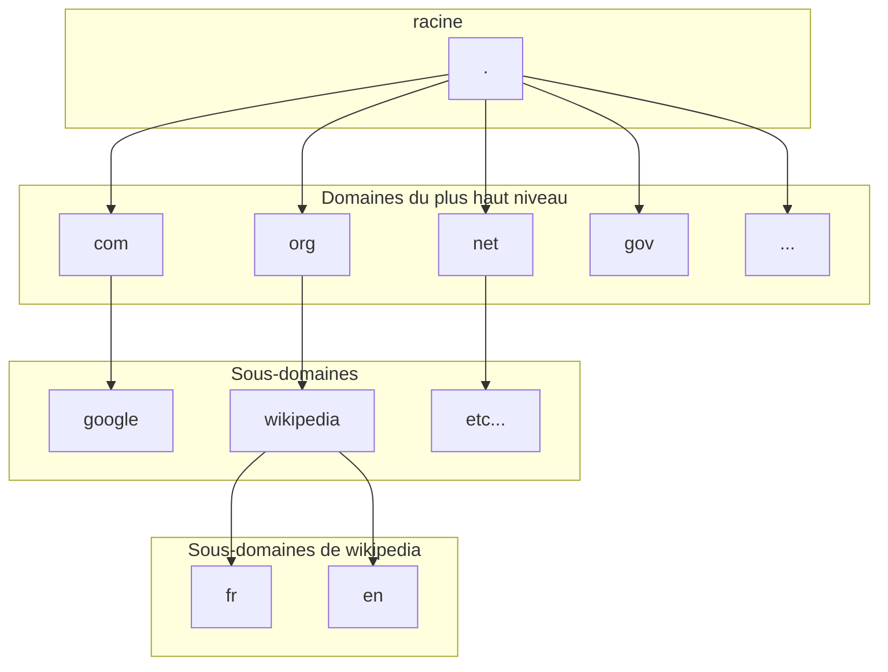

# DNS, l'annuaire d'Internet

> Connaissez vous le super moteur de recherche 216.58.214.163 ? Non ? Pourtant vous l'utilisez très souvent !

> De la même manière que votre amie Alice poste quotidiennement ses pensées sur un morceau d'eurodance sur le fameux 95.100.86.78 !

> Et que dire de Bob, qui fait f5 toutes les 10 min sur 46.33.191.5 ?

Cela vous parait idiot ? Pourtant les adresses IP citées au dessus sont bel et bien utilisées quotidiennement par des milliers de personnes. Néanmoins, vous les connaissez probablement mieux sous leur petit nom *__google__*, *__tiktok__* et *__pronote__* !

Comme nous l'avons vu avec l'adresse IP, chaque machine possède un identifiant sur le réseau. Tout comme chaque personne possède une adresse physique : lorsque vous allez voir tatie Monique, vous vous rendez là où elle vit, et bien c'est pareil avec un site internet.

---------

### Pourquoi le DNS ?

Si, à l'époque, on stockait les adresses des sites dans un fichier HOST.TXT, celui ci n'a jamais dépassé les 600 entrées :

Très rapidement, cette solution devint ingérable au vu de la croissance exponentielle du nombre de sites mis en ligne.
En 1983, le DNS voit le jour. Et très rapidement, ce système montra son utilité : quatre années plus tard, on enregistrait plus de 20 000 enregistrements de nom de domaine.

Pour nous autres, êtres humains, il est complexe de retenir toutes les adresses IP des sites que l'on souhaite visiter. Et à moins de tout noter dans un repertoire, jamais vous ne vous rappelerez de tous ces nombres.

C'est pour cela que le __protocole__ *Domain Name System* a été crée.

### Où se situent les serveurs DNS Primaires ?

---------

### Adresse symbolique

Le protocole DNS permet d'associer une adresse IP à une *__adresse symbolique__* aussi appelée __*URL*__: celle ci est simple à retenir, et très souvent en rapport avec son contenu : http://www.nice.fr/fr/ par exemple, est le site qui traite de la ville de ...Nice.

Toutes ces adresses vont être enregistrées auprès d'un organisme, *L'ICANN*.

### URL

> Vous l'aurez compris, le principe du DNS est de faire le lien entre l'adresse IP et l'URL d'un site.
Mais c'est quoi, une URL ?

Une URL, ou Uniform Ressource Locator, est composée de 5 parties; le protocole, le sous-domaine, le nom de domaine principal, le domaine de deuxième niveau et le répertoire.

Par exemple, dans cette adresse, que peut on retrouver ? 

| Partie                                        | Type                       | Définition                                                                                                                                    |
|-----------------------------------------------|----------------------------|-----------------------------------------------------------------------------------------------------------------------------------------------|
| HTTPS                                         | Protocole                  | Indique au navigateur le type de ressource souhaitée                                                                                          |
| WWW                                           | Sous-domaine               | Séparé du domaine par un point, il permet de diviser un site en plusieurs parties.Par convention, on le nomme www s'il s'agit d'une page web. |
| franceculture                                 | Domaine Principal          | Généralement, indique le nom de votre site web et permet immédiatement de savoir ce que l'on va y trouver.                                    |
| fr                                            | Domaine de deuxième niveau | Précise le type d’entité sous laquelle est enregistrée votre organisation sur internet (ici, la France, mais on trouve org, net, com...)      |
| ada-lovelace-la-premiere-codeuse-de-lhistoire | Repertoire                 | Indique la ressource à laquelle vous êtes en train d'accéder (page web, vidéo, fichier texte, page html, dossier...)                          |

Répondez aux questions suivantes :

- De combien de parties est composée une url ?
- Pour chaque partie, donner votre propre définition
- Si une partie de l'URL est incorrecte, que se passe -il ?

Voici une autre url : https://fr.wikipedia.org/wiki/Ada_Lovelace

Remplissez le tableau correspondant :

| Partie | Type                       | Définition                                                                                                                                    |
|--------|----------------------------|-----------------------------------------------------------------------------------------------------------------------------------------------|
| ...    | Protocole                  | Indique au navigateur le type de ressource souhaitée                                                                                          |
| ...    | Sous-domaine               | Séparé du domaine par un point, il permet de diviser un site en plusieurs parties.Par convention, on le nomme www s'il s'agit d'une page web. |
| ...    | Domaine Principal          | Généralement, indique le nom de votre site web et permet immédiatement de savoir ce que l'on va y trouver.                                    |
| ...    | Domaine de deuxième niveau | Précise le type d’entité sous laquelle est enregistrée votre organisation sur internet (ici, la France, mais on trouve org, net, com...)      |
| ...    | Repertoire                 | Indique la ressource à laquelle vous êtes en train d'accéder (page web, vidéo, fichier texte, page html, dossier...)                          |

-------

### Organisation de l'annuaire

--------

### Resolution de nom

Que se passe t-il lorsque l'on tape dans son navigateur web *__ViveLaSNT.fr__* ?

---------

Prenons l'adresse de l'établissement : 

https://www.lyc-thierry-maulnier.ac-nice.fr

✏ Quelles sont les informations visibles en un coup d'oeil ?

✏ Comment peut-on décomposer cette URL ?

### Manipulations

- Ouvrez une console d'invite de commande sous windows (Windows + R puis taper cmd, entrée) et faites les exercices suivants :
    - *nslookup* www.google.fr
    
    - Essayer de joindre le site en utilisant l'adresse IP.
    
    - Que constatez vous ?

Après avoir vu le résultat de cette commande, en déduire son principe de fonctionnement.

Ouvrir le site https://dnslookup.online et refaire les mêmes manipulations.

Que constatez vous ?

--------------------

## Synthese

- Le **DNS** est un ............... et signifie D.......... N.........S.........
- Le protocole DNS permet d'associer une ......................... à une .................... aussi appelée . . .
- Une **URL** est composée de 5 parties:
  - ..............................
  - ...............................
  - ..............................
  - .............................
  - .............................
- La commande .................... (sous Windows) ou .................. (sous Linux) permet d'interroger les serveurs **DNS** afin d'obtenir les informations d'un domaine.
