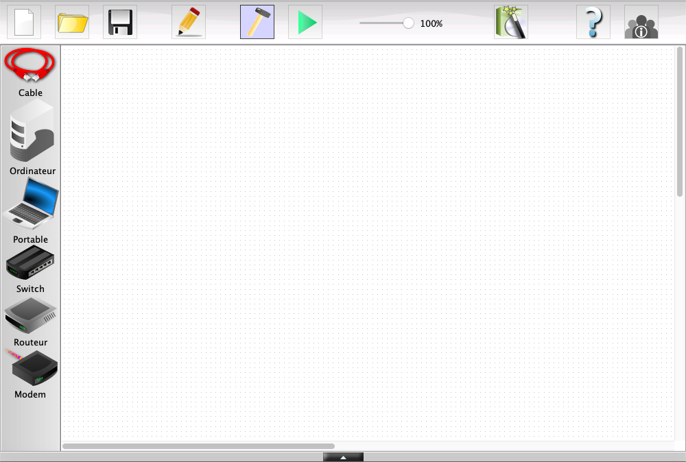

# Simulation de Réseau (1 / 4)

Dans cette activité, vous allez être amené à construire et simuler des réseaux sur un logiciel allemand de simulation : __Filius__

Les objectifs :

- Apprendre à configurer un réseau
- Manipuler les commandes de base de communication entre 2 machines
- Matérialiser la notion de protocole de communication

## Étape 1 : Installation de Filius

1. Télécharger le fichier [reseau_1.fls](reseau_1.fls)

2. Télécharger le fichier zip contenant le logiciel Filius en cliquant sur ce [lien](../filius-1.12.5.zip) Le fichier est téléchargé dans le répertoire "Téléchargements" de votre ordinateur

3. Aller dans le répertoire "Téléchargements" de votre ordinateur

4. Faire un clic droit sur le fichier filius-1.12.5.zip et cliquer sur "Extraire ici" $`\rArr`$ le fichier zip est décompressé, un dossier filius-1.12.5 est créé.

5. Ouvrir le dossier filius-1.12.5

6. Double-cliquer sur Filius.exe $`\rArr`$ le logiciel Filius est lancé. L'interface suivante apparait :

## Étape 2 : Comment relier 2 ordinateurs ?

__L'objectif est de créer un mini-réseau de 2 ordinateurs et de les faire communiquer ensemble.__

Ouvrir le fichier [reseau_1.fls](reseau_1.fls) $`\rArr`$ ce fichier contient un réseau virtuel composé de 2 machines : 1 ordinateur et 1 portable. 

Ces machines ne sont pas correctement configurées pour communiquer entre elles. Les étapes suivantes vont permettre d'y remédier.

### Étape 2.1 Configuration

1. Faire un clic droit sur la machine de gauche puis cliquer sur `configurer`
2. Renseigner l'adresse IP comme celle indiquée dans la figure suivante :

3. Faire un clic droit sur la machine de droite puis cliquer sur `configurer`
4. Renseigner l'adresse IP comme celle indiquée dans la figure suivante :
. 

### Étape 2.2 Simulation d'une communication

1. Passer en mode `simulation` en cliquant sur le bouton . (N.B : Vous pouvez revenir en mode `construction`à tout moment en cliquant sur le bouton )
2. Lorsque vous êtes en mode « simulation » vous pouvez cliquer sur un ordinateur pour installer des logiciels virtuels :
	1. Cliquer sur l'ordinateur de gauche,
	2. Cliquer sur `installation des logiciels` 
	3. Choisir dans la liste de gauche le logiciel `ligne de commande`
	4. Cliquer sur `Appliquer les modifications`
	5. Réitérer l'opération à partir du 2. sur l'ordinateur de droite.
3. Lorsque vous double-cliquer sur un ordinateur, vous devez avoir une interface similaire à la suivante :

Une icône `Ligne de commande` est présente.

Voiçi la liste des commandes que nous allons utiliser :

- `ipconfig` : affiche les caractéristiques réseaux de la machine
- `ping [Adresse IP]` : envoie 4 paquets de données sur l’adresse ip saisie pour tester la connexion
- `traceroute [Adress IP]` : permet de suivre le chemin qu'un paquet de données va mettre d’une
machine à une autre

À Faire

1. Faire une commande `ipconfig` pour vérifier les adresses IP de vos machines
2. Faire une commande `ping` depuis l’ordinateur avec l'adresse IP `192.168.0.10` vers l’ordinateur avec l'adresse IP `192.168.0.20`, puis inversement.

   __Questions__ :

   1. Combien de temps a duré l’envoi du ping ?
   2. Quel est le masque de sous-réseau ?

3. Faire une commande `traceroute`depuis l'ordinateur avec l'adresse IP `192.168.0.10` vers l'ordinateur avec l'adresse IP. `192.168.0.20`.

   __Questions__ :

   1. Combien de sauts ont été nécessaires pour que les ordinateurs communiquent entre eux ?
   3. Trouver le nom et la signification du protocole utilisé pour échanger les données lors du `traceroute` et `ping`. Pour obtenir le nom du protocole, vous pouvez effectuer un clic droit sur un ordinateur et sélectionner `Afficher les échanges de données`.
   
4. Modifier le masque de réseau de l'ordinateur 192.168.0.10 à 255.255.255.255 et effectuer les étapes à partir du 2. Quelles différences constatez-vous ?

## Étape 3 : Agrandir le réseau

Réalisez le réseau suivant :

1. Configurer l’adresse IP du Serveur sur 192.168.0.30
2. Lancer la simulation
3. Sur le serveur, installer l'application « Serveur générique », la lancer et appuyer sur `Démarrer` pour allumer le Serveur
4. Sur l’ordinateur 192.168.0.10, installer l'application « Client générique »
5. Rnseigner l'adresse Serveur et appuyer sur `Connecter`
6. Puis envoyez-lui un message du type `Bonjour Serveur, je suis un ordinateur`
7. Afficher les données échangées à partir de l'ordinateur 192.168.0.10. Vous devez obtenir une interface similaire à celle-ci :

   __Questions__ :

   1. Quel est le protocole utilisé pour le « transport » des données ?

Pour échanger des données, les ordinateurs utilisent un même langage pour se reconnaître, se comprendre et ne pas perdre les données. Ils utilisent un protocole. (ICMP, TCP, IP …)
