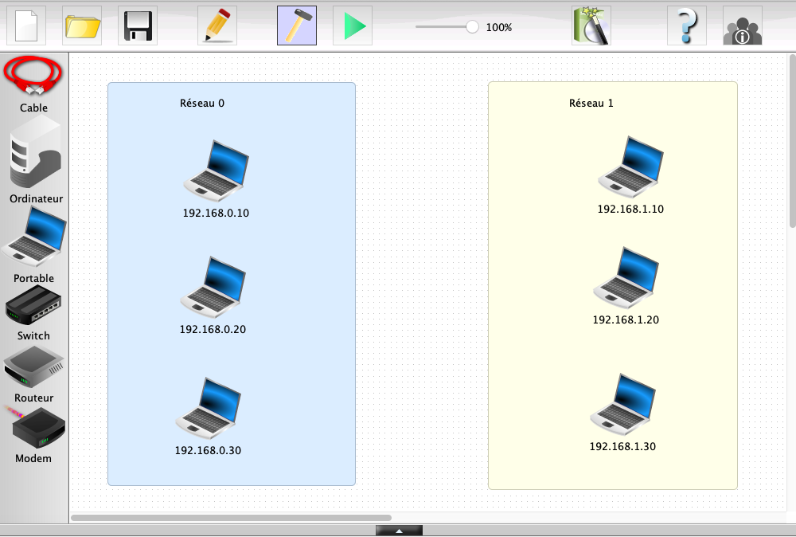
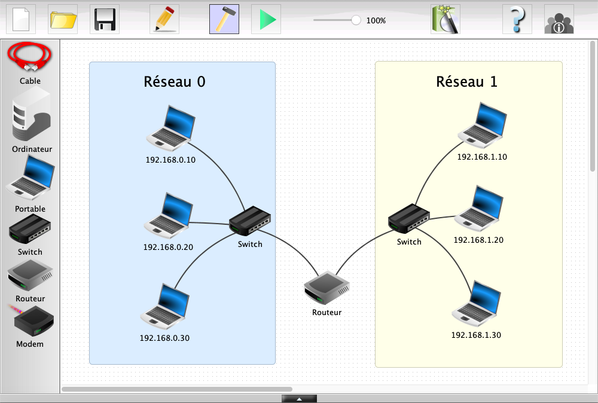
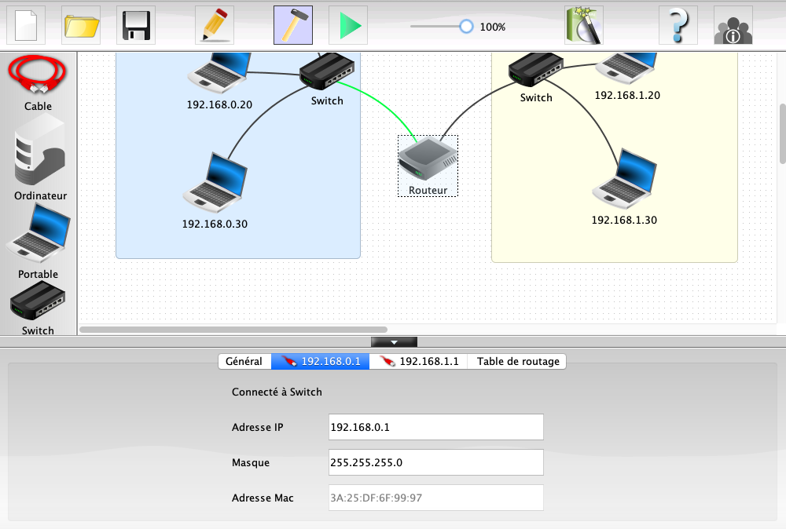
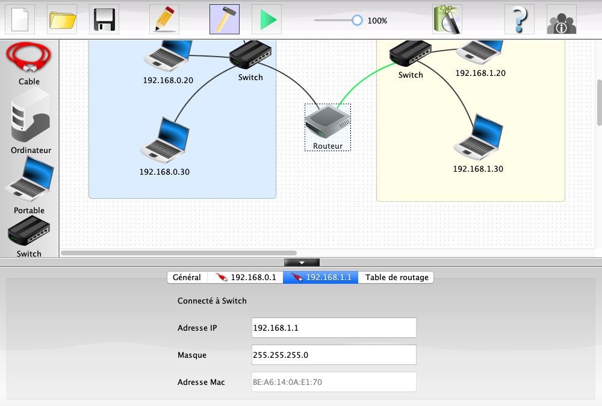

# Simulation de Réseau (2 / 4)

Dans cette activité, vous allez être amené à construire et simuler des réseaux sur un logiciel allemand de simulation : __Filius__

Les objectifs :

- Apprendre à configurer un routeur
- Manipuler les commandes de base de communication entre 2 machines sur 2 réseaux distincts
- Matérialiser la notion de routage

## Étape 1 : Comment communiquer avec mon voisin

__L'objectif est de créer  2 réseaux de 3 ordinateurs et de les faire communiquer ensemble.__

Ouvrir le fichier `reseau_2.fls` $`\rArr`$ ce fichier contient un réseau virtuel composé de 6 machines réparties dans 2 réseaux distincts. 

Ces machines ne sont pas correctement configurées pour communiquer entre elles. Les étapes suivantes vont permettre d'y remédier.

### Étape 1.1 : Configuration des éléments

1. Ajouter un commutateur dans chaque réseau
2. Ajouter un routeur reliant les 2 commutateurs
3. Le résultat attendu est le suivant :

Après avoir effectué toutes les opérations de configuration nécessaires, effectuez un ping entre deux machines de deux réseaux différents.

__Questions__ :
1. Que se passe-t-il ? Que signifie d’après-vous le message « destination not reachable »

### Étape 1.2 : Configuration des passerelles

Le message a besoin de quitter le réseau local, mais cependant nous n’avons pas encore configuré les __passerelles__ entre les différents postes.

Rectifions cette erreur : Dans les paramètres du routeur, définir l’adresse passerelle dans chacun des onglets correspondant à chaque sous réseau (on prendra 192.168.0.1 et 192.168.1.1) :

L'adresse passerelle permet de définir l'adresse IP du routeur dans le sous-réseau. Le routeur a 2 adresses IP, une pour chaque sous-reseau.

4. Testez de nouveau un ping entre deux ordinateurs de chaque sous-réseau. 

Cela ne marche toujours pas. En effet nous devons maintenant indiquer l’adresse passerelle dans chaque poste de chaque sous-réseau :

- pour chacun des 3 ordinateurs du réseau 0, indiquez 192.168.0.1 pour la passerelle.
- pour chacun des 3 ordinateurs du réseau 1, indiquez 192.168.1.1 pour la passerelle.

5. Effectuer de nouveau le `ping` entre deux machines de deux réseaux différents. 
6. Sur la machine 192.168.0.10, effectuer successivement `traceroute 192.168.0.30` et `traceroute 192.168.1.30`.  La commande `traceroute` : la commande `traceroute` permet de suivre le chemin qu'un paquet de données va suivre pour aller d'une machine à l'autre.
7. Comparer les résultats et expliquer les différences obtenues.. 

## Synthèse 

__Faire une synthèse des manipulations effectuées en complétant le texte suivant__ :

Dans un réseau, chaque hôte possède une .....................(1)  qui permet de l'identifier de manière unique. Un ................(2) permet de connecter plusieurs hôtes entre eux dans un même réseau. Pour connecter plusieurs réseaux entre eux, un ................(3) est nécessaire. Il possède autant d'adresse IP que de réseaux auxquels il est connecté. On dit aussi qu'il sert de ................(4) entre les réseaux.  Il faut de plus configurer l'adresse de la ...............(5) de chaque hôte des sous-réseaux pour qu'elle soit égale à celle du .................(6)

La commande ................(7) permet de tester la connexion d'un hôte à un autre.

La commande ................(8) permet d'obtenir le nombre de sauts et le chemin emprunté lors d'une communication entre deux hôtes.