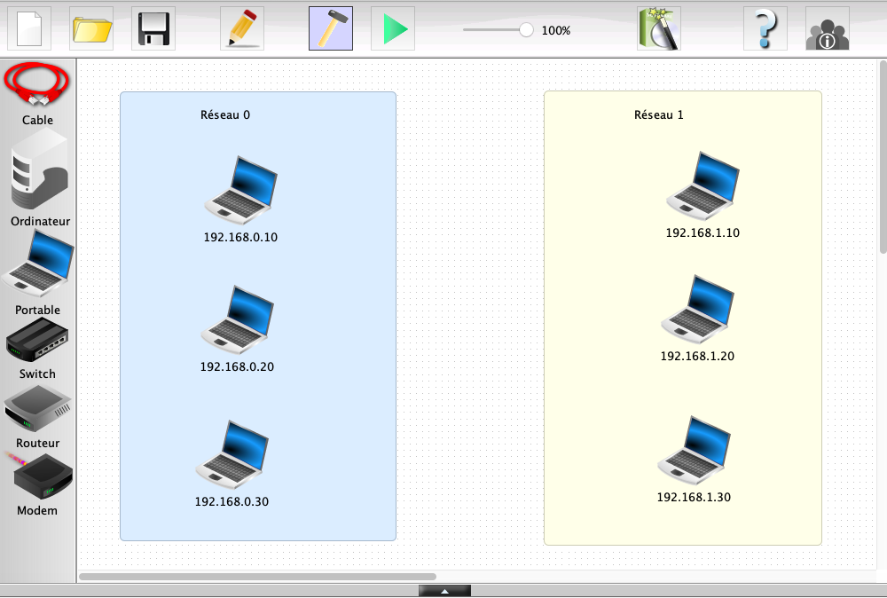

# Simulation de Réseau (3 / 4)

Dans cette activité, vous allez être amené à construire et simuler des réseaux sur un logiciel allemand de simulation : __Filius__

Les objectifs :

- Étudier l'utilité d'un serveur DNS
- Mettre en place un serveur DNS

## Étape 1 : Comment accéder à une page web ...via son adresse IP

Ouvrir le fichier [reseau_3.fls](reseau_3.fls) $`\rArr`$ ce fichier contient un réseau virtuel composé de 6 machines réparties dans 2 réseaux distincts. 

1. Sur le serveur 192.168.0.30 nous allons installer un « Serveur Web » qui héberge un site virtuel www.snt.com. Pour cela, en mode `simulation`, installer l'application `Serveur Web` et cliquer sur `Démarrer`
2. Depuis n’importe quel ordinateur du réseau 1, installer un « Navigateur Web », puis dans la barre de recherche, renseignez l'adresse 192.168.0.30
3. Dans la même barre de recherche, renseignez l'adresse www.snt.com
4. Constatez la différence dans le résultat obtenu.

À ce stade, l'hôte 192.168.0.30 héberge bien le site mais il est uniquement accessible par les autres hôtes en saisissant son adresse IP...il serait plus commode de pouvoir accéder au site via l'url www.snt.fr. C'est là qu'intervient le serveur DNS !

## Étape 2 : Comment accéder à une page web ...sans connaitre son adresse IP

En mode `création`, ajouter un nouvel hôte, qui jouera le rôle de serveur DNS :

- adresse IP `192.168.2.10`,
- passerelle `192.168.2.1`,
- le relier au routeur.

Pour permettre à tous les postes d’utiliser les services du DNS, nous devons ajouter l’adresse IP du DNS (`192.168.2.10`) dans la configuration de tous les ordinateurs du réseau.

Ensuite nous allons donner à notre serveur une URL classique et la communiquer au DNS pour qu’il puisse la traduire en adresse IP.

1. Lancez le mode `simulation`
2. Sélectionnez le serveur DNS et installez-y l’application « Serveur DNS ».
3. Lancez-la avec un double clic.
4. Renseigner comme nom de domaine www.snt.com et comme adresse IP 192.168.0.30 puisqu’il sera hébergé sur le serveur du réseau 0
5. Appuyez sur le bouton « Ajouter ».
6. Activez le DNS en appuyant sur le bouton « Démarrer ».
7. Testez la connexion à partir du poste 192.168.1.10 en demandant d’accéder à l’URL http://www.snt.com en utilisant simplement la commande « host www.snt.com »
8. Nous voyons que le DNS fait son travail en nous fournissant l’adresse IP du serveur.
9. Dans le `Navigateur Web`utilisé à l'étape 1, saisir l'url www.snt.fr et cliquer sur `Afficher`.
10. Dans la même barre de recherche, renseignez l'adresse 192.168.0.30. Constatez la différence dans le résultat obtenu.

## Synthèse 

__Faire une synthèse des manipulations effectuées en complétant le texte suivant__ :

Dans un réseau, chaque hôte peut héberger des pages web à travers un ................(1). Tout hôte peut afficher une page web via un ................(2).

Une page web est accessible via ................(3) de l'hôte qu'il l'héberge.

Un serveur DNS permet d'associer un ................(4) à ................(5) de l'hôte qui héberge la page web.

Tout hôte du réseau doit avoir l'adresse IP du ................(6) configurée. Sans cela, il ne sait pas quel hôte contacter pour obtenir l'adresse IP associée au nom de domaine.

La commande ................(7) permet d'obtenir le nom de l'hôte associée à son adresse IP.
