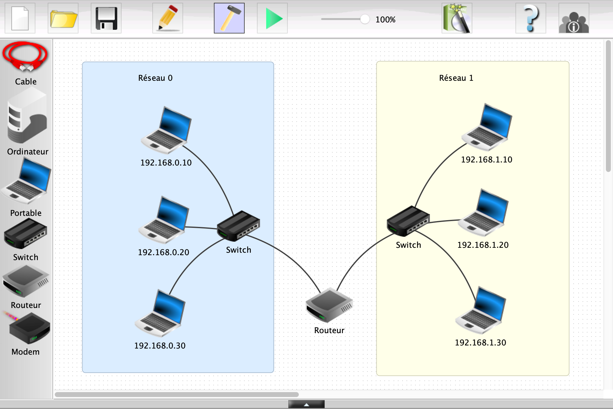

# Simulation de Réseau (4/4)

--------------

Cette partie vous proposera d'observer le fonctionnement d'un ou plusieurs échanges [peer-to-peer](../../p2p/README.md) à l'intérieur du réseau précédémment utilisé lors de [l'activité 3](../seance_3/README.md).

Les objectifs :

- Mettre en place un réseau p2p
  - Dans un même sous-réseau
  - Entre deux sous-réseaux
- Observer les intéractions lors des transferts de fichiers
- Comprendre l'intérêt de ce type de réseau

## Étape 1 : Observer les échanges dans un sous réseau

-----------

Ouvrez donc le fichier [reseau_4.fls](reseau_4.fls). Il comporte un réseau composé de deux sous-réseaux composés de trois machines chacun.

1. Il va s'agir, dans un premier temps, d'installer *Gnutella* ainsi qu'un *Explorateur de Fichier* sur chaque machine du réseau 0.

Gnutella est un *protocole* de partage de fichier p2p.

Pour cela, passez en mode `simulation`, et pour chaque machine du réseau 0, répétez l'opération d'installation des deux applications.

2. Ouvrez Gnutella sur une machine : dans l'onglet `reseau`il vous est proposé de rejoindre un réseau de machines, à conditions de connaître l'IP d'une d'entre elles. Ça tombe bien, nous savons que les machines `192.168.1.20`et `192.168.1.30`ont également le logiciel Gnutella d'installé...

3. Entrez donc l'une ces adresses IP et faites `rejoindre le réseau`

   

> Ici on trouve une seule machine car `192.168.0.30`n'a pas encore rejoint le réseau Gnutella. 
>
> Par ailleurs, en rejoignant ce réseau, vous constaterez qu'il est inutile de faire cette manipulation sur la machine possédant l'adresse `192.168.0.20`, tout simplement car pour créer un réseau, il faut forcément un minimum de deux machines, donc celle ci rejoint automatiquement le réseau gnutella crée.

4. Sur la machine `192.168.0.10`installez donc l'application *Ligne de commande". Lancez celle ci et tapez les commandes suivantes:

   `cd peer2peer` --> on se place dans le repertoire où gnutella va effectuer les partages

   `touch toto.txt` --> ici, on va créer un fichier *toto.txt*

   Vous pouvez également faire `ls` pour vous assurer que le fichier `toto.txt` existe bien désormais. 

5. Vérifiez que le fichier `toto.txt`se trouve bien dans le bon dossier grâce à l'explorateur de fichier.
6. Faites un clic droit sur la machine `192.168.0.10`et selectionnez *afficher les échanges de données*

7. Ouvrez gnutella sur une des deux autres machines, et, dans l'onglet `rechercher`entrez `toto`
8. Telechargez et observez les échanges, comme sous la vidéo ci dessous.  Que se passe t-il d'après vous ?

-----------

## Étape 2 : observer les échanges entre deux sous - réseaux

Ici, il s'agira de faire les mêmes manoeuvres que précédemment mais entre une machine du sous réseau 0 et une machine du sous réseau 1.

1. installer Gnutella sur la machine `192.168.1.10`et essayez de rejoindre le réseau gnutella existant. 

2. Ouvrez la fenêtre d'échange de données sur cette machine

3. Telechargez le fichier `toto.txt`

4. À votre avis, quel est l'élément qui gère le protocole `ARP` , qui associe une adresse IP à une adresse physique (MAC) ?

   Il s'agit du même appareil qui permet le *routage* des données à travers le réseau.

5. Constatez que la machine a bel et bien pu télécharger le fichier malgré sa présence dans un autre sous-réseau.

6. Le fichier `toto.txt`est téléchargeable depuis les deux machines `192.168.0.10`& `192.168.0.20` 

   Selon vous, pourquoi le réseau pair à pair est il intéressant dans le cadre d'un téléchargement de fichier ?

7. Le partage du fichier `toto.txt`est tout à fait légal. Qu'en est - il alors du peer-to peer ? 

## Synthèse 

--------------

__Faire une synthèse des manipulations effectuées en complétant le texte suivant :__

Dans un sous - réseau, chaque machine peut ................. des fichiers à l'aide d'un échange ....... à ........   .

Pour cela il est necessaire d'utiliser une application fonctionnant avec un ............ d'échange de fichiers.

Dans un réseau peer-to-peer, chaque machine se comporte à la fois comme un ............. et un ............. .

Il est tout à fait ........... d'échanger des fichiers via un réseau peer to peer,  mais uniquement si les fichiers sont libres  ou que vous en possédez les droits d'exploitation.

Le routeur permet de joindre plusieurs ............ ................. afin de créer un seul et unique réseau.

Il permet également d'acheminer les fichiers d'une machine à une autre à travers un réseau. On parle alors de ............... .

On peut donc dire qu'................ est un gigantesque réseau constitué de plusieurs .............. .................. .

