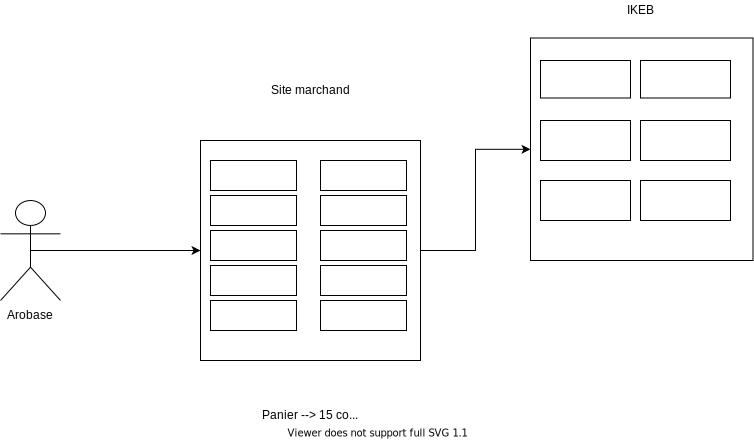
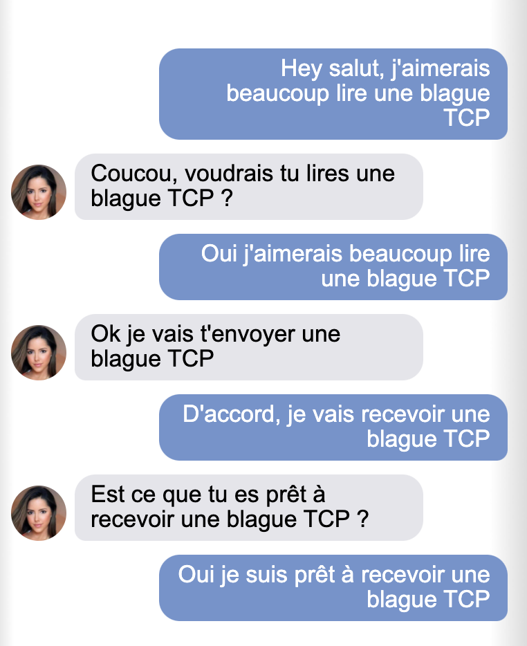
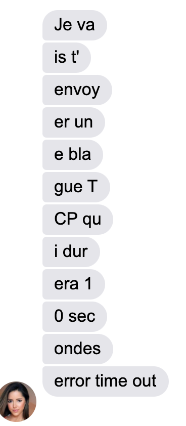

# Le protocole TCP

> Parmi tous les [protocoles](../definition/PROTOCOLE.md) employés dans le domaine de l'informatique, on peut très souvent entendre l'un d'entre eux revenir en boucle : IP. Et il se trouve qu'IP a un grand ami, le protocole TCP, avec qui il est très proche.

TCP, ou *Transmission Control Protocol* est toujours associé à IP, sous la dénomination *__TCP/IP__*. Il s'agit d'un membre essentiel d'Internet : il permet de relier les machines entre elles, ainsi que d'assurer l'échange de données, en garantissant l'arrivée à destination de paquets.

## Cliquez, c'est envoyé !

Imaginons que vous souhaitiez acheter quelque chose sur votre site de e-commerce préféré : lorsque vous passez votre commande, vous devez indiquer votre adresse postale, afin d'assurer la livraison jusqu'à votre domicile.

Dans le merveilleux monde d'Internet, c'est la même chose, grâce à l'adresse *__IP__* : chaque machine a la sienne, et vos données peuvent traverser tout le réseau mondial jusqu'à parvenir au bon destinataire : on parle alors de *__routage__*.

Arobase souhaite passer une commande auprès d'une célèbre chaine de magasin de meuble. Hélas, le paquet est trop gros pour être livré en une fois, en effet, le poids maximum d'un colis est de 1,5 kg.

*Quelle solution le commerçant va t-il choisir pour expédier les différents colis ?*

*__Problématiques__* :

    - Comment découper la commande pour faire parvenir l'ensemble des éléments ?
    - Comment s'assurer que tous les éléments arrivent bien ?

__En informatique__

Cela fonctionne de la même manière : Arobase souhaite envoyer télécharger un gros fichier depuis un serveur https. Les problèmatiques restent les mêmes : 

    - Comment découper le fichier ?
    - Comment s'assurer que tous les "morceaux" de fichiers parviennent à destination ?

## Deux méthodes d'envoie

Arobase a le choix entre deux méthodes de livraison :

    - Soit l'ensemble des paquets sera livrée en trois jours, avec une numérotation précise de chaque colis
    - Soit la commande arrivera dès le lendemain, mais sans aucune garantie de fiabilité

On peut rapprocher ces deux méthodes à deux protocoles de transmission de données :

- [x] TCP
- [x] UDP

### TCP

TCP assure une qualité de service, c'est à dire qu'il assure le découpage du fichier en plus petits paquets, en permettant le routage des données par quelques chemins que cela soit tout en promettant une reconstitution des fichiers demandés dans le bon ordre, grâce à une numérotation précise des données.

*__Selon vous, qu'est ce que le routage des paquets (c'est à dire le fait de pouvoir disperser les données à travers Internet tout en s'assurant qu'elles parviennent à destination) engendre comme contrainte ?__*

### UDP

Contrairement au protocole TCP, UDP s'affranchit de la numérotation des paquets et n'assure en aucun cas la fiabilité des données transmises.

*__Pourquoi, d'après vous, le protocole UDP est-il plus rapide que TCP ?__*

On suppose qu'Arobase souhaite envoyer des fichiers personnels sur son cloud Bobble Drive, et pour patienter, Arobase décide de regarder son jeu favori sur une plateforme de streaming.

À votre avis :

- Lequel de ces services favorise le TCP ?
- Lequel favorise l'UDP ? Pourquoi ?
- Que faire si un paquet se perd ?
- Que faire si un paquet arrive en double ?

## Mais au fait, comment se font ces échanges tcp ?

Voilà comment se déroule un échange entre un client et un serveur TCP.

Tout d'abord, le client demande un canal TCP au serveur

Puis le serveur se met en mode TCP et envoie les données découpées en paquets :

Hélas on voit ici que le message était trop long, et que le canal s'est refermé après la durée  choisie par défaut...

Et que se passe t-il dans ce cas ...?

## Synthèse

- TCP et UDP sont des ........................
- ............. permet de s'assurer que les données transmises sont bien arrivées à destination, contrairement à ............
- UDP est plus ..................... que TCP mais n'assure en aucun cas la fiabilité de la transmission
- Avec le protocole IP, ils forment un modèle informatique appelé ................
