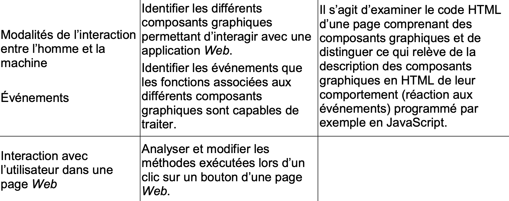
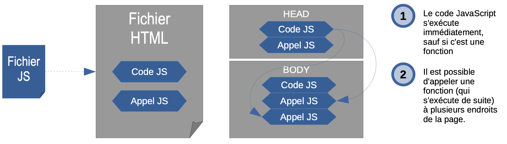

# Le JavaScript

> Crée en 1995, JavaScript est un langage inspiré de Java (mais de façon simplifiée) qui permet d’accéder aux objets dans les applications web notamment. Il est utilisé pour vérifier les champs de saisies dans les formulaires, pour faire des animations ou des effets de transitions.
>
> JavaScript s’utilise principalement dans un navigateur (qui intègre un moteur JavaScript).

---------

## Le programme



------

## Intégration 

Comme pour le CSS, on peut très facilement intégrer du code JS dans du code HTML :

- À l'aide d'une balise **script**
- À l'aide d'une balise **script** en indiquant qu'on va employer le javascript
- Ou bien dans un **fichier à part** (il faut donc le lier à votre fichier HTML dans ce cas):

```html
<script> tapez votre code ici...</script>
```

```html
<script language = "javascript"> tapez votre code JS ici...</script>
```

```html
<script type ="text/javascript" src = "chemindufichier.js"> </script>
```

Comme vu avec le CSS, il ne faut pas mettre ces balises n'importe où :

```html
<html>
  <head>
    <title> Ma page web </title>
<script language="JavaScript"> code </script> </head>
<body>
    <script language = "javascript">
      alert("Hello World 1.\nCliquez sur OK ")
</script>
  </body>
</html>
```

Ici, j'ai placé deux fois du code JavaScript dans ma page HTML.

- D'abord entre les balises <title> et </title>

Ici, le code va se charger **avant** la page web, ce qui peut occasionner des pages blanches si votre code est très long à charger.

- Ensuite, dans le <body> de la page HTML 

Dans ce cas, le script chargera lorsqu'il apparaîtra. Il s'executera alors immédiatement.

Si vous placez votre code dans un fichier, celui ci sera chargé lorsqu'il apparaîtra dans le code **mais** s'il contient des ***fonctions***, celles ci ne ***s'executeront*** que lorsqu'elles seront ***appelées***.

#### Résumé :



--------

## Utilisation

Le JavaScript est un langage **interprété** tout comme le HTML & le CSS : dès lors que votre navigateur web va rencontrer une balise "script" il n'essaiera plus de lire mais laissera le moteur JS faire le travail. Une fois la balise fermante atteinte, le navigateur web reprendra la main.

Il est donc possible d'exécuter du code au moment voulu dans une page web : lancer un calcul, demander une action à l'utilisateur...

À votre avis, à quoi sert le code suivant ?

```html
<script>
  a = 5
  b= 6
  document.write(a+b)
</script>
```

> Comme dans de nombreux autres langages de programmation, la fin d'une instruction lance l'instruction suivante.

-----------------

## 1ere Activité


### **Premier programme**

- Créons une page HTML5 nommée index.html. Vous pouvez utiliser une copie de votre précédent site. Ajoutons ensuite une ligne de code qui va demander l’exécution du code JavaScript :

```
<!doctype html>
<html lang="fr">
<head>
```


```
</head>
<body>
</body>
</html>
```

Nous avons donc ajouté la balise "script", cette balise accepte un attribut "src" qui correspond au chemin du fichier JavaScript (extension .js) qui doit être exécuté. Dans notre exemple, notre fichier "JavaScript" sera dans le même dossier que notre fichier "HTML" et se nommera "monprogramme .js".

- Nous allons maintenant créer et enregistrer un fichier "monprogramme .js" dans notepad++ : document.write("Hello World !");

- Enregistrez le fichier et ouvrez le fichier HTML (index.html) avec le navigateur Firefox.

À ce stade, vous devez juste avoir compris que le code document.write vous permet d'afficher la chaîne de caractères contenue entre les guillemets (dans notre exemple : Hello World !). Il est aussi important de noter qu'en JavaScript, une ligne de code doit se terminer par un point virgule.

Pour votre information, il est aussi possible d'inclure le code JavaScript directement dans le code HTML :

### Les variables en JavaScript

Vous devez tout d'abord déclarer votre variable en utilisant le mot clé var. var point_de_vie;

Puis vous pouvez affecter une valeur à votre variable

```
point_de_vie=15;
```

Ces 2 actions peuvent être couplées :

```
var point_de_vie=15;
```

- Voici un premier exemple : modifiez et enregistrez le fichier "monprogramme.js": var point_de_vie=15;

```
document.write(point_de_vie);
```

- Ouvrez le fichier HTML à l'aide du navigateur Firefox et observez le résultat. ❑On peut aussi améliorer le message avec le code suivant :

```
var point_de_vie=15;
document.write("point_de_vie a pour valeur ", point_de_vie);
```

***À votre avis, à quoi sert la virgule entre valeur et point_de_vie ?***

JavaScript est un langage faiblement typé, il n'est donc pas nécessaire de préciser le type de la variable. Attention, cela ne veut pas dire que votre variable n'a pas de type, juste que le programmeur n'a pas besoin de le préciser.

En JavaScript les types possibles sont : string (chaîne de caractères), boolean, les nombres (number) qui regroupent les entiers (type integer) et les nombres à virgule (type float). Attention pour le type float vous devez utiliser le point à la place de la virgule, par exemple le nombre pi ne s'écrit pas 3,14 mais 3.14.

- La fonction typeof() renvoie le type de la variable qui a été passé en argument (dans les parenthèses). **var a=4;**

```
document.write ("a a pour valeur ", a, ". Elle est de type ", typeof(a), "</br>");
var b="Hello";
document.write ("b a pour valeur ", b, ". Elle est de type ", typeof(b), "</br>");
```

**var c=true;**

```
document.write ("c a pour valeur ", c, ". Elle est de type ", typeof(c), "</br>");
```

**var d;**

```
document.write ("d a pour valeur ", d, ". Elle est de type ", typeof(d), "</br>");
```

Vous avez dû noter que pour une variable de type string, la valeur est entre guillemets.

- Ouvrez le fichier HTML à l'aide du navigateur Firefox et observez le résultat.

Deux choses à bien noter dans cet exemple :

- ➢  Vous avez sans doute reconnu la balise </br> ("retour à ligne") du HTML. 

  - document.write vous permet d'écrire du code HTML, il est donc logique d'utiliser la balise </br> pour effectuer un retour à la ligne (toute autre balise est aussi utilisable, essayez avec une balise <strong> par exemple). 
  - Enlevez les </br> du code pour vous convaincre de leur utilité. Enfin, attention, tout comme le texte, les balises HTML doivent être entre guillemets. La variable et la fonction typeof ne sont pas entre guillemets.

- ➢  Une variable quand elle a été déclarée, mais qu'aucune valeur ne lui a été attribué, a pour valeur undefined et est de type undefined.

  - Que se passe-t-il quand on utilise une variable qui n'a même pas été déclarée ?

  ```
  var a=4;
  document.write ("a a pour valeur ", a);
  document.write ("b a pour valeur ", b);
  var c="Hello";
  document.write ("c a pour valeur ", c);
  ```

  - 1ère ligne nous déclarons la variable a et nous lui attribuons la valeur (numérique) 4. 
  - 2ème ligne, nous utilisons la variable a

  - 3ème ligne nous utilisons une variable b qui n'a pas été déclarée !
  - 4ème ligne nous déclarons la variable c et nous lui attribuons la valeur (chaîne) "Hello". 

  - 5ème ligne nous utilisons c.

- Ouvrez le fichier HTML à l'aide du navigateur Firefox et observez le résultat.
   Le programme s’est arrêté à la 3ème ligne. Utiliser une variable non déclarée est une erreur qui provoque l'arrêt du programme.
   Problème, rien ne nous signale cette erreur dans le navigateur (c'est assez logique, à la base un navigateur n'est pas un outil de développement !).

### Les boites de dialogue

- Pour debugger des programmes il suffit souvent de placer des alertes à différents endroits du code.

```
alert("Une alerte simple");
var myText="Une alerte avec le message dans une variable";
alert(myText);
var myNumber=13;
alert("La variable contient la valeur" + myNumber);
```

- Ouvrez le fichier HTML à l'aide du navigateur Firefox et observez le résultat.
   Notez qu’ici pour la dernière ligne de code l’opérateur + est un opérateur de concaténation. En effet ajouter

deux chaînes de caractères revient à les coller à la suite l’une de l’autre : c’est une concaténation.
 Nous allons maintenant étudier la méthode qui permet à l'utilisateur de rentrer des valeurs au clavier : la

méthode prompt(). Nous allons utiliser une structure de la forme : var maVariable = prompt (message).

L'utilisateur va alors saisir (au clavier) du texte dans la zone de saisie. La validation avec le bouton OK permettra d'attribuer le texte entré par l'utilisateur à la variable maVariable. Au cas où l'utilisateur ne rentrerait rien ou qu'il appuierait sur Annuler on aura alors maVariable = null (pas de valeur).

- Voici un exemple :
   var prenom=prompt("Quel est votre prénom ?");

```
document.write ("Bonjour ", prenom, ", vous allez bien ?");
```

❑Ouvrez le fichier HTML à l'aide du navigateur Firefox et observez le résultat.

❑Testez ce qui se passe si l'utilisateur n'entre rien (ou appuie sur le bouton Annuler).

Pour éviter ce genre de chose, nous verrons un peu plus loin l'utilisation du couple if/else (les conditions)

- Un autre exemple : une machine à additionner

```
document.write ("Nous allons additionner 2 nombres, a et b </br>");
var a=prompt("Entrer a ");
var b=prompt("Entrer b ");
var resultat=a+b;
document.write ("Résultat ",a," + ",b," = ",resultat);
```

- Ouvrez le fichier HTML à l'aide du navigateur Firefox et observez le résultat.

- Pour essayer de comprendre ce qui se passe, faites un "typeof()" sur les variables a et b.

Les variables a et b sont toutes deux de type string. Or, nous avons vu que si nous avons affaire à des chaînes de caractères le signe + est le signe de concaténation (mise bout à bout de 2 chaînes de caractère). Si nous mettons bout à bout 5 et 15, nous obtenons bien 515.

Pour que notre programme fonctionne, il faut "transformer" notre chaîne (variable de type string) en nombre (variable de type integer). Nous allons faire du transtypage (convertir un type en un autre).

- Pour se faire, utilisons la méthode parseInt() :

```
document.write ("Nous allons additionner 2 nombres, a et b </br>");
var as=prompt("Entrer a ");
var bs=prompt("Entrer b ");
var a=parseInt(as);
var b=parseInt(bs);
var resultat=a+b;
document.write ("Résultat ",a," + ",b," = ",resultat);
```

- Ouvrez le fichier HTML à l'aide du navigateur Firefox et observez le résultat.
   as et bs sont de type string, a et b sont maintenant des nombres, le résultat est maintenant correct.
