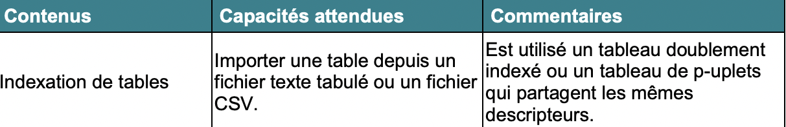

## Données en table & Fichiers CSV

 Un chapitre Excel-lent !


> Le format CSV est fréquemment utilisé pour échanger des données traitées à l'aide de tableurs ou de logiciels de traitement de bases de données. Ici, notre objectif sera d'apprendre à importer et exporter des données dans Python à l'aide du format CSV.

En informatique, il est courant de traiter d'importantes quantités d'informations, c'est d'ailleurs le modèle économique de bon nombre de sites et services que vous utilisez quotidiennement : *réseaux sociaux, magasins en ligne, cabinets d'analyses...*

> **Contenu**: Définition d'un fichier CSV, de données en table, recherche dans une table, fonction de tri <br>**Compétences**: Savoir exporter et importer des données dans un programme Python depuis un fichier CSV

### Le programme 

<br>





### <span style="color:green"> Apport de connaissances </span>

Les données en table sont une composante essentielle de l'informatique : de très nombreuses entreprises utilisent sdes tableurs afin de traiter un gros volume de données.  <p>

<p>
 En maîtrisant cet aspect, nous pourrons commencer à utiliser de petites bases de données pour nos activités, mais également travailler sur des projets plus intéressants.

---------------

### <span style="color: green" > Enregistrements </span>

Un **enregistrement** est une structure de données (différentes ou non) auxquelles on accède grâce à un nom.

On peut donc représenter les notes d'une élève dans différentes disciplines à l'aide d'un **enregistrement**

```python
{'Nom' : 'Jean-Yves', 'Anglais' : '17', 'NSI' : '18', 'Maths' : '16'}
```

À quelle structure de données python cela vous fait-il penser ?

✏ *Les clés sont parfois appelées champs ou attributs quand on parle de base de données* ✏

-----------

### <span style="color: green" > Fichiers CSV</span>

Le format CSV (***Comma Separated Value***) est employé poour importer / exporter des données depuis ou vers un tableur.

C'est une sorte de fichier texte dans lequel chaque ligne correspond à une ligne du tableau.

Comme son nom l'indique, on sépare les colonnes (et donc les valeurs) par une **virgule**, ou par un **point-virgule**.

Il permet donc de représenter une liste d'enregistrement ayant les même **champs**.

→ Exemple de feuille de calcul<br>
| Prénom       | DS1  | DS2  | Projet |
| ------------ | ---- | ---- | ------ |
| Michelangelo | 12   | 14   | B      |
| Leonardo     | 15   | 16   | A      |
| Raphael      | 10   | 12   | C      |
| Donatello    | 13   | 15   | B      |

On peut donc représenter ce tableau sous forme d'un fichier "notes.csv" :

```
Prenom; DS1; DS2; Projet
Michelangelo; 12; 14; B
Leonardo; 15; 16; A
Raphael; 10; 12; C
Donatello; 13; 15; B
```

Chaque ligne est un ***enregistrement***. La première ligne définit les ***attributs*** de chaque enregistrement.

------------------

### <span style="color: green" > Implémentation en Python</span>

On peut choisir de représenter en Python les fichiers **CSV** par des listes de dictionnaires dont les clés sont les noms des colonnes.

Par exemple, avec le tableau du dessus, cela donne :

```python
Notes = [{'Prénom' : 'Michelangelo', 'DS1' : '12', 'DS2' : '14', 'Projet' : 'B'},
{'Prénom' : 'Leonardo', 'DS1' : '15', 'DS2' : '16', 'Projet' : 'A'},
{'Prénom' : 'Raphael', 'DS1' : '10', 'DS2' : '12', 'Projet' : 'C'},
{'Prénom' : 'Donatello', 'DS1' : '13', 'DS2' : '15', 'Projet' : 'B'}]
```

On peut utiliser le vocabulaire décrivant une feuille de calcul de tableau :

- Une table est une liste de dictionnaire, ici **Notes**
- Chaque ligne est un dictionnaire et correspond à un enregistrement, par exemple **Notes[0]**
- Chaque cellule contient la valeur d'une clé du dictionnaire, par exemple **Notes[0] ['DS2']**

-----------------

### <span style = "color : green">Import d'un fichier CSV </span>

Il existe un module Python nommé *CSV* qui permet de manipuler ces fichiers.

On va donc créer une liste de dictionnaires, soit un par ligne de la table.

```python
import csv

def import_csv(fichier):
  lecteur = csv.Dictreader(open(fichier + '.csv', 'r'))
  return [dict(ligne) for ligne in lecteur ]
```

Ce qui nous donne :

```python
[{'Prénom' : 'Michelangelo', 'DS1' : '12', 'DS2' : '14', 'Projet' : 'B'},
{'Prénom' : 'Leonardo', 'DS1' : '15', 'DS2' : '16', 'Projet' : 'A'},
{'Prénom' : 'Raphael', 'DS1' : '10', 'DS2' : '12', 'Projet' : 'C'},
{'Prénom' : 'Donatello', 'DS1' : '13', 'DS2' : '15', 'Projet' : 'B'}]
```


On peut également manipuler les fichiers afin de lire puis de le transformer en tableau :

```python
import csv
def import_csv2():
  resultat = []
  with open('notes.csv',newline = '') as csvfile:
    s = csv.reader(csvfile,delimiter = ';')
    for i in s:
      resultat.append(i)
  return resultat 
```

On obtient donc ici la liste suivante :

```python
resultat = [['Prenom', 'DS1', 'DS2', 'Projet'], ['Michelangelo', '12', '14', 'B'],
           ['Leonardo', '15','16', 'A'], ['Raphael', '10', '12', 'C'], ['Donatello' '13', '15', 'B']]
```

-------

### <span style = "color : green">Export d'un fichier CSV </span>

Pour exporter une table vers un **fichier CSV** - *comprendre, créer un fichier csv depuis une table python* - on va entrer le nom de la table sous forme de chaine de caracteres. On donnera l'ordre des colonnes sous forme de liste d'attributs.

```python
def vers_csv(nom, ordre):
  with open(nom + '.csv', 'w') as fic:
    dic = csv.DictWriter(fic, fieldnames = ordre)
    table = eval(nom)
    dic.writeheader() # première ligne, celle des attributs
    for ligne in table:
      dic.writelow(ligne) # ajoute les lignes de la table
  return None
```


