# Petite Histoire de l'informatique

## 1er siècle avant J.-C.

- Datée d'avant 87 av. J.-C, la machine d'__Anticythère__ est une calculatrice mécanique antique permettant de calculer des positions astronomiques. C'est le plus vieux __mécanisme à engrenages
connu.__

## 1623

- __Wilhelm Schickard__ (1592-1635) invente pour Kepler une « horloge calculante » destinée à calculer les éphémérides.

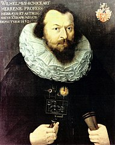{ height=50% }


## 1642-1644

- __Blaise Pascal__ (1623-1662) invente une machine à calculer (« __la Pascaline__ ») capable d'additionner et de soustraire des nombres de huit chiffres.

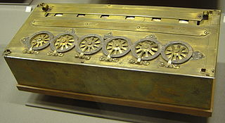{ width=50% }

## 1673

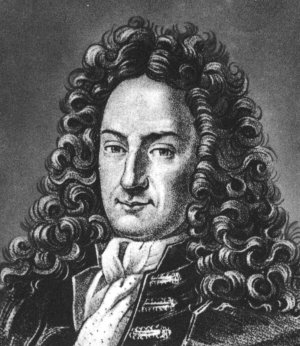{ height=30% }

- Gottfried Wilhelm von __Leibniz__ s'inspire de la Pascaline et invente une machine capable de multiplier et diviser sans utiliser les additions successives.
- Construite qu'en 1694, faute de trouver un artisan assez habile.
- Leibniz a aussi compris l'importance du __système binaire__ pour les mathématiques et la logique. On trouve cependant des traces du système binaire bien avant, chez les _Indiens_ et les _Chinois_.

## 1801

- Joseph Marie __Jacquard__ (1752-1834) invente des cartes pour commander le tissage de motifs sur les métiers à tisser.
- On peut considérer cette invention comme le __début de la programmation__.

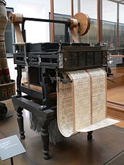{ height=50% }

## 1823

- __Charles Babbage__ (1791-1871) commence à construire sa __machine à différences__, inspiré par le métier à tisser de Jacquard.
- En 1823 débute la construction de cette machine qui ne sera jamais complétée. 

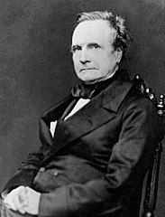{ height=50% }

## 1842

- __Ada Lovelace__ (1815-1852), mathématicienne, aide à concevoir les « diagrammes » pour faire fonctionner la machine analytique de Charles Babbage. Elle conçoit le premier __programme__ qui porte sur le calcul du nombre de Bernoulli.

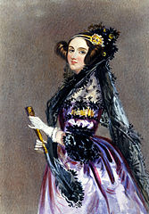{ height=50% }

## 1854

- __George Boole__ (1815-1864) publie un article sur la __logique binaire__. Les travaux de Boole, s'ils
sont théoriques, n'en trouveront pas moins des applications primordiales dans les systèmes informatiques.

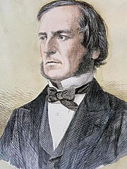{ height=50% }

## 1890

- __Herman Hollerith__ (1860-1929) utilise une __machine à cartes perforées__ pour le dépouillement du recensement américain.

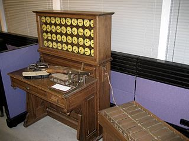{ width=50% }

## 1936

- Alan Mathison __Turing__ (1912-1954) publie _On Computable Numbers with an Application to the Entscheidungsproblem_, ouvrage qui définit les limites théoriques de l'ordinateur. 
- Il présente le modèle des __machines de Turing__ et construit (mathématiquement) la première __machine universelle__. 
- Il prouve également l'absence de méthodes algorithmiques (indécidabilité algorithmique) pour résoudre certains problèmes comme le problème de l'arrêt ou le problème de la décision.

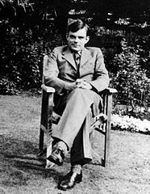{ height=50% }

## 1940

- Pour décrypter les messages de l'armée Allemande, les Anglais mettent au point sur le site de Bletchley Park les calculateurs __Robinson__ et __Colossus__ sous la direction du mathématicien Alan Turing.

{ height=50% }

- Tout ceci sera classé « Secret défense » jusqu'en 1975.
- L'histoire de cette période est retracée dans le film __The Imitation Game__ de _Morten Tyldum_ sorti en 2014.

## 1941

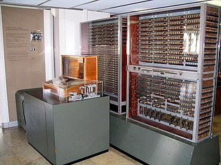{ width=25% }

- Konrad Zuse (1910-1995) fait fonctionner le __premier ordinateur du monde__, le Z3 (ou Zuse 3).
- Encore largement méconnu, il est l'un des pères de l'informatique en ayant développé le premier calculateur électromécanique Z1 en 1938. Le Z3 fut détruit en 1944 par les bombardements alliés et servait à produire des calculs pour une usine aéronautique allemande.
- Il concevra aussi et réalisera entre 1942 et 1946 le premier langage de haut niveau nommé __Plankalkül__. 

## 1943

- L'__ENIAC__ (Electronic Numerical Integrator And Computer) est créé. Il sera opérationnel en 1946. Son poids est de 30 tonnes pour des dimensions de 2,4 x 0,9 x 30,5 mètres occupant une surface de 67 mètres carrés. 

{ width=25% }

- Il fut utilisé pour des calculs ayant servi à mettre au point la bombe H. Son principal inconvénient était sa programmation : l'ENIAC était en effet uniquement programmable manuellement avec des commutateurs et des câbles à enficher.

## 1944

- John __Von Neumann__ (né János Neumann, 1903-1957) a donné son nom à « l'architecture de von Neumann » utilisée dans la quasi-totalité des ordinateurs modernes. 

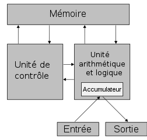{ width=50% }

## 1947

- Un papillon de nuit coincé dans les circuits bloque le fonctionnement du calculateur Mark II. La mathématicienne __Grace Murray Hopper__ décide alors que tout ce qui arrête le bon fonctionnement d'un programme s'appellera « __bug__ » (bestiole en anglais).

{ width=50% }

- Il faut noter que le terme « bug » était déjà utilisé auparavant : Thomas Edison par exemple avait employé ce terme dans un courrier à propos d'une de ses inventions.

## 1951

- __Grace Murray Hopper__ (1906-1992) conçoit le __premier compilateur__, nommé A-0 System. 

{ width=50% }

## 1954

- Création du __FORTRAN__, par John Backus, premier __langage de programmation__ à être implémenté sur un ordinateur.

	```Fortran
	program hello
  	implicit none
  	write(*,*) 'Hello world!'
	end program hello
	```

## 1954

- IBM (société fondée en 1911) lance sur le marché le modèle 650, __premier calculateur, muni d'une mémoire à tambour__ et orienté calcul scientifique produit en grande série. Il coûtait un demi-million de dollars, occupait plusieurs mètres cubes et était doté d'une mémoire vive de 2 kilooctets.

## 1955

- Le professeur __Jacques Perret__ de la faculté des lettres de l'université de Paris, invente le mot « __ordinateur__ » le 16 avril 1955, à la demande d'IBM France.

## 1958

- En 1958, alors qu'il travaillait pour Texas Instrument, l'Américain __Jack Kilby__ (1923-2005) invente le premier circuit intégré, jetant ainsi les bases du matériel informatique moderne. Cette découverte a valu à Kilby le prix Nobel de physique en 2000.

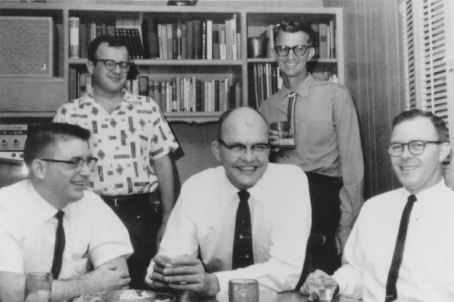{ width=50% }

## 1962

- Philippe Dreyfus invente le mot « __informatique__ », mot-valise né de la contraction des mots « information » et « automatique ».

## 1963

- Création de la __souris__ par Douglas Engelbart (1925-2013) du Stanford Research Institute.


## 1967

- Une équipe d'ingénieurs d'IBM dirigée par Alan Shugart (1930-2006) lance la __disquette__ (dans sa version 8 pouces) pour stocker les microprogrammes des systèmes 370 et, accessoirement, envoyer pour un faible coût des mises à jour à leurs possesseurs. Cette première disquette pouvait stocker 80'000 caractères, soit environ une journée de frappe d'une opératrice de saisie. 

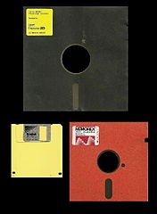{ height=33% }

## 1969

- Début du réseau __Arpanet__, renommé plus tard Internet. Il compte 4 nœuds.

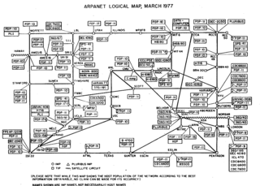{ width=50% }

## 1971

- Le __microprocesseur 4004__ d'Intel date de 1971. De la taille d'un timbre, il développe des performances équivalents à celle de l'ENIAC (1946), qui occupait toute une pièce.

{ width=50% }

## 1973

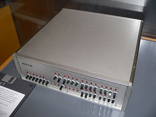{ width=25% }

- Commercialisation du Micral, le premier micro-ordinateur. Il a été développé de 1972 à 1973 par R2E, jeune société Française dirigée par André Truong (1936-2005), mais c'est François Gernelle (né en 1944) qui en est l'inventeur. Cet ordinateur ne possédait ni clavier ni écran et était commandé par des interrupteurs, comme l'Altaïr, deux ans plus tard.

## 1975

- L'Altaïr 8800 du constructeur américain MITS est un micro-ordinateur basé sur le micro- processeur Intel 8080A vendu en kit électronique à quelques milliers d'exemplaires pour les particuliers en 1975. Il est considéré par les Américains comme le premier micro-ordinateur.

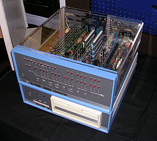{ width=25% }

## 1975

- La société Microsoft est fondée en avril 1975 sous le nom original de __Micro-Soft__, par deux étudiants américains, __Bill Gates__ (photo, né en 1955) et Paul Allen (1953-2018).

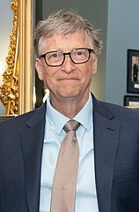{ height=50% }

## 1976

- Steve Jobs (1955-2011), Steve Wozniak (photo, né en 1950) et Ronald Wayne (né en 1934) fondent la société __Apple__.

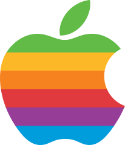{ width=25% }

## 1976

- Apparition du premier supercalculateur : le __Cray I__.

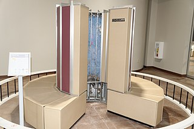{ width=50% }

## 1982

- L'arrivée du PC portable __Grid Compass 1101__ : la première machine à proposer un concept d'écran « refermable ». 

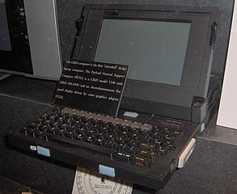{ height=33% }

- Vendu la bagatelle de 8150 dollars, c'est un véritable monstre de puissance et se targue de proposer un écran de 6 pouces affichant une définition de 320 x 240 px. À l'intérieur, on y trouvait un processeur Intel 8086 cadencé à 8 MHz et 256 Ko de mémoire vive.

## 1982

- Commercialisation du CD-ROM par Philips et Sony

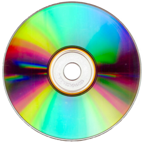{ width=33% }

## 1989

- Tim Berners-Lee (né en 1955) invente le World Wide Web (WWW) pour que les chercheurs puissent partager les informations au sein du CERN.

{ width=50% }

## 1990

- le 20 Décembre, le premier site web est mis en ligne, accessible à l'adresse [info.cern.ch](info.cern.ch)


## 1991

- __Guido van Rossum__ créé le langage __Python__.

{ width=50% }

## 1994

- Le site de vente en ligne __Amazon__ est fondé par __Jeff Bezos__ (né en 1964).
- En 2017, la société emploie 541'900 personnes dans le monde et a établi, outre le site originel américain (ouvert en 1995), des sites spécifiques dans de nombreux pays.

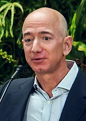{ height=33% }

## 1995

- Création du Premier réseau social sur Internet : __Classmates.com__, par Randy Conrads, l’objectif de ce site était de remettre en contact des anciens camarades de classe.

{ width=50% }

## 1997

- __Deep Blue__ bat Gary Kasparov sur le score de 3,5 – 2,5.
- Deep Blue est un superordinateur spécialisé dans le jeu d'échecs, développé par IBM.
- C'est la première fois qu'un ordinateur bat un champion du monde d'échecs.

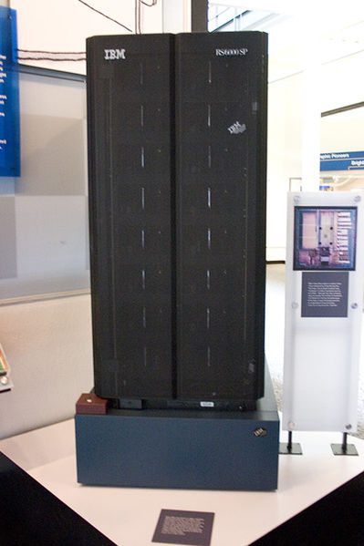{ height=50% }

## 1998

- La société __Google__, Inc. est fondée le 27 septembre 1998 dans la Silicon Valley, en Californie, par Larry Page et Sergey Brin, créateurs du moteur de recherche Google.

## 1999

- Création de la norme __Bluetooth__ par le fabricant suédois Ericsson à Lund.
- Le nom « Bluetooth » est directement inspiré du surnom anglicisé du roi viking danois Harald à la dent bleue (en danois Harald Blåtand, en anglais Harald Bluetooth), connu pour avoir réussi à unifier les tribus danoises au sein d'un même royaume, introduisant du même coup le christianisme. 


## 2001

- __Wikipédia__ est une encyclopédie numérique ouverte, libre, multilingue, consultable gratuitement sur internet et en évolution permanente grâce à de très nombreux contributeurs bénévoles. Son succès est considérable et sa croissance exponentielle : créée en janvier 2001 par Jimmy Wales (né en 1966), elle est devenue un des 10 sites les plus consultés au monde.

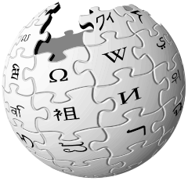{ width=25% }

## 2004

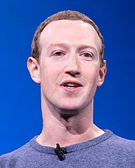{ height=33% }

- __Mark Zuckerberg__ (né en 1984) fonde « The Facebook », le 4 février 2004.
- L'inscription était alors limitée aux étudiants de l'université Harvard.
- En 2018, __Facebook__ compte plus de 2.2 milliards d'utilisateurs.

## 2005

- __Youtube__ est créé par Steve Chen, Chad Hurley et Jawed Karim, trois anciens employés de PayPal. 
- Il est racheté par Google en octobre 2006 pour la somme de 1.65 milliard de dollars.

{ width=50% }

## 2006

- __Twitter__ est créé le 21 mars 2006 par Jack Dorsey, Evan Williams, Biz Stone et Noah Glass, et lancé le 13 juillet de la même année. Le service est rapidement devenu populaire, jusqu'à réunir plus de 500 millions d'utilisateurs dans le monde fin février 2012. Au 5 mars 2017, Twitter compte 313 millions d'utilisateurs actifs par mois avec 500 millions de tweets envoyés par jour et est disponible en plus de 40 langues.

## 2007

- Apple entre dans le marché des téléphones portables avec la commercialisation de l'__iPhone__.

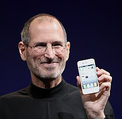{ height=50% }

## 2010

- Le 3 avril 2010, Steve Jobs (1955-2011), président-directeur général d'Apple, présente sa dernière nouveauté : l'__iPad 1__. La tablette d'Apple est la plus vendue au monde.
- L'écran tactile de la tablette remplace en quelque sorte la souris. Un logiciel interprète le contact et les déplacements des doigts sur l'écran. L'affichage à l'écran peut se faire en mode portrait et paysage en pivotant la tablette.

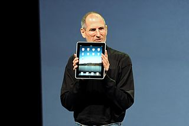{ height=33% }

## 2010

- __Instagram__ est fondé et lancé par l'Américain Kevin Systrom et le Brésilien Michel Mike Krieger en octobre 2010. Le 10 avril 2012, Facebook annonce l'acquisition d'Instagram pour environ un milliard de dollars américains.
- Instagram revendique plus d'un milliard d'utilisateurs à travers le monde, dont 75 % d'utilisateurs en dehors des États-Unis, selon les chiffres officiels fournis en juin 2018.

## 2011

- En Septembre 2011, Evan __Spiegel__ et Bobby __Murphy__ créént L'application Snapchat.

## 2017

- En novembre, IBM déclare avoir développé un __ordinateur quantique__ capable de gérer 50 bits quantiques, ou qubits. Les chercheurs ont pu préserver l'état quantique pendant 90 microsecondes. En dépit d'une période de temps extrêmement courte, il s'agit d'un nouveau record pour l'industrie.

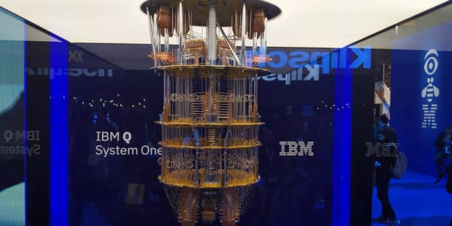{ width=50% }

## 2018

- En mars 2018, Google a marqué les esprits en présentant __Bristlecone__, un processeur quantique avec 72 qubits. Personne n'a fait mieux à ce jour.

## Tester vos connaissances

Pour tester vos connaissances en histoire de l'informatique, vous pouvez compléter la [grille de mots croisés](./MOTS_CROISES.pdf).

## Sources

[1] Rossi Serge, « Histoire de l'informatique », <http://histoire.info.online.fr/>

[2] Wikipédia, « Chronologie de l'informatique », <http://fr.wikipedia.org/wiki/Chronologie_informatique>

[3] Breton Philippe, Une histoire de l'informatique, Éditions La découverte, 1987

[4] Les Cahiers de Sciences & Vie, Qui a inventé l'ordinateur ?, HS No 36, Décembre 1996