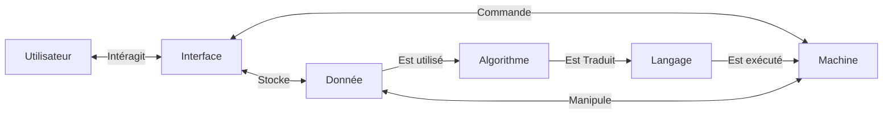
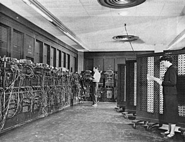
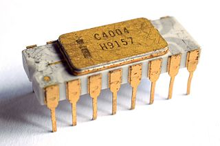
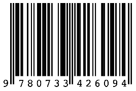
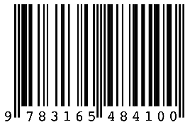
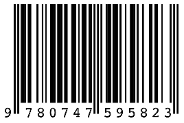
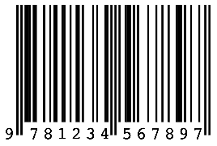

# Introduction

## L'informatique c'est quoi ?

L'informatique est structurée par quatre concepts:

- L'__algorithme__ : méthode opérationnelle permettant de résoudre un problème.
- La __machine__ : système physique doté de fonctionnalités.
- Le __langage__ : moyen de communication entre l'informaticien et la machine.
- Les __données__ : éléments symboliques susceptibles d'être traitées par une machine.

À ces concepts s'ajoute un élément transversal : Les __interfaces__

« *L'informatique n'est pas plus la science des ordinateurs que l'astronomie n'est celle des télescopes* » (Michael R. Fellows et Ian Parberry)

## Définition

On peut dire que l'informatique est : __La science du traitement automatisé de l'information__.

- __Science__ : donc un aspect théorique (domaine des mathématiques)
- __Traitement automatisé__ : c'est l'ordinateur (domaine des technologies)
- __Information__ (au sens de [Claude Shannon](https://fr.wikipedia.org/wiki/Claude_Shannon)) : Grandeur mesurable, observable tout ce qui est numérisable (texte,musique, voix,image, films, ADN,...)

L'informatique regroupe un grand nombre de domaines : langage et programmation, architecture et système, théorie des graphes, réseau, sécurité, base de données, intelligence artificielle, etc.

Comme toute connaissance scientifique et technique, les concepts de l'informatique ont une __histoire__ plus ancienne qu'il n'y parait et ont été forgés par des femmes et des hommes...sur des siècles !

## Une brève histoire

| Qui | Date | Événement |
| :--: | :--: | :-- |
| - | 1er siècle avant J.-C. | Machine d’Anticythère, le plus vieux __mécanisme à engrenages connu__. |
| __Charles Babbage__ | 1821 | Commence à construire sa __machine à différences__, première machine mécanique programmable. |
| __Alan Turing__ | 1936 | Il présente le modèle des __machines de Turing__ et construit (mathématiquement) la première machine universelle. |
| - | 1943 | __ENIAC__, machine servant au calcul des trajectoires balistiques, est créée. Son poids est de 30 tonnes pour des dimensions de 2,4 x 0,9 x 30,5 mètres occupant une surface de 67 mètres carrés. |
| __John Von Neumann__ | 1944 | A donné son nom à « l’architecture de __von Neumann__ » utilisée dans la quasi-totalité des ordinateurs modernes. |
| __DARPA__ | 1969| Début d'Arpanet, le prédécesseur d'Internet par le ministère de la défense américaine |
| __Intel__ | 1971| Le microprocesseur 4004 d’Intel est de la taille d’un timbre, il développe des performances équivalents à celle de l’ENIAC (1946), qui occupait toute une pièce. |
| __Jimmy Wales__ | 2001 | Création de __Wikipédia__ |

### À Faire

- Cette histoire est très incomplète, vous allez contribuer à la développer.
- Via votre téléphone ou ordinateur, trouver les dates / protagonistes des événements suivants :

| Événement / Fait | Date | Protagoniste.s |
| :--: | :--: | :--: |
| Premier réseau social sur Internet | | |
| Sortie du 1er Iphone | | |
| Premier site web | | |
| Création du premier ordinateur | | |
| Sortie du premier micro-ordinateur | | |
| Sortie du premier ordinateur portable | | |
| Création du langage Python | | |
| Création d'Internet | | |
| Création de la souris | | |
| Création du mot Bug | | |
| Premier programme informatique | | |
| Première machine à calculer | | |
| Création du CD-ROM | | |
| Première langage de programmation | | |
| Utilisation du système binaire | | |
| Création du mot ordinateur | | |
| Création du mot informatique | | |

### Pour aller plus loin

Tester vos connaissances via cette [grille de mots croisés](./MOTS_CROISES.pdf)

## Un premier TP

### Le code ISBN d'un livre

L'__ISBN__ est un numéro international normalisé permettant l'identification d'un livre dans une édition donnée. ISBN est l'acronyme d'__I__nternational __S__tandard __B__ook __N__umber.

__L'ISBN a été conçu pour simplifier le traitement informatisé des livres__

- Les libraires peuvent passer des commandes standardisées, les distributeurs ont le même code pour traiter les commandes et les retours, les différentes opérations de gestion dans les bibliothèques et centres de documentation sont également facilitées.
- Par ailleurs, le caractère international de cette numérotation constitue, à l'étranger également, une référence unique pour tous les professionnels du livre.

__L'ISBN identifie donc de façon unique un livre quel que soit son support de publication,imprimé ou numérique.__

ISBN du livre de Catherine Dufour, _Ada ou la beauté des nombres_.

#### Le TP

Ce [premier TP](./TP/isbn.md) vous conduira à étudier le format de données de l'ISBN et la méthode qui vérifie la validité d'un code ISBN.

##### Les codes à vérifier

<table>
<tr>
<td></td>
<td></td>
<td></td>
<td></td>
<td></td>
</tr>
</table>

#### Pour les plus rapides

[Voici un second TP](./TP/vitale.md) qui vous conduira à étudier et écrire la méthode qui vérifie la validité d'une carte vitale.

