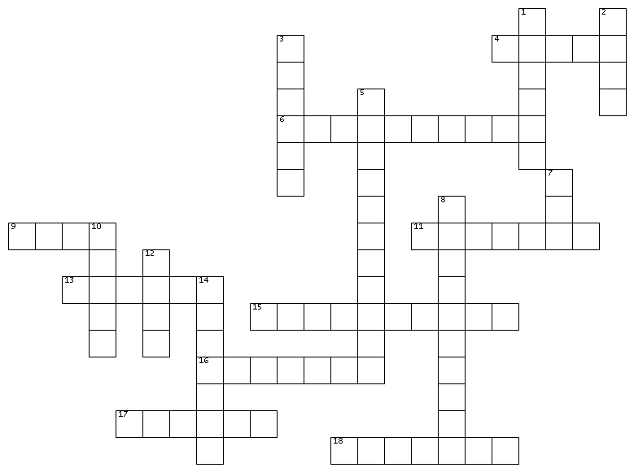

# Mots croisés - Histoire de l'informatique

{ width=70% }

__HORIZONTAL__

4 - Inventeur de la logique binaire

6 - Nom du premier langage de programmation de haut niveau

9 - Informaticien allemand ayant fait fonctionner le premier ordinateur du monde

11 - premier langage de programmation à être implémenté sur un ordinateur

13 - Nom du premier micro-ordinateur

15 - Créateur de Facebook

16 - Concepteur de la "machine à différences"

17 - A construit la première machine universelle

18 - Ancêtre d'Internet

__VERTICAL__

1 - Firme fondée par Larry Page et Sergey Brin

2 - Lieu où a été inventé le World Wide Web

3 - Informaticienne américaine qui a conçu le premier compilateur

5 - Plus vieux mécanisme à engrenages connu

7 - Prénom de la collaboratrice de Babbage et langage de programmation

8 - A donné son nom à l'architecture utilisée dans la quasi-totalité des ordinateurs modernes

10 - Electronic Numerical Integrator And Computer

12 - Nom du premier supercalculateur

14 - Inventeur de la première calculatrice capable de multiplier