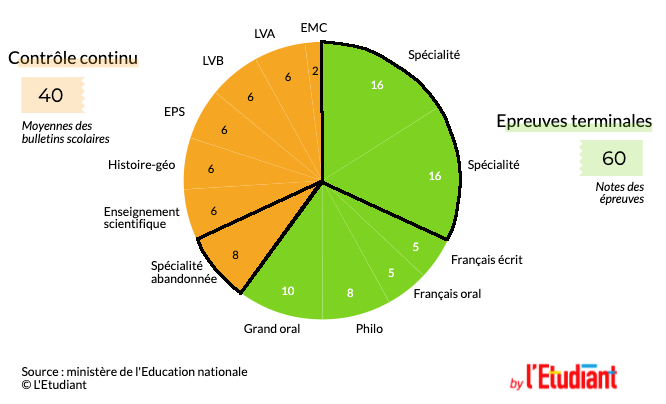

# Préambule

## Règles du jeu

- __Téléphone en mode avion__ dans les sacs,
- Port du __masque obligatoire__,
- __Lève la main__ pour répondre ou poser une question.

## Mot de bienvenue

- Bienvenue en __1ère__, au __lycée Masséna__
- Tous mes voeux de __réussite__ pour cette nouvelle année
- Merci d'avoir choisi la spécialité __NSI__ (**N**umérique et **S**ciences **I**nformatiques)

# Le programme

## Définition

Cet enseignement s'appuie sur les quatre concepts de l'informatique :

- Les __données__, qui représentent sous une forme numérique unifiée des informations très diverses,
- Les __algorithmes__, qui spécifient de façon abstraite et précise des traitements à effectuer sur les données,
- Les __langages__, qui permettent de traduire les algorithmes abstraits en programmes exécutables par les machines.
- Les __machines__, et leurs systèmes d'exploitation, qui permettent d'exécuter des programmes en enchaînant un grand nombre d'instructions simples, assurent la persistance des données par leur stockage et de gérer les communications. On y inclut les objets connectés et les réseaux.

## Organisation (1 / 3)

- L'horaire hebdomadaire est de __4h__ en 1ère,
- Cet enseignement favorise les __travaux pratiques__, la réalisation de __projets__ et comme son nom l'indique une __part théorique__ y est inhérente,

## Organisation (2 / 3)

- 6 chapitres :
  - Représentation des données : types et valeurs de base
  - Représentation des données : types construits
  - Réseau et Web
  - Architectures matérielles et systèmes d'exploitation
  - Langages et programmation
  - Algorithmique

## Organisation (3 / 3)

- 1er trimestre : Qu'est-ce que __coder__ et __programmer__ ? Qu'est-ce qu'une __donnée__ en machine ?
- 2ème trimestre : Comment __prouver un algorithme__ ? Qu'est-ce qu'un __système d'exploitation__ ?
- 3ème trimestre : Comment communique-t-on sur le __WEB__ ? Comment échanger des données de __manière sécurisée__ ? Que se pase-t-il quand on cherche __LA meilleure solution__ à un problème ?

## Attendus (1 / 2)

Développer des compétences :

- __analyser et modéliser un problème__ en termes de flux et de traitement d’informations,
- décomposer un problème en sous-problèmes, __reconnaître des situations__ déjà analysées et réutiliser des solutions,
- __concevoir__ des solutions algorithmiques,
- __traduire__ un algorithme dans un __langage de programmation__.

## Attendus (2 / 2)

- En NSI, on attend des élèves qu'ils sachent faire __preuve d'autonomie, d'initiative et de créativité__,
- Ils doivent faire preuve d'__esprit d'équipe__,
- La __rigueur et l'organisation__ sont également très importantes 
- Il faut savoir __rechercher de l'information et partager des ressources__.

## Évaluation (1 / 2)

{ width=50% }

2 situations :

1. la spécialité NSI est __abandonnée__ en _Première_ : la note du bac est égale à la __moyenne__ des bulletins scolaires de cette année, __coefficient 8__.
2. la spécialité NSI est __gardée__ en _Terminale_ : la note du bac est égale à l'__épreuve terminale__, __coefficient 16__.

## Évaluation (2 / 2)

- __Objectifs__ : Vérifier vos acquis et identifier vos difficultés. Évaluation $\neq$ Sanction.
- __Périodicité__ : Tout au long de l'année,
- __Modalité__ : QCM, TD, exposés, projets

## Point Mickael Jordan (1 / 2)

::: columns

:::: column

- Mickael Jordan :
	- Basketteur américain des années 1990,
	- 6 fois champion de NBA,
	- 2 fois médaille d'or olympique,
	- détenteur de plusieurs records : meilleur marqueur, meilleur passeur, ... 
- Un grand champion qui parle de l'échec...
::::

:::: column

::::

:::

## Point Mickael Jordan (2 / 2)

{ width=75% }

$\Rightarrow$ ___ce n'est pas parce qu'une évaluation est ratée que les autres le seront___.

## Cours

- Les cours se trouvent sur :
	- Framagit : [https://gitlab.com/Philippe-Boddaert/premiere](https://gitlab.com/Philippe-Boddaert/premiere)
	- Dans le cahier de texte de l'ENT
- Il est mis à jour à chaque séance
- Il contient l'essentiel des cours, et sujets des travaux (TD, TP, Projets)
- Il ne contient pas les corrigés des exercices

## Impact pour vous

- Les cours sont __disponibles 24h/24h__ et accessible par téléphone, ordinateur, tablette
- __Prise de notes obligatoires__ pour les notions importantes et les corrigés d'exercice

## Matériel

Obligatoire : 

- Un grand classeur avec intercalaires (1 pour chaque chapitre)
- Feuille petit carreaux
- Un ordinateur

Facultatif :

- Crayon 4 couleurs
- 1 clé USB : pour pouvoir récupérer votre travail
- 1 casque audio : pour écouter les vidéos proposés lors de certaines séances

## Fiche de connaissances (1 / 2)

- Sur une demi-feuille, en 5 minutes, renseigner les éléments suivants :
	1. Nom, prénom
	2. Classe
	3. Autres spécialités choisies
	4. Éléments du programme de NSI "difficiles"
	5. Éléments du programme de NSI "favoris"
	6. Orientation envisagée
	7. Ordinateur à disposition ? Endroit calme pour travailler ?
	8. Parent.s / frères / soeurs évoluant dans le domaine de l'informatique ? Si oui, à quel niveau, poste ?

## Fiche de connaissances (2 / 2)

- Pendant 1 minute, à l'__oral__, présenter les éléments :
	1. Nom, prénom
	2. Classe
	3. Autres spécialités choisies
	4. Orientation envisagée
	5. 30' libre : partage d'un livre, film, série...

## Outils

- __Spyder, Pizo__ : Outil de développement Python,
- __Gimp__ : Outil de manipulation d'images,
- __Notepad++__ : Outil de traitement de texte,
- __Libreoffice__ : Suite logiciel (traitement de texte, tableur, présentation),
- __Firefox, Chrome__ : Navigateur Web
