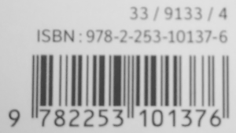
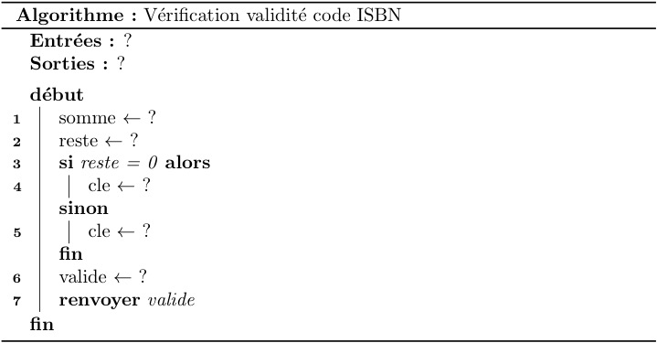

# TP - Code ISBN d'un livre

## 1 - Définition

L’ISBN est un numéro international normalisé permettant l’identification d’un livre dans une édition donnée.

ISBN est l’acronyme d’International Standard Book Number

L’ISBN a été conçu pour simplifier le traitement informatisé des livres : les libraires peuvent passer des commandes standardisées, les distributeurs ont le même code pour traiter les commandes et les retours, les différentes opérations de gestion dans les bibliothèques et centres de documentation sont également facilitées. Par ailleurs, le caractère international de cette numérotation constitue, à l’étranger également, une référence unique pour tous les professionnels du livre.

__L’ISBN identifie donc de façon unique un livre quel que soit son support de publication, imprimé ou numérique.__

_Deux livres peuvent avoir le même titre, mais auront des codes ISBN différents_

<table>
<tr><td style="text-align:center;">L’ISBN est un numéro à 13 chiffres depuis le 1er janvier 2007
(les ouvrages antérieurs avaient un ISBN à 10 chiffres).</td><td style="text-align:center;"></td>
</table>
Les parties de l’ISBN : __978 2 253 10137 6__

- __978__, signifie que l’article est un livre (’Bookland’) (979 sera aussi employé en fonction des besoins...) Dans un code barre, les 3 premiers chiffres indiquent le pays producteur, comme 978 et 979 ne sont pas utilisés, on les a attribués aux livres...
- __2__ : La deuxième partie de l’ISBN est le numéro identifiant le groupe national, linguistique ou géographique. Le __2__ identifie la francophonie dans son ensemble.
- __253__ : C’est un numéro qui identifie un éditeur en particulier.
- __10137__ : C’est le numéro d’identification d’une édition donnée d’une publication produite par un éditeur en particulier.
- __6__ : La cinquième partie de l’ISBN est la clé de contrôle. Il s’agit de la partie finale de l’ISBN qui est reliée aux précédents caractères de la chaîne par un algorithme mathématique et qui permet d’en vérifier la validité. La clé peut varier de 0 à 9.

## 2 - Le problème

étant donné un code ISBN, est-il valide?

Dans un __premier temps__, examinons comment est calculée la clé de contrôle :

<table>
<tr>
<th>Les 12 premiers chiffres de l'ISBN (n)</th>
<td style="text-align:center;">9</td>
<td style="text-align:center;">7</td>
<td style="text-align:center;">8</td>
<td style="text-align:center;">2</td>
<td style="text-align:center;">2</td>
<td style="text-align:center;">5</td>
<td style="text-align:center;">3</td>
<td style="text-align:center;">1</td>
<td style="text-align:center;">0</td>
<td style="text-align:center;">1</td>
<td style="text-align:center;">3</td>
<td style="text-align:center;">7</td>
</tr>
<tr>
<th>Pondération (p)</th>
<td style="text-align:center;">1</td>
<td style="text-align:center;">3</td>
<td style="text-align:center;">1</td>
<td style="text-align:center;">3</td>
<td style="text-align:center;">1</td>
<td style="text-align:center;">3</td>
<td style="text-align:center;">1</td>
<td style="text-align:center;">3</td>
<td style="text-align:center;">1</td>
<td style="text-align:center;">3</td>
<td style="text-align:center;">1</td>
<td style="text-align:center;">3</td>
</tr>
<tr>
<th>n * p</th>
<td style="text-align:center;">9</td>
<td style="text-align:center;">21</td>
<td style="text-align:center;">8</td>
<td style="text-align:center;">6</td>
<td style="text-align:center;">2</td>
<td style="text-align:center;">15</td>
<td style="text-align:center;">3</td>
<td style="text-align:center;">3</td>
<td style="text-align:center;">0</td>
<td style="text-align:center;">3</td>
<td style="text-align:center;">3</td>
<td style="text-align:center;">21</td>
</tr>
</table>

### 2.1 - À Faire 

1. On additionne les résultats de la dernière ligne :
```txt


```
2. On calcule le reste de la division par 10 de la somme obtenue :
```txt


```


3. Si ce reste est 0, alors la clé de contrôle est 0, sinon la clé de contrôle est alors le résultat de 10 - reste, soit ici :
```txt


```

Donc en comparant le résultat et la clé de contrôle du code ISBN, on peut affirmer que le code ISBN est valide ou pas.

C’est un cas typique où l’informatique est d’une aide précieuse...

- Toute personne pourra vérifier la validité d’un code ISBN, sans connaître les calculs à faire.
- On entre le code ISBN dans une zone de saisie, et un programme nous informe de la validité du code...

Dans un __second temps__, écrivons un __algorithme__ qui permet de savoir si un code ISBN est valide ou pas. Il s’agit de décrire la __méthode__ pour résoudre ce problème:

### 2.2 - À Faire

1. Quelles sont les données en entrées? 
```txt

```
2. La variable somme reçoit
```txt

```
3. La variable reste reçoit
```txt

```
4. Complétez la méthode qui résout le problème initial : "Étant donné un code ISBN, est-il valide? "
	

### 2.3 - Conclusion

Cette partie nous permet d'écrire un premier __algorithme__,.

Un __algorithme__ est une _suite finie d'instructions séquentielles permettant de résoudre un problème_. Il est écrit en langage naturel, doit prévoir tous les cas de figures et doit comporter une description non équivoque de la manipulation des __données__.

_Quiconque lit et exécute les instructions de l'algorithme sur les données en entrée obtient une solution au problème en sortie._

Un algorithme a :

- un __nom__,
- une / des __entrées__,
- une / des __sorties__,
- des __instructions__.

Dans ce premier algorithme, nous avons utilisés différents types d'instructions manipulant des __variables__ :

- __affectation__ : 
	```txt
	nom de variable <- x
	```
	À la fin de cette instruction, la variable prend `x` comme valeur 
- __structure conditionnelle__ : 
	```txt
	Si condition alors
		bloc1
	Sinon
		bloc2
	FinSi
	```
	Le bloc d'instructions `bloc1` est exécuté si et seulement si la condition est vérifiée. Dans le cas contraire, c'est le bloc d'instruction `bloc2` qu'il l'est. 

## 3 - Implantation en Python

Cette partie est à effectuer si les notions de base de Python sont acquises.
L'algorithme obtenu dans la partie 2 est à traduire dans un langage de programmation (Python dans notre cas).

A la lecture de l'algorithme, des questions se posent :

- Comment représenter l’ISBN ? 
- Comment atteindre le 13ème chiffres ? 
- Comment calculer la clé ?
- Comment calculer une somme ? 
- Comment calculer le reste ?

### 3.1 Représentation du code ISBN:

Comme c’est l’utilisateur qui donne le code ISBN, l’entrée sera une chaîne de caractères.

```python
>>> code = input("Entrez le code à 13 chiffres")
>>> print(type(code))
```

Produit :

```python
<class ’str’>
```

Une chaîne de caractère étant itérable, on peut accéder à chacun des caractères via leurs indices.

Par exemple : Pour accéder au dernier caractère, puisque nous connaissons la longueur de la chaîne, on utilise l’instruction code[12] (le 1er étant d’indice 0, le 13ème est d’indice 12)

```python
>>> code = input("Entrez le code à 13 chiffres") 
>>> print(code[12])
```

Nous avons donc la variable `code` qui contient une chaîne de 13 caractères, nous savons accéder à chacun d’entre eux et nous pouvons transformer chacun de ces caractères en nombre avec la fonction int().

#### À Faire

Pour s’en convaincre tester ce code avec le code 9782253101376.

```python
>>> code = input("Entrez le code à 13 chiffres")
>>> print(3 * code[12])
>>> print(3 * int(code[12]))
```

Expliquer les affichage obtenus

```txt


```

### 3.2 - Les calculs

Notre code est une chaîne de 13 caractères : code = "9782123456803"

En détails :

<table>
<tr>
<th>Indice</th>
<td style="text-align:center;">0</td>
<td style="text-align:center;">1</td>
<td style="text-align:center;">2</td>
<td style="text-align:center;">3</td>
<td style="text-align:center;">4</td>
<td style="text-align:center;">5</td>
<td style="text-align:center;">6</td>
<td style="text-align:center;">7</td>
<td style="text-align:center;">8</td>
<td style="text-align:center;">9</td>
<td style="text-align:center;">10</td>
<td style="text-align:center;">11</td>
</tr>
<tr>
<th>chiffres de l'ISBN</th>
<td style="text-align:center;">9</td>
<td style="text-align:center;">7</td>
<td style="text-align:center;">8</td>
<td style="text-align:center;">2</td>
<td style="text-align:center;">2</td>
<td style="text-align:center;">5</td>
<td style="text-align:center;">3</td>
<td style="text-align:center;">1</td>
<td style="text-align:center;">0</td>
<td style="text-align:center;">1</td>
<td style="text-align:center;">3</td>
<td style="text-align:center;">7</td>
</tr>
</table>

- Il faut faire la somme (s1) des caractères (transformés en nombre) d’indices (0, 2, 4, 6, 8, 10).
- Il faut faire la somme (s2) pondérée par 3 des caractères (transformés en nombre) d’indices (1, 3, 5, 7, 9, 11).
- Il faudra ajouter s1 et s2.

#### À Faire

Vérifier que le code ci-dessous effectue bien le calcul de s1 :
```python
>>> code = "9782123456803" 
>>> s1 = 0 # on initialise s1 à 0
>>> for i in range(0, 11, 2):
      s1 = s1 + int(code[i])
```

_Remarque: L’instruction `for i in range(0,11,2)`: signifie que la boucle démarre à l’indice 0 pour aller jusqu’à l’indice 11 non compris (soit l’indice 10) et cela avec un pas de 2._

#### À Faire

Écrire une boucle qui calcule s2 :
```python


```
_Rappel : Pour calculer le reste de la division de $`a`$ par $`b`$, on utilise l’instruction : $`reste = a \,\%\, b`$._

#### À Faire

La clé de contrôle se calcule comme suit :

- On détermine le reste de la division de s = s1 + s2 par 10.
- Si ce reste est nul alors la clé est égale à 0.
- Sinon la clé est égale à 10 - reste.

Écrire le code qui calcule cette clé de contrôle :
```python


```

Pour finir, il ne reste plus qu’à comparer cette clé calculée avec le 13ème chiffre du code ISBN, s’il y a égalité alors le code est valide, sinon il n’est pas valide.

#### À Faire

Écrire une fonction `validite(code)` qui prend en paramètre un code ISBN entré par l’utilisateur, et qui renvoie `True` si ce code est valide et `False` sinon. On prendra soin de spécifier la fonction.

```python


```