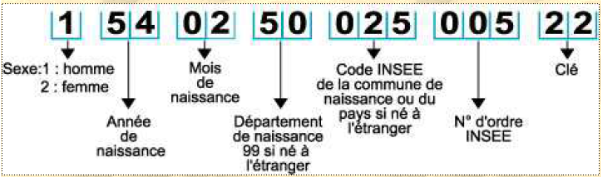

# TP - Carte Vitale

## 1 - Définition

Le code _INSEE_, en France, est un code identifiant chaque individu, utilisé par l’Institut national de la statistique et des études économiques ( INSEE), pour différentes analyses statistiques. Ce code s’appelle également NIR ( numéro d’inscription au répertoire ) et se retrouve sur les cartes de sécurité sociale (carte Vitale par exemple)


Source : CNAMTS - GIE SESAM-Vitale

Dès la naissance, en France, chaque personne est identifiée par un numéro composé de quinze chiffres. C’est le numéro INSEE ou Numéro de Sécurité Sociale.



Afin d’éviter des erreurs lors des enregistrements (par exemple, lors des remboursements de la Sécurité Sociale), le dernier nombre (rangs 14 et 15) est une clé de contrôle.

## 2 - Un peu d'histoire

L’inventeur du NIR est René Carmille (mort en déportation en 1944 à Dachau) qui réalisa entre avril et août 1941, sous le régime de Vichy, le premier répertoire général, pour préparer secrètement la mobilisation d’une armée française.

Ultérieurement, cette codification fut reprise par le général Marie, en Algérie, afin de recenser la population sur de nombreuses caractéristiques. Le but était de ficher toute la population française et de les discriminer selon des critères ethniques ou statutaires, dans le cadre de la politique du régime de Vichy. En effet le premier chiffre du code NIR qui aujourd’hui sert juste à identifier le sexe de la personne était plus « complet » à l’époque :

- 1 ou 2 pour les citoyens français ;
- 3 ou 4 pour les indigènes d’Algérie (ceux qu’on appelait les « Musulmans ») et de toutes les colonies, non juifs ;
- 5 ou 6 pour les juifs indigènes ;
- 7 ou 8 pour les étrangers ;
- 9 ou 0 pour les statuts mal définis.

Cette catégorisation discriminante utilisée en Algérie fut abolie en 1944. Elle n’a jamais été utilisée sur le territoire de la France « métropolitaine », où, durant toute la guerre, il n’a été fait usage que du « 1 » et du « 2 ».

_Source : Wikipédia, l’encyclopédie libre_

## 3 - Comment vérifier la validité d'une carte vitale ?

On considère le nombre formé des treize premiers chiffres. Ce nombre est alors divisé par 97 (division euclidienne). Puis le reste obtenu est soustrait à 97 ( 97 - reste ). Le résultat est la clé de contrôle.

_Remarque : Pour la Corse, les lettres A et B sont remplacées par des zéros, et on soustrait du nombre à 13 chiffres ainsi obtenu 1 000 000 pour A et 2 000 000 pour B._

Exemple : Vérifions la validité du n° d’INSEE : 1 54 02 50 025 005 22 

On a : $`1540250025005 = 97 \times 15878866237 + 16`$ et $`97 - 16 = 8`$

La clé est donc 81 et pas 22, ce numéro de carte vitale n’est donc pas valide.

### 3.1 - À Faire

Vérifier que le numéro d’INSEE 1 52 03 55 527 002 38 est valide

### 3.2 - À Faire

Écrire une fonction qui prend en paramètre un numéro d’INSEE et qui renvoie `vrai` si son numéro est valide et `faux` sinon.

```python


```

