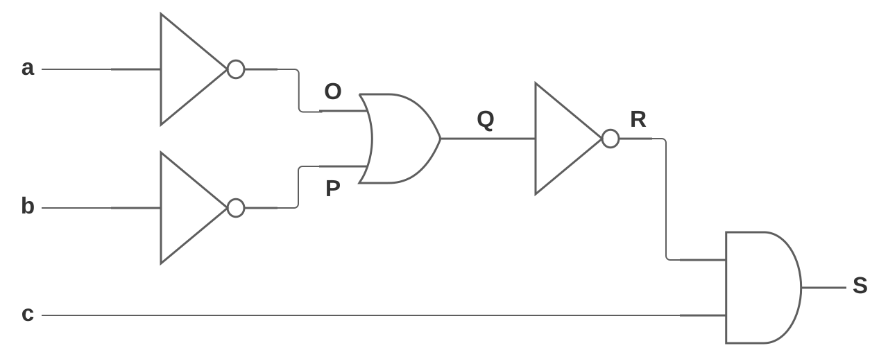
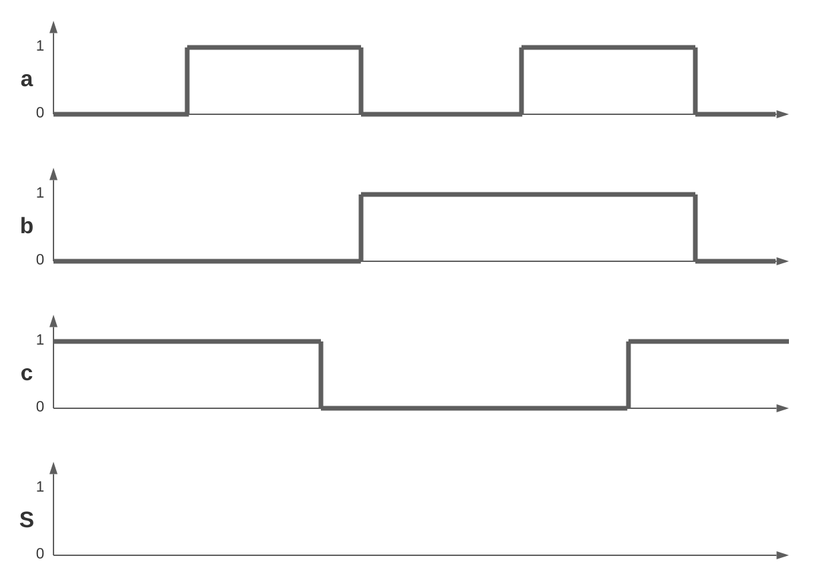

# TD : Logique combinatoire

## Exercice 1

Q1. En utilisant les propriétés de l’algèbre de Boole, simplifier les équations logiques suivantes :

1. $`S = a \land(a \lor \overline{b})`$
2. $`S = (\overline{a} \lor b) \land (\overline{a} \lor \overline{b})`$
3. $`S = a \lor (\overline{a} \land \overline{b})`$
4. $`S = a \land (\overline{a} \lor b)`$

## Exercice 2

Q2. Faire le logigramme des fonctions suivantes en utilisant que des portes logiques à 2 entrées :

1. $`S = a\land b \lor \overline{b} \land c`$
2. $`S = \overline{(a \lor b) \land c}`$
3. $`S = \overline{(a \lor \overline{b}) \land (d \lor \overline{c})}`$​

## Exercice 3

Q3. Pour le logigramme suivant, donner l’équation logique de la sortie $`S`$​​ en fonction des entrées $`a, b`$ et $`c`$​​​ :

Q4. Simplifier l’équation logique $`S`$.

Q5. Dessiner le nouveau logigramme simplifié de l’équation logique $`S`$.

## Exercice 4

Q6. Pour le logigramme suivant, donner l’équation logique de la sortie $`T`$ en fonction des entrées $`a, b, c`$ et $`d`$ :

Q7. Simplifier l’équation logique $`T`$.

Q8 : Dessiner le nouveau logigramme simplifié de l’équation logique $`T`$.

## Exercice 5

Q9. À partir de la table de vérité ci-dessous, déterminer l’équation logique $`S`$.

| $`a`$ | $`b`$ | $`c`$ | $`S`$ |
| :--: | :--: | :--: | :--: |
| 0 | 0 | 0 | __1__ |
| 0 | 0 | 1 | __1__ |
| 0 | 1 | 0 | __1__ |
| 0 | 1 | 1 | __0__ |
| 1 | 0 | 0 | __0__ |
| 1 | 0 | 1 | __0__ |
| 1 | 1 | 0 | __1__ |
| 1 | 1 | 1 | __0__ |

Q10. Simplifier l'équation logique $`S`$

Q11. Compléter les chronogrammes ci-dessous.

## Exercice 6

Un parking souterrain est géré grâce à un gardien et à partir de capteurs de détection de véhicules.
Un capteur $`p`$ dans le sol détectera la présence d'un véhicule à l'entrée du parking ($`p = 1`$).
Un capteur $`h`$ en hauteur détectera la présence d'un véhicule de plus de 2 mètres ($`h = 1`$). Pour une hauteur supérieure à 2 mètres l'entrée dans le parking est interdite.
De plus, le gardien du parking aura la possibilité de fermer un contact $`g`$ ($` g = 1`$) si le parking est plein, pour ne pas autoriser l'entrée de véhicules supplémentaires.
L'autorisation de pénétrer sera visualisée sur un feu bicolore :

- Si le feu est vert la barrière s'ouvrira et le véhicule pourra
- Si le feu est rouge la barrière restera fermée

Q12. Donnez la table de vérité du système. Pour les combinaisons matériellement impossibles, le feu rouge restera allumé.

Q13. En déduire les équations Logiques de "Vert" et "Rouge". 

Q14. Réalisez le schéma à l’aide de portes logiques
