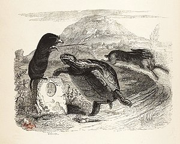

# TD - Le Li�vre et la Tortue

## Contexte

2 fichiers `lièvre-iso-8859-1.html` et `lièvre-utf8.html` contiennent le même texte : la fable du lièvre et de la tortue de Jean de La Fontaine.

Source : Wikipédia

Si on ouvre ces 2 fichiers dans un navigateur Web, des symboles étranges apparaissent, rendant la lecture inconfortable.

Ce TD a pour but de comprendre l'origine de ce phénomène.

Cette séance se découpe en 2 parties :
- La première consiste à explorer et découvrir la problématique d'encodage,
- La deuxième consiste à manipuler la représentation des chaines de caractères en python.

Les parties doivent être traitées dans l'ordre.

# Pré-Requis

Avoir l'extension [Set Character Encoding](https://chrome.google.com/webstore/detail/set-character-encoding/bpojelgakakmcfmjfilgdlmhefphglae) installée sur votre poste.

# Partie 1 - Exploration et découverte

Cette partie vise à vous faire comprendre le problème d'encodage par différentes observations, calculs et manipulations à réaliser.

A la fin de cette partie, vous devez répondre à un questionnaire et le valider avec votre professeur.

En cas de réussite, vous pouvez aborder la partie 2.

## Table d'encodage et calcul de la représentation binaire

### ISO-8859-1

Voici la table d'encodage ISO-8859-1 :

Exemple : la point de code du caractère `A` est 41 (ligne 4x et colonne x1).

***Observation 1.***  Sachant que l'encodage ISO-8859-1 représente les points de code sur 1 octet. Quelle est la représentation binaire du caractère `A` ?

***Observation 2.***  Quelle est le point de code du caractère `<` ? Quelle est sa représentation binaire ?

***Observation 3.***  Quelle est la point de code du caractère `à`? Quelle est sa représentation binaire ?

***Observation 4.***  Étant donné le mot binaire $`(10101001)_2`$, quel caractère représente-il ? Quel est celui associé au mot binaire $`(11110100)_2`$ ?

### Unicode UTF-8

La table d'encodage de l'UTF-8 est plus conséquente que celle de l'encodage ISO-8859-1. Le site https://unicode-table.com/fr permet d'obtenir les correspondances entre les caractères, leur point de code ainsi que leur représentation binaire UTF-8.

Exemple : le caractère `©` a le point de code U+00A9 (U+ symbolise le fait que l'encodage est Unicode), soit le 169ème point de code ($`(A9)_{16} = (169)_{10}`$) dans la table d'encodage.

***Observation 5.***  En vous référant au cours sur l'encodage UTF-8, calculez la représentation binaire UTF-8 de ce caractère. Qu'observez-vous par rapport à l'observation 8 ?

***Observation 6.***  Cherchez le point de code et la représentation binaire du caractère ♧.

***Observation 7.***  Cherchez le point de code et le caractère associés à la représentation binaire $`(11100010\,10000100 \,10111100)_2`$.

## Effet visuel du problème d'encodage

***Observation 8.*** Ouvrez dans votre navigateur Web les fichiers `lièvre-iso-8859-1.html` et `lièvre-utf8.html`.
Quelles différences constatez-vous ?

***Observation 9.*** Dans l'explorateurs de fichiers, comparez la taille de ces 2 fichiers (en octets). Quelles différences constatez-vous ?

***Observation 10.*** Dans votre navigateur Web, en faisant clic droit sur le page `lièvre-iso-8859-1.html`, changer la valeur de `Set Encoding character` avec les autres valeurs que celle sélectionnée. Que constatez-vous ?

***Observation 11.*** Dans votre navigateur Web, en faisant clic droit sur le page `lièvre-utf8.html`, changer la valeur de `Set Encoding character` avec les autres valeurs que celle sélectionnée. Que constatez-vous ?

## Analyse de la représentation binaire d'un fichier texte

Nous allons utiliser un éditeur hexadécimal de texte en ligne https://www.onlinehexeditor.com/, il permet de visualiser le contenu réel d'un fichier texte, i.e les mots binaires (en héxadécimal) qui représentent les caractères.

***Observation 12.*** Dans votre navigateur Web, rendez-vous sur la page https://www.onlinehexeditor.com/ et ouvrez les 2 fichiers `lièvre-iso-8859-1.html` et `lièvre-utf8.html` en cliquant sur `open file`. Quelles différences constatez-vous ?

***Observation 13.*** Au vu des observations précédentes, comment expliquez-vous que votre navigateur affiche :
- `LiÚvre` au lieu de `lièvre`quand on ouvre le fichier `lièvre-utf8.html` avec un encodage iso-8859-1 ?
- `t�moignage` au lieu de `témoignage`quand on ouvre le fichier `lièvre-iso-8859-1.html` avec un encodage UTF-8 ?

## Questionnaire

Q1. le caractère `à` a toujours la même représentation en mémoire quelque soit l'encodage utilisé ?

A. Vrai
B. Faux

Q2. Dans la table d'encodage Unicode, le caractère `Ô` est le :

A. 212ème
B. 213ème
C. $`(D4)_{16}`$ème
D. Il n'existe dans la table d'encodage Unicode

Q3. En UTF-8, les caractères sont représentés sur :

A. 1 octet
B. 2 octets
C. 7 bits
D. un nombre variable entre 1 et 4 octets

Q4. En cas de problème d'affichage visuel d'un texte, quelle(s) est(sont) la(les) solution(s) selon vous ?

A. s'assurer que l'encodage du fichier et le même que celui qui sert à l'affichage
B. modifier le fichier pour corriger les erreurs
C. appeler son professeur pour qu'il corrige le problème
D. modifier l'encodage de la visualisation

Q5. Soit le point de code U+00D4, cela vous indique que :

A. l'encodage est Unicode et la représentation binaire du caractère est $`(01001101)_2`$
B. l'encodage est Unicode et la représentation binaire du caractère est $(11000011 \,10010100)_2$
C. l'encodage est Unicode et le caractère associé est la lettre Ô
D. l'encodage est ISO-8859-1 et la représentation binaire du caractère est $`(01001101)_2`$

Q6. Quand une application traite un fichier encodé en iso-8859-1 :

A. Elle traite octet par octet
B. Elle traite un nombre variable d'octets
C. calcule la position en fonction de la valeur de l'octet et affiche le caractère associé
D. affiche les caractères en fonction de la table d'encodage Unicode

## Partie 2 - Manipulation en Python

***Q1.*** Dans un interpréteur Python, exécutez successivement les instructions `chr(212)` et `chr(169)`. Qu'en déduisez-vous sur la spécification de la fonction `chr`?

***Q2.*** Dans un interpréteur Python, exécutez successivement les instructions `ord('©')` et `ord('à')`. Qu'en déduisez-vous sur la spécification de la fonction `ord`?

***Q3.*** Écrire une fonction `binaire_utf8`, qui prend en paramètre un point de code Unicode sous la forme d'un entier et renvoie la représentation binaire UTF-8 du caractère associé, sous la forme d'une liste d'octet (un octet est une liste de bits). (Aide : Vous pouvez réutiliser les fonctions de conversion en binaire des précédentes séances ainsi que la méthode vu en cours)

***Q4.*** Écrire une fonction `str_to_utf8`, qui prend en paramètre une chaine de caractère et renvoie la représentation binaire UTF-8, en hexadécimal, de l'ensemble des caractères de la chaine. Exécutez votre fonction sur la chaine `Rien ne sert de courir ; il faut partir à point. Le Lièvre et la Tortue en sont un témoignage.` Comparez le résultat obtenu avec celui de l'observation 12.
