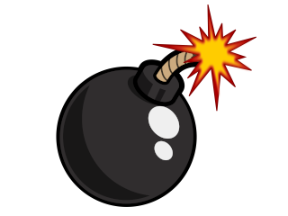
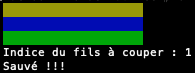
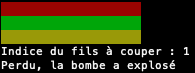
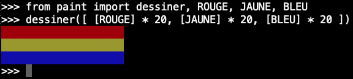

# Projet - Désamorceur de bombes



## 1. Contexte

Ce jeu est une adaptation du jeu ___[Keep Talking and nobody explodes](https://keeptalkinggame.com/)___, de l'éditeur steelcrategames.com où l'objectif est de désamorcer une bombe en coupant le bon fil.

Cette adaptation a pour but de mettre en oeuvre les connaissances acquises en python, notamment les types construits, les boucles, les structures conditionnelles et les fonctions.

## 2. Description

### 2.1. Règles

- Une bombe peut contenir entre 3 et 6 fils.
- Seul un fil a besoin d'être coupé pour désarmer la bombe.
- Les fils sont ordonnés de haut en bas.
- A l'armement de la bombe, l'utilisateur est invité à indiquer l'indice du fil qu'il souhaite couper.

Les règles complètes de désamorçage sont décrites en annexe. Pour __3 fils__, les règles sont les suivantes

```txt
S'il n'y a pas de fil rouge, couper le deuxième fil.
Sinon, si le dernier fil est blanc, couper le dernier fil.
Sinon, s'il y a plus d'un fil bleu, couper le dernier fil bleu.
Sinon, couper le dernier fil.
```

### 2.2. Exemples

| Exemple | Explication |
| :--: | :-- |
|  | Le fil à couper est celui à l'indice 1, soit le deuxième fil.<br />La règle qui le justifie : il n'y a pas de fil rouge. |
|  | Le fil à couper est celui à l'indice 2, soit le dernier fil.<br />La règle qui le justifie : Toutes les règles ne sont pas satisfaites, c'est le dernier sinon qui s'applique. |

## 3. Consignes

Vous devez créer un module `desamorceur` qui va permettre de :

- créer une combinaison aléatoire de couleur pour $`n`$ fils,
- créer une bombe de $`n`$ fils,
- afficher une bombe,
- créer un numéro de série sur 8 chiffres,
- déterminer si le fil choisi désarme la bombe ou non,
- ... ainsi que d'autres fonctions nécessaires à l'implantation du jeu (Cf. Partie "Petit manuel du désamorceur de bombes").

L'algorithme principal est le suivant :
```python
bombe = creer_bombe(creer_combinaison(combinaison))
numero_serie = creer_numero_serie()

print(f"n°{numero_serie}")

afficher_bombe(bombe)

indice = input('Indice du fils à couper : ')

if est_bon_fil_a_couper(bombe, int(indice), numero_serie):
	print('Sauvé !!!')
else:
	print('Perdu, la bombe a explosé')
```
***N.B : Vous devez, pour chaque fonction y adjoindre les docstrings et doctests nécessaires***

Le module sera exécutable de la manière suivante :

> python3 desamorceur.py 4

où le 2ème paramètres correspond au nombre de fils de la bombe

## 4. Matériel fourni

Le module `paint` dispose de :

- 5 variables : `ROUGE, VERT, JAUNE, BLEU, BLANC`, qui permettent de matérialiser les couleurs des fils,
- d'une méthode `dessiner` qui permet d'afficher une matrice passée en paramètre.

<figure>
  <center></center>
  <figcaption style='text-align:center;'>Fig 2. Exemple d'utilisation du module paint</figcaption>
</figure>

## 5. Rendu

- un script `desamorceur.py`,
- un fichier `README.md` qui présente vos choix de structures de données, les autres fonctions implantées..., ainsi qu'un extrait de codes ou le decriptif d'un problème rencontré et la solution mise en place.

## 6. Annexe - Petit manuel du désamorceur de bombes

Voici les règles pour désamorcer la bombe :

__3 fils__ :

S'il n'y a pas de fil rouge, couper le deuxième fil.

Sinon, si le dernier fil est blanc, couper le dernier fil.

Sinon, s'il y a plus d'un fil bleu, couper le dernier fil bleu.

Sinon, couper le dernier fil.

__4 fils__ :

S'il y a plus d'un fil rouge et si le dernier chiffre du numéro de série est impair, couper le dernier fil rouge.

Sinon, si le dernier fil est jaune et s'il n'y a pas de fil rouge, couper le premier fil.

Sinon, s'il y a exactement un fil bleu, couper le premier fil.

Sinon, s'il y a plus d'un fil jaune, couper le dernier fil.

Sinon, couper le deuxième fil.

__5 fils__ :

Si le dernier fil est vert et si le dernier chiffre du numéro de série est impair, couper le quatrième fil.

Sinon, s'il y a exactement un fil rouge et plus d'un fil jaune, couper le premier fil.

Sinon, s'il n'y a pas de fil vert, couper le deuxième fil.

Sinon, couper le premier fil.

__6 fils__ :

S'il n'y a pas de fil jaune et si le dernier chiffre du numéro de série est impair, couper le troisième fil.

Sinon, s'il y a exactement un fil jaune et plus d'un fil blanc, couper le quatrième fil.

Sinon, s'il n'y a pas de fil rouge, couper le dernier fil.

Sinon, couper le quatrième fil.

## 7. Pour aller plus loin

Dans le cas où les éléments du projet sont finalisés, vous pouvez le compléter avec les éléments suivants :
- En cas d'explosion de la bombe, afficher à l'utilisateur l'indice du fil qu'il fallait couper pour désarmer la bombe,
- Mettre en place un numéro de série alphanumérique, qui comporte au moins 1 chiffre qui n'est pas forcément en dernière position,
- Doter le projet d'une interface graphique, via le module `pygame`.
