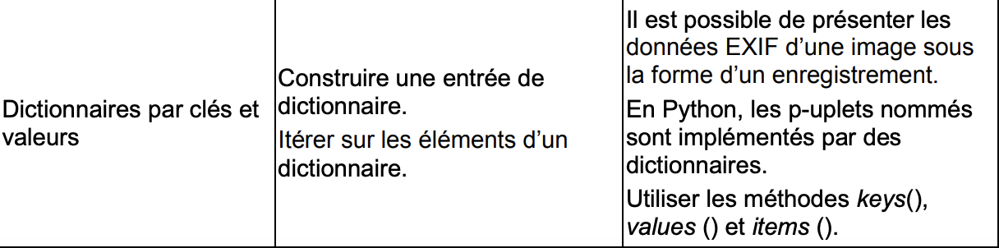

## Représentation des données : Les Dictionnaires 

-------------

> ***Contenue*** : Notions introduites : le type dictionnaire
> ***Compétences*** : Construire une entrée de dictionnaire, savoir itérer sur es élèments d'un dictionnaire, connaître les méthodes.

## Le programme

-----------



## Apport de connaissances

--------

Les dictionnaires Python permettent d'associer des valeurs à des clés : À partir d'une clé, on peut alors accéder directement à la valeur qui lui est associée.

### Propriétés

Les dictionnaires sont des conteneurs, comme les listes et tuples, vus précédemment, et sont mutables : *on peut donc modifier, ajouter ou supprimer du contenu.*

Par contre, contrairement aux types de conteneurs précédémment étudiés, on ne peut pas accéder au contenu d'un dictionnaire à l'aide d'un indice : un dictionnaire n'est pas une séquence.

Si on peut bien modifier les valeurs dans un dictionnaire, chaque clé est *unique et non mutable*. Elle peut être une chaîne de caractères, un nombre, un tulle de nombre...

Enfin, les valeurs, quant à elles, peuvent être quelconques.

-----------------

### Création et accès 

Pour initialiser un dictionnaire vide : 

```python
dico = {}
#ou
dico = dict()
```

Pour initialiser un dictionnaire avec des valeurs :

```pytho
perso = {"prenom" : "Bilbo", "age" : 111}
```

On a donc la clé en premier, ici, prenom & age sont deux chaines de caractères faisant office de clés.

Accéder à une valeur d'un dictionnaire : on donne la clé à laquelle est associée la valeur recherchée (il faut donc que la clé existe)

```python
perso ["prenom"]
'Bilbo'
perso["taille"]
KeyError "taille"
```

Tout comme les listes, on peut utiliser la fonction ***len*** pour connaître le nombre de couples stockés.

```python
len(perso)
2
```

--------------

### Modification et parcours

 On ajoute très simplement un couple clé / valeur :

```python
perso ["taille"] = 112
perso 
{"prenom" : 'Bilbo', 'age' : 111, 'taille' : 112}
```

 Pour modifier une valeur, c'est la même méthode : on ajoute un couple deja existant, et cela va écraser la valeur précédente :

```python
perso["age"] = 131
perso
{'prenom' : 'Bilbo', 'age' : 131, 'taille' : 112}
```

Pour supprimer une clé et sa valeur associée, on peut utiliser la fonction ***del***:

```python
del perso["age"]
```

-----

Comme les listes et les tuples, les dictionnaires sont intérables : on itère sur les clés, les valeurs, ou les couples clé / valeur

- Itération sur les clés :

```python
for cle in perso.keys():
  print (cle)
```

- Itération sur les valeurs :

```python
for val in perso.values():
  print(val)
```

- Itération sur les couples clé / valeur:

```python
for (cle, val) in perso.items():
  print(cle, "->", val)
```

✏ Par défaut, on itère sur les clés.

--------

### À retenir

| Opération              | Résultat                                                     |
| ---------------------- | ------------------------------------------------------------ |
| dico[k]                | renvoie la valeur associée à la clé k                        |
| x in dico.values()     | renvoie True si une valeur de dico est égale à x, False sinon |
| x not in dico.values() | renvoie True si aucune valeur de dico n'est égale à x, False sinon |
| x in dico.keys()       | renvoie True si une clé de dico est égale à x, False sinon   |
| dico[k] = v            | Modifie la valeur v associée à la clé k ou l'ajoute si elle n'existe pas |
| dico.get(k, v)         | Renvoie la valeur associé à la clé k. Si la clé k n'existe pas, renvoie la valeur v |
| del dico(k)            | Enlève du dictionnaire la clé k                              |