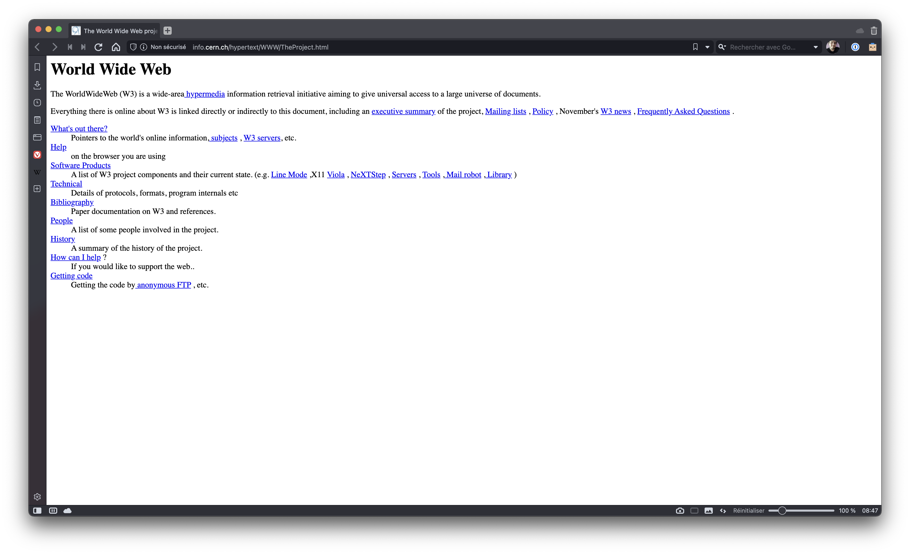

# Le web

> Le **Web** est le terme communément employé pour parle du World Wide Web, ou WWW, traduit en français par la toile d’araignée mondiale. Il fait référence au système hypertexte fonctionnant sur le réseau informatique mondial internet.

##  

## Historique

Le "World Wide Web", plus communément appelé "Web" a été développé au CERN (Conseil Européen pour la Recherche Nucléaire) par le Britannique Sir Timothy John Berners-Lee et le Belge Robert Cailliau au début des années 90. 

À cette époque les principaux centres de recherche mondiaux étaient déjà connectés les uns aux autres, mais pour faciliter les échanges d'information Tim Berners-Lee met au point le système hypertexte. 

Le système hypertexte permet, à partir d'un document, de consulter d'autres documents en cliquant sur des mots clés. 

Ces mots "cliquables" sont appelés hyperliens et sont souvent soulignés et en bleu. Ces hyperliens sont plutôt connus aujourd'hui sous le simple terme de "liens".

Cette première page web est toujours consultable [ici]( http://info.cern.ch/hypertext/WWW/TheProject.html).

Tim Berners-Lee développe le premier navigateur web (logiciel permettant de lire des pages contenant des hypertextes), il l'appelle simplement "***WorldWideWeb***". Il faudra attendre 1993 et l'arrivée du navigateur web "NCSA Mosaic" pour que le web commence à devenir populaire en dehors du petit monde de la recherche.

Techniquement le web se base sur trois choses : le protocole *HTTP* (HyperText Transfert Protocol), les *URL* (Uniform Resource Locator) et le langage de description *HTML* (HyperText Markup Language). Nous aurons, très prochainement l'occasion de revenir sur ces trois éléments.

Une chose très importante à bien avoir à l'esprit : beaucoup de personnes confondent "web" et "internet". Même si le "web" "s'appuie" sur internet, les deux choses n'ont rien à voir puisqu'"internet" est un "réseau de réseaux" s'appuyant sur le protocole IP (voir le module Internet) alors que, comme nous venons de le voir, le web est la combinaison de trois technologies : HTTP, URL et HTML. D'ailleurs on trouve autre chose que le "web" sur internet, par exemple, les emails avec le protocole SMTP (Simple Mail Transfert Protocol) et les transferts de fichiers avec le protocole FTP (File Transfert Protocol).

## Comment ?

Les navigateurs interprètent des **codes** (HTML et CSS) afin d’afficher des pages Web. Il s’agit de langages informatiques qui permettent de créer des sites web.
Les langages **HTML** et **CSS** sont à la base du fonctionnement de tous les sites Web.

Nous allons nous intéresser à un acteur fondamental du développement web, le couple HTML+CSS (***Hyper Text Markup Langage et Cascading Style Sheets).***

Dans un premier temps, nous allons exclusivement nous intéresser au HTML. Qu'est-ce que le HTML, voici la définition que nous en donne Wikipedia :

*L’Hypertext Markup Language, généralement abrégé HTML, est le format de données conçu pour représenter les pages web. C’est un langage de balisage permettant d’écrire de l’hypertexte, d’où son nom. HTML permet également de structurer sémantiquement et de mettre en forme le contenu des pages, d’inclure des ressources multimédias, dont des images, des formulaires de saisie, et des programmes informatiques. Il permet de créer des documents interopérables avec des équipements très variés de manière conforme aux exigences de l’accessibilité du web. Il est souvent utilisé conjointement avec des langages de programmation (JavaScript) et des formats de présentation (feuilles de style en cascade).*

Pour l'instant, nous allons retenir deux éléments de cette définition «conçu pour représenter les pages web» et «un langage de balisage».

Grâce au HTML vous allez pouvoir, dans votre navigateur (Firefox, Chrome, Opera,....), afficher du texte, afficher des images, proposer des hyperliens (liens vers d'autres pages web), afficher des formulaires et même maintenant afficher des vidéos (grâce à la dernière version du HTML, l'HTML5).

HTML n'est pas un langage de programmation (comme le Python par exemple), ici, pas question de conditions, de boucles....c'est un langage de description.